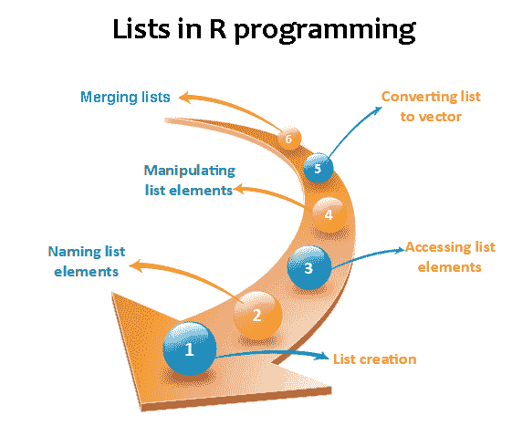
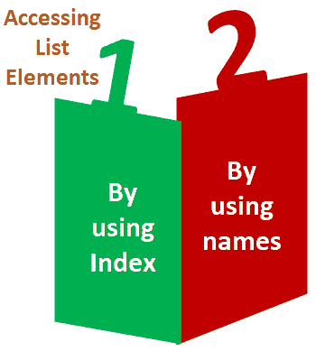

# 列表

> 原文：<https://www.javatpoint.com/r-lists>

在 R 中，列表是第二类向量。列表是 R 的对象，其中包含不同类型的元素，如数字、向量、字符串和其他列表。它也可以包含函数或矩阵作为其元素。列表是包含混合数据类型组件的数据结构。我们可以说，列表是包含其他对象的一般向量。

### 例子

```

vec <- c(3,4,5,6)
char_vec<-c("shubham","nishka","gunjan","sumit")
logic_vec<-c(TRUE,FALSE,FALSE,TRUE)
out_list<-list(vec,char_vec,logic_vec)
out_list

```

**输出:**

```
[[1]]
[1] 3 4 5 6
[[2]]
[1] "shubham" "nishka"  "gunjan"  "sumit"
[[3]]
[1]  TRUE FALSE FALSE  TRUE

```



## 列表创建

创建列表的过程与创建向量的过程相同。在 R 中，向量是借助 c()函数创建的。和 c()函数一样，还有另外一个函数，即 list()用来在 R. A 列表中创建一个列表，避免了向量是数据类型的缺点。我们可以在不同数据类型的列表中添加元素。

**语法**

```

list()

```

**示例 1:** 创建具有相同数据类型的列表

```

list_1<-list(1,2,3)
list_2<-list("Shubham","Arpita","Vaishali")
list_3<-list(c(1,2,3))
list_4<-list(TRUE,FALSE,TRUE)
list_1
list_2
list_3
list_4

```

**输出:**

```
[[1]]
[1] 1
[[2]]
[1] 2
[[3]]
[1] 3

[[1]]
[1] "Shubham"
[[2]]
[1] "Arpita"
[[3]]
[1] "Vaishali"

[[1]]
[1] 1 2 3

[[1]]
[1] TRUE
[[2]]
[1] FALSE
[[3]]
[1] TRUE

```

**示例 2:** 创建不同数据类型的列表

```

list_data<-list("Shubham","Arpita",c(1,2,3,4,5),TRUE,FALSE,22.5,12L)
print(list_data)

```

在上例中，list 函数将创建一个包含字符、逻辑、数字和向量元素的列表。它将给出以下输出

**输出:**

```
[[1]]
[1] "Shubham"
[[2]]
[1] "Arpita"
[[3]]
[1] 1 2 3 4 5
[[4]]
[1] TRUE
[[5]]
[1] FALSE
[[6]]
[1] 22.5
[[7]]
[1] 12

```

## 给列表元素命名

r 为访问元素提供了一种非常简单的方法，即给列表中的每个元素命名。通过给元素命名，我们可以很容易地访问元素。打印名称对应的列表数据只有三个步骤:

1.  创建列表。
2.  借助 names()函数为列表元素指定一个名称。
3.  打印列表数据。

让我们看一个例子来理解我们如何给列表元素命名。

**例**

```

# Creating a list containing a vector, a matrix and a list.
list_data <- list(c("Shubham","Nishka","Gunjan"), matrix(c(40,80,60,70,90,80), nrow = 2),
   list("BCA","MCA","B.tech"))

# Giving names to the elements in the list.
names(list_data) <- c("Students", "Marks", "Course")

# Show the list.
print(list_data)

```

**输出:**

```
$Students
[1] "Shubham" "Nishka"  "Gunjan"

$Marks
     [,1] [,2] [,3]
[1,]   40   60   90
[2,]   80   70   80

$Course
$Course[[1]]
[1] "BCA"

$Course[[2]]
[1] "MCA"

$Course[[3]]
[1] "B. tech."

```

## 访问列表元素

r 提供了两种访问列表元素的方法。第一种是以与向量相同的方式执行的索引方法。在第二个例子中，我们可以借助名字访问列表的元素。只有使用指定的列表才有可能。；如果列表正常，我们不能使用名称访问列表的元素。



让我们看一个这两种方法的例子，来理解它们是如何在列表中用来访问元素的。

**示例 1:** 使用索引访问元素

```

# Creating a list containing a vector, a matrix and a list.
list_data <- list(c("Shubham","Arpita","Nishka"), matrix(c(40,80,60,70,90,80), nrow = 2),
   list("BCA","MCA","B.tech"))
# Accessing the first element of the list.
print(list_data[1])

# Accessing the third element. The third element is also a list, so all its elements will be printed.
print(list_data[3])

```

**输出:**

```
[[1]]
[1] "Shubham" "Arpita"  "Nishka"

[[1]]
[[1]][[1]]
[1] "BCA"

[[1]][[2]]
[1] "MCA"

[[1]][[3]]
[1] "B.tech"

```

**示例 2:** 使用名称访问元素

```

# Creating a list containing a vector, a matrix and a list.
list_data <- list(c("Shubham","Arpita","Nishka"), matrix(c(40,80,60,70,90,80), nrow = 2),list("BCA","MCA","B.tech"))
# Giving names to the elements in the list.
names(list_data) <- c("Student", "Marks", "Course")
# Accessing the first element of the list.
print(list_data["Student"])
print(list_data$Marks)
print(list_data)

```

**输出:**

```
$Student
[1] "Shubham" "Arpita"  "Nishka"

        [,1] [,2] [,3]
[1,]   40   60   90
[2,]   80   70   80

$Student
[1] "Shubham" "Arpita"  "Nishka"

$Marks
     [,1] [,2] [,3]
[1,]   40   60   90
[2,]   80   70   80

$Course
$Course[[1]]
[1] "BCA"
$Course[[2]]
[1] "MCA"
$Course[[3]]
[1] "B. tech."

```

## 列表元素的操作

r 允许我们添加、删除或更新列表中的元素。我们可以从任何地方更新列表中的元素，但是元素只能在列表的末尾添加或删除。要从指定的索引中移除一个元素，我们将为它分配一个空值。我们可以通过用新值覆盖列表元素来更新它。让我们看一个例子来理解我们如何添加、删除或更新列表中的元素。

**例**

```

# Creating a list containing a vector, a matrix and a list.
list_data <- list(c("Shubham","Arpita","Nishka"), matrix(c(40,80,60,70,90,80), nrow = 2),
   list("BCA","MCA","B.tech"))

# Giving names to the elements in the list.
names(list_data) <- c("Student", "Marks", "Course")

# Adding element at the end of the list.
list_data[4] <- "Moradabad"
print(list_data[4])

# Removing the last element.
list_data[4] <- NULL

# Printing the 4th Element.
print(list_data[4])

# Updating the 3rd Element.
list_data[3] <- "Masters of computer applications"
print(list_data[3])

```

**输出:**

```
[[1]]
[1] "Moradabad"

$<NA>
NULL

$Course
[1] "Masters of computer applications"

```

## 将列表转换为矢量

列表有一个缺点，即我们不能对列表元素执行所有的算术运算。为了消除这个缺点，R 提供了 unlist()函数。这个函数将列表转换成向量。在某些情况下，需要将列表转换为向量，以便我们可以使用向量的元素进行进一步的操作。

函数的作用是:将列表作为一个参数，转换成一个向量。让我们看一个例子来理解如何取消函数在 r 中的使用。

**例**

```

# Creating lists.
list1 <- list(10:20)
print(list1)

list2 <-list(5:14)
print(list2)

# Converting the lists to vectors.
v1 <- unlist(list1)
v2 <- unlist(list2)

print(v1)
print(v2)

adding the vectors
result <- v1+v2
print(result)

```

**输出:**

```
[[1]]
[1] 1 2 3 4 5

[[1]]
[1] 10 11 12 13 14

[1] 1 2 3 4 5
[1] 10 11 12 13 14
[1] 11 13 15 17 19

```

## 合并列表

r 允许我们将一个或多个列表合并成一个列表。合并也是借助 list()函数完成的。要合并列表，我们必须将所有列表作为参数传递给 list 函数，它会返回一个包含列表中所有元素的列表。让我们看一个例子来理解合并过程是如何完成的。

**例**

```

# Creating two lists.
Even_list <- list(2,4,6,8,10)
Odd_list <- list(1,3,5,7,9)

# Merging the two lists.
merged.list <- list(Even_list,Odd_list)

# Printing the merged list.
print(merged.list)

```

**输出:**

```
[[1]]
[[1]][[1]]
[1] 2

[[1]][[2]]
[1] 4

[[1]][[3]]
[1] 6

[[1]][[4]]
[1] 8

[[1]][[5]]
[1] 10

[[2]]
[[2]][[1]]
[1] 1

[[2]][[2]]
[1] 3

[[2]][[3]]
[1] 5

[[2]][[4]]
[1] 7

[[2]][[5]]
[1] 9

```

* * *