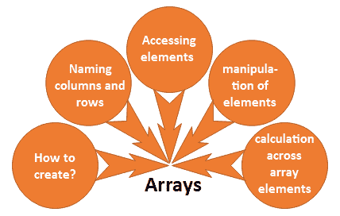

# 阵列

> 原文：<https://www.javatpoint.com/r-arrays>

在 R 语言中，数组是允许我们在两个以上维度上存储数据的数据对象。在 R 中，借助**数组()**函数创建一个数组。这个 array()函数将一个向量作为输入，并使用 **dim** 参数中的向量值来创建一个数组。

**例如** -如果我们将创建维度(2，3，4)的数组，那么它将创建 4 个 2 行 3 列的矩形矩阵。

## 数组语法

R 数组有以下语法:

```

array_name <- array(data, dim= (row_size, column_size, matrices, dim_names))

```

**数据**

数据是 array()函数中的第一个参数。它是给数组的输入向量。

**矩阵**

在 R 中，数组由多维矩阵组成。

**行 _ 大小**

此参数定义了数组可以存储的行元素的数量。

**列 _ 大小**

此参数定义数组可以存储的列元素的数量。

**dim _ name**

此参数用于更改行和列的默认名称。



## 如何创作？

在 R 中，数组创建相当简单。我们可以使用 vector 和 array()函数轻松创建一个数组。在数组中，数据以矩阵的形式存储。创建矩阵只有两个步骤，如下所示

1.  在第一步中，我们将创建两个不同长度的向量。
2.  一旦我们的向量被创建，我们就把这些向量作为数组的输入。

让我们看一个例子来理解如何借助向量和 array()函数实现一个数组。

**例**

```

#Creating two vectors of different lengths
vec1 <-c(1,3,5)
vec2 <-c(10,11,12,13,14,15)

#Taking these vectors as input to the array 
res <- array(c(vec1,vec2),dim=c(3,3,2))
print(res)

```

**输出**

```
, , 1
     [,1] [,2] [,3]
[1,]    1   10   13
[2,]    3   11   14
[3,]    5   12   15

, , 2
     [,1] [,2] [,3]
[1,]    1   10   13
[2,]    3   11   14
[3,]    5   12   15

```

## 命名行和列

在 R 中，我们可以给数组的行、列和矩阵命名。这是在 array()函数的 dim name 参数帮助下完成的。

不必给行和列命名。它仅用于区分行和列，以便更好地理解。

下面是一个例子，其中我们创建了两个数组，并为行、列和矩阵命名。

**例**

```

#Creating two vectors of different lengths
vec1 <-c(1,3,5)
vec2 <-c(10,11,12,13,14,15)

#Initializing names for rows, columns and matrices
col_names <- c("Col1","Col2","Col3")
row_names <- c("Row1","Row2","Row3")
matrix_names <- c("Matrix1","Matrix2")

#Taking the vectors as input to the array 
res <- array(c(vec1,vec2),dim=c(3,3,2),dimnames=list(row_names,col_names,matrix_names))
print(res)

```

**输出**

```
, , Matrix1

     Col1 Col2 Col3
Row1    1   10   13
Row2    3   11   14
Row3    5   12   15

, , Matrix2

     Col1 Col2 Col3
Row1    1   10   13
Row2    3   11   14
Row3    5   12   15

```

## 访问数组元素

像 C 或 C++一样，我们可以访问数组的元素。在索引的帮助下访问这些元素。简单地说，我们可以在索引方法的帮助下访问数组的元素。让我们看一个例子来理解我们如何使用索引方法访问数组的元素。

**例**

```

, , Matrix1
     Col1 Col2 Col3
Row1    1   10   13
Row2    3   11   14
Row3    5   12   15

, , Matrix2
     Col1 Col2 Col3
Row1    1   10   13
Row2    3   11   14
Row3    5   12   15

Col1 Col2 Col3
   5   12   15

[1] 13

     Col1 Col2 Col3
Row1    1   10   13
Row2    3   11   14
Row3    5   12   15

```

## 元素操作

数组由多维矩阵组成，因此对数组元素的操作是通过访问矩阵元素来执行的。

**例**

```

#Creating two vectors of different lengths
vec1 <-c(1,3,5)
vec2 <-c(10,11,12,13,14,15)

#Taking the vectors as input to the array1 
res1 <- array(c(vec1,vec2),dim=c(3,3,2))
print(res1)

#Creating two vectors of different lengths
vec1 <-c(8,4,7)
vec2 <-c(16,73,48,46,36,73)

#Taking the vectors as input to the array2 
res2 <- array(c(vec1,vec2),dim=c(3,3,2))
print(res2)

#Creating matrices from these arrays
mat1 <- res1[,,2]
mat2 <- res2[,,2]
res3 <- mat1+mat2
print(res3)

```

**输出**

```
, , 1
     [,1] [,2] [,3]
[1,]    1   10   13
[2,]    3   11   14
[3,]    5   12   15

, , 2
     [,1] [,2] [,3]
[1,]    1   10   13
[2,]    3   11   14
[3,]    5   12   15

, , 1
     [,1] [,2] [,3]
[1,]    8   16   46
[2,]    4   73   36
[3,]    7   48   73

, , 2
     [,1] [,2] [,3]
[1,]    8   16   46
[2,]    4   73   36
[3,]    7   48   73

     [,1] [,2] [,3]
[1,]    9   26   59
[2,]    7   84   50
[3,]   12   60   88

```

## 跨数组元素的计算

出于计算目的，r 提供 **apply()** 功能。该应用函数包含三个参数，即 x、边距和函数。

这个函数接受我们必须执行计算的数组。apply()函数的基本语法如下:

```

apply(x, margin, fun)

```

这里，x 是一个数组，边距是使用的数据集的名称，fun 是应用于数组元素的函数。

**例**

```

#Creating two vectors of different lengths
vec1 <-c(1,3,5)
vec2 <-c(10,11,12,13,14,15)

#Taking the vectors as input to the array1 
res1 <- array(c(vec1,vec2),dim=c(3,3,2))
print(res1)

#using apply function 
result <- apply(res1,c(1),sum)
print(result)

```

**输出**

```
, , 1
     [,1] [,2] [,3]
[1,]    1   10   13
[2,]    3   11   14
[3,]    5   12   15

, , 2
     [,1] [,2] [,3]
[1,]    1   10   13
[2,]    3   11   14
[3,]    5   12   15

[1] 48 56 64

```

* * *