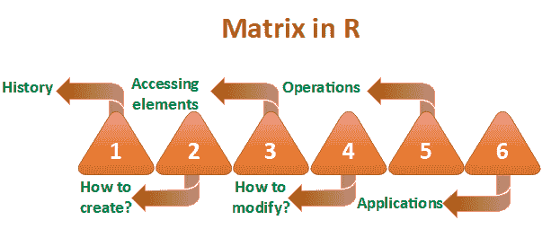
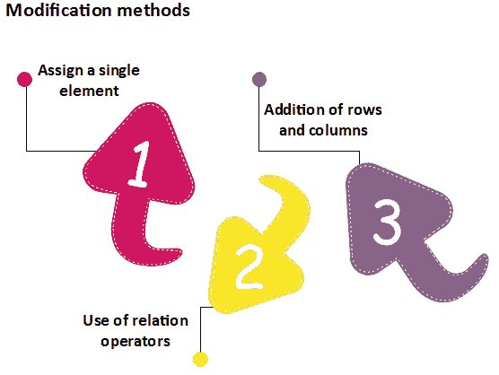
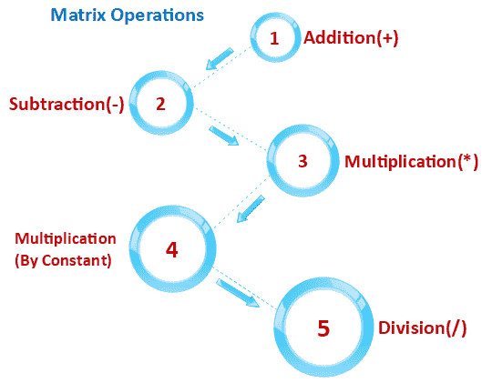

# r 矩阵

> 原文：<https://www.javatpoint.com/r-matrix>

在 R 中，二维矩形数据集被称为矩阵。借助矩阵函数的向量输入创建矩阵。在 R 矩阵上，我们可以进行加法、减法、乘法和除法运算。

在 R 矩阵中，元素以固定的行数和列数排列。矩阵元素是实数。在 R 中，我们使用矩阵函数，可以很容易地再现矩阵的记忆表示。在 R 矩阵中，所有元素必须共享一个公共的基本类型。

### 例子

```

matrix1<-matrix(c(11, 13, 15, 12, 14, 16),nrow =2, ncol =3, byrow = TRUE)
matrix1

```

**输出**

```
[,1]  [,2]  [,3]
[1,]   11   13   15
[2,]   12   14   16

```



## R 中矩阵的历史

“矩阵”这个词是拉丁语中子宫的意思，意思是形成或产生某物的地方。两位具有历史意义的作者以不同寻常的方式使用了“矩阵”一词。他们提出了这个公理，作为将任何函数简化为较低类型的一种方法，以便在“底部”(0 阶)函数与其扩展相同。

借助于推广的过程，除了来自矩阵的矩阵之外，任何可能的函数都成立。只有当命题(断言所讨论的函数)为真时，它才是真的。只有当另一个参数不确定时，它才适用于所有或其中一个参数的值。

## 如何在 R 中创建矩阵？

像向量和列表一样，R 提供了一个创建矩阵的函数。r 提供矩阵()函数来创建矩阵。这个函数在数据分析中起着重要的作用。R 中的矩阵有以下语法:

```

matrix(data, nrow, ncol, byrow, dim_name)

```

**数据**

矩阵函数的第一个参数是数据。输入向量是矩阵的数据元素。

非政府组织

第二个参数是我们想要在矩阵中创建的行数。

ncl

第三个参数是我们想要在矩阵中创建的列数。

**局**

byrow 参数是一个逻辑线索。如果其值为真，则输入向量元素按行排列。

**dim_name**

dim_name 参数是分配给行和列的名称。

让我们看一个例子来理解如何使用矩阵函数来创建矩阵，并按行或列顺序排列元素。

**例**

```

#Arranging elements sequentially by row.
P <- matrix(c(5:16), nrow = 4, byrow = TRUE)
print(P)

# Arranging elements sequentially by column.
Q <- matrix(c(3:14), nrow = 4, byrow = FALSE)
print(Q)

# Defining the column and row names.
row_names = c("row1", "row2", "row3", "row4")
col_names = c("col1", "col2", "col3")

R <- matrix(c(3:14), nrow = 4, byrow = TRUE, dimnames = list(row_names, col_names))
print(R)

```

**输出**

```
      [,1] [,2] [,3]
[1,]    5    6    7
[2,]    8    9   10
[3,]   11   12   13
[4,]   14   15   16

      [,1] [,2] [,3]
[1,]    3    7   11
[2,]    4    8   12
[3,]    5    9   13
[4,]    6   10   14

      col1 col2 col3
row1    3    4    5
row2    6    7    8
row3    9   10   11
row4   12   13   14

```

## 访问 R 中的矩阵元素

像 C 和 C++一样，我们可以通过使用元素的索引来轻松访问矩阵的元素。有三种方法可以访问矩阵中的元素。

1.  我们可以访问出现在第 n 行和第 m 列的元素。
2.  我们可以访问存在于第 n 行的矩阵的所有元素。
3.  我们还可以访问存在于第 m 列的矩阵的所有元素。

让我们看一个例子来理解如何从第 n 行第 m 列、第 n 行或第 m 列的矩阵中访问元素。

**例**

```

# Defining the column and row names.
row_names = c("row1", "row2", "row3", "row4")
col_names = c("col1", "col2", "col3")
#Creating matrix 
R <- matrix(c(5:16), nrow = 4, byrow = TRUE, dimnames = list(row_names, col_names))
print(R)

#Accessing element present on 3rd row and 2nd column
print(R[3,2])

#Accessing element present in 3rd row
print(R[3,])

#Accessing element present in 2nd column
print(R[,2])

```

**输出**

```
      col1 col2 col3
row1    5    6    7
row2    8    9   10
row3   11   12   13
row4   14   15   16

[1] 12

col1 col2 col3
  11   12   13

row1 row2 row3 row4
   6    9   12   15

```

## 矩阵的修改

r 允许我们修改矩阵。在矩阵中进行修改的方法有以下几种:



### 分配一个元素

在矩阵修改中，第一种方法是在特定位置给矩阵指定一个元素。通过为该位置分配新值，旧值将被新值替换。这种修改技术执行矩阵修改非常简单。它的基本语法如下:

```

matrix[n, m]<-y 

```

这里，n 和 m 分别是元素的行和列。y 是我们用来修改矩阵的值。

让我们看一个例子来理解如何进行修改:

**例**

```

# Defining the column and row names.
row_names = c("row1", "row2", "row3", "row4")
col_names = c("col1", "col2", "col3")

R <- matrix(c(5:16), nrow = 4, byrow = TRUE, dimnames = list(row_names, col_names))
print(R)

#Assigning value 20 to the element at 3d roe and 2nd column
R[3,2]<-20
print(R)

```

**输出**

```
      col1 col2 col3
row1    5    6    7
row2    8    9   10
row3   11   12   13
row4   14   15   16

      col1 col2 col3
row1    5    6    7
row2    8    9   10
row3   11   20   13
row4   14   15   16

```

### 关系运算符的使用

r 提供了另一种进行基质药物治疗的方法。在这个方法中，我们使用了一些关系运算符，如>、

**例 1**

```

# Defining the column and row names.
row_names = c("row1", "row2", "row3", "row4")
col_names = c("col1", "col2", "col3")

R <- matrix(c(5:16), nrow = 4, byrow = TRUE, dimnames = list(row_names, col_names))
print(R)

#Replacing element that equal to the 12
R[R==12]<-0
print(R)

```

**输出**

```
      col1 col2 col3
row1    5    6    7
row2    8    9   10
row3   11   12   13
row4   14   15   16

      col1 col2 col3
row1    5    6    7
row2    8    9   10
row3   11    0   13
row4   14   15   16

```

**例 2**

```

# Defining the column and row names.
row_names = c("row1", "row2", "row3", "row4")
col_names = c("col1", "col2", "col3")

R <- matrix(c(5:16), nrow = 4, byrow = TRUE, dimnames = list(row_names, col_names))
print(R)

#Replacing elements whose values are greater than 12
R[R>12]<-0
print(R)

```

**输出**

```
      col1 col2 col3
row1    5    6    7
row2    8    9   10
row3   11   12   13
row4   14   15   16

      col1 col2 col3
row1    5    6    7
row2    8    9   10
row3   11   12    0
row4    0    0    0

```

### 添加行和列

矩阵修改的第三种方法是使用 cbind()和 rbind()函数添加行和列。cbind()和 rbind()函数分别用于添加一列和一行。让我们看一个例子来理解 cbind()和 rbind()函数的工作原理。

**例 1**

```

# Defining the column and row names.
row_names = c("row1", "row2", "row3", "row4")
col_names = c("col1", "col2", "col3")

R <- matrix(c(5:16), nrow = 4, byrow = TRUE, dimnames = list(row_names, col_names))
print(R)

#Adding row
rbind(R,c(17,18,19))

#Adding column
cbind(R,c(17,18,19,20))

#transpose of the matrix using the t() function:
t(R)

#Modifying the dimension of the matrix using the dim() function
dim(R)<-c(1,12)
print(R)

```

**输出**

```
      col1 col2 col3
row1    5    6    7
row2    8    9   10
row3   11   12   13
row4   14   15   16

      col1 col2 col3
row1    5    6    7
row2    8    9   10
row3   11   12   13
row4   14   15   16
             17   18   19

      col1 col2 col3
row1    5    6    7 17
row2    8    9   10 18
row3   11   12   13 19
row4   14   15   16 20

      row1 row2 row3 row4
col1    5    8   11   14
col2    6    9   12   15
col3    7   10   13   16

     [,1] [,2] [,3] [,4] [,5] [,6] [,7] [,8] [,9] [,10] [,11] [,12]
[1,]    5    8   11   14    6    9   12   15    7    10    13    16

```

## 矩阵运算

在 R 中，我们可以对矩阵进行加、减、乘等数学运算。为了对矩阵进行数学运算，要求两个矩阵具有相同的维数。



让我们看一个例子来理解数学运算是如何在矩阵上进行的。

**例 1**

```

R <- matrix(c(5:16), nrow = 4,ncol=3)
S <- matrix(c(1:12), nrow = 4,ncol=3)

#Addition
sum<-R+S
print(sum)

#Subtraction
sub<-R-S
print(sub)

#Multiplication
mul<-R*S
print(mul)

#Multiplication by constant
mul1<-R*12
print(mul1)

#Division
div<-R/S
print(div)

```

**输出**

```
      [,1] [,2] [,3]
[1,]    6   14   22
[2,]    8   16   24
[3,]   10   18   26
[4,]   12   20   28

      [,1] [,2] [,3]
[1,]    4    4    4
[2,]    4    4    4
[3,]    4    4    4
[4,]    4    4    4

      [,1] [,2] [,3]
[1,]    5   45  117
[2,]   12   60  140
[3,]   21   77  165
[4,]   32   96  192

      [,1] [,2] [,3]
[1,]   60  108  156
[2,]   72  120  168
[3,]   84  132  180
[4,]   96  144  192

      [,1]     [,2]      [,3]
[1,] 5.000000 1.800000 1.444444
[2,] 3.000000 1.666667 1.400000
[3,] 2.333333 1.571429 1.363636
[4,] 2.000000 1.500000 1.333333

```

## 矩阵的应用

1.  在地质学中，矩阵进行调查并绘制图表、统计数据，用于不同领域的研究。
2.  矩阵是有助于绘制常见测量事物的表示方法。
3.  在机器人和自动化领域，矩阵拥有机器人运动的最高层元素。
4.  在经济学中，矩阵主要用于计算国内生产总值，它也有助于计算商品和产品的能力。
5.  在基于计算机的应用中，矩阵在创建逼真的表面运动中起着至关重要的作用。

* * *