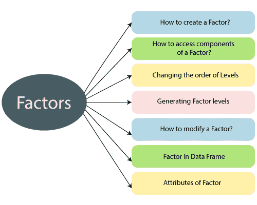

# R 元素

> 原文：<https://www.javatpoint.com/r-factors>

因子是一种数据结构，用于只取预定义的有限数量值的字段。这些变量采用有限数量的不同值。这些数据对象用于对数据进行分类，并将其存储在多个级别上。它可以存储整数和字符串值，并且在唯一值数量有限的列中非常有用。



因子具有与存储在其中的唯一整数相关联的标签。它包含预定义的设置值，称为级别，默认情况下，R 总是按字母顺序对级别进行排序。

## 因子的属性

R 中的因子有以下属性


1.  **X**
    是要转化为因子的输入向量。
2.  **等级**
    它是一个输入向量，表示一组由 x 取的唯一值
3.  **标签**
    是对应标签数量的字符向量。
4.  **排除**
    用于指定我们想要排除的值，
5.  **有序**
    这是一个逻辑属性，决定了等级是否有序。
6.  **nmax**
    用于指定最大级别数的上限。

## 如何创造一个因素？

在 R 中，创建一个因子相当简单。因子分两步创建

1.  第一步，我们创建一个向量。
2.  下一步是将向量转换成因子，

r 提供 factor()函数将向量转换为因子。factor()函数有以下语法

```

factor_data
```

让我们看一个例子来理解因子函数是如何使用的。

**例**

```

# Creating a vector as input.
data 
```

**输出**

```
[1] "Shubham" "Nishka"  "Arpita"  "Nishka"  "Shubham" "Sumit"   "Nishka"
 [8] "Shubham" "Sumit"   "Arpita"  "Sumit"
[1] FALSE
 [1] Shubham Nishka Arpita Nishka Shubham Sumit Nishka Shubham Sumit
[10] Arpita Sumit
Levels: Arpita Nishka Shubham Sumit
[1] TRUE

```

## 访问因子的组成部分

像向量一样，我们可以获得因子的分量。访问因子的组成部分的过程更类似于向量。我们可以借助索引方法或使用逻辑向量来访问元素。让我们看一个例子，在这个例子中，我们理解了访问组件的不同方式。

**例**

```

# Creating a vector as input.
data 
```

**输出**

```
[1] Shubham Nishka Arpita Nishka Shubham Sumit Nishka Shubham Sumit
[10] Arpita Sumit
Levels: Arpita Nishka Shubham Sumit

[1] Nishka
Levels: Arpita Nishka Shubham Sumit

[1] Shubham Nishka
Levels: Arpita Nishka Shubham Sumit

 [1] Shubham Nishka Arpita Shubham Sumit Nishka Shubham Sumit Arpita
[10] Sumit
Levels: Arpita Nishka Shubham Sumit

[1] Shubham Shubham Sumit Nishka Sumit
Levels: Arpita Nishka Shubham Sumit

```

## 因子的修正

像数据帧一样，R 允许我们修改因子。我们可以通过简单地重新赋值来修改因子的值。在 R 中，我们不能选择其预定义级别之外的值，这意味着如果它的级别不在它上面，我们就不能插入值。为此，我们必须创造一个价值水平，然后我们可以把它加入到我们的因素中。

让我们看一个例子来理解修改是如何在因子中完成的。

**例**

```

# Creating a vector as input.
data 
```

**输出**

```
[1] Shubham Nishka Arpita Nishka Shubham
Levels: Arpita Nishka Shubham
[1] Shubham Nishka Arpita Arpita Shubham
Levels: Arpita Nishka Shubham
Warning message:
In `[ Shubham
Levels: Arpita Nishka Shubham
[1] Shubham Nishka Arpita Gunjan Shubham
Levels: Arpita Nishka Shubham Gunjan

```

## 数据框中的因素

当我们创建一个包含一列文本数据的框架时，R 将该文本列视为分类数据，并在其上创建因子。

**例**

```

# Creating the vectors for data frame.
height 
```

**输出**

```
height weight gender
1    132     40   male
2    162     49   male
3    152     48 female
4    166     40 female
5    139     67   male
6    147     52 female
7    122     53   male
[1] TRUE
[1] male   male   female female male   female male
Levels: female male

```

## 更改级别的顺序

在 R 中，我们可以借助因子函数来改变因子中的层次顺序。

**例**

```

data 
```

**输出**

```
[1] Nishka Gunjan Shubham Arpita Arpita Sumit Gunjan Shubham
Levels: Arpita Gunjan Nishka Shubham Sumit
[1] Nishka Gunjan Shubham Arpita Arpita Sumit Gunjan Shubham
Levels: Gunjan Nishka Arpita Shubham Sumit

```

## 生成因子级别

r 提供 gl()函数来生成因子等级。这个函数接受三个参数，即 n、k 和标签。这里，n 和 k 是整数，表示我们需要多少级，每级需要多少次。

gl()函数的语法如下

```

gl(n, k, labels)

```

1.  n 表示层数。
2.  k 表示复制次数。
3.  标签是结果因子水平的标签向量。

**例**

```

gen_factor
```

**输出**

```
[1] BCA BCA BCA BCA BCA MCA MCA MCA MCA MCA
[11] B.Tech B.Tech B.Tech B.Tech B.Tech
Levels: BCA MCA B.Tech

```

* * *