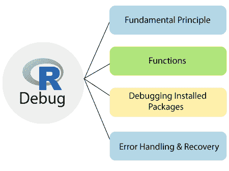
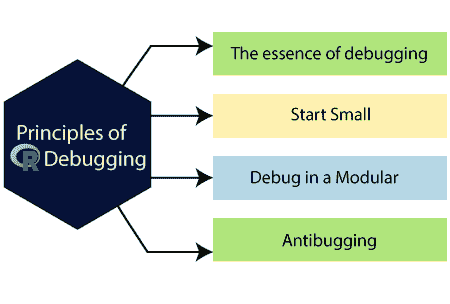
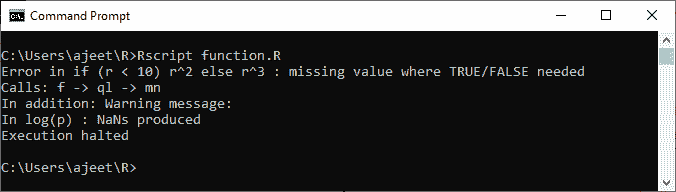
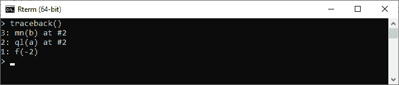
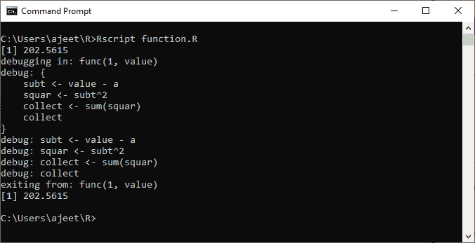
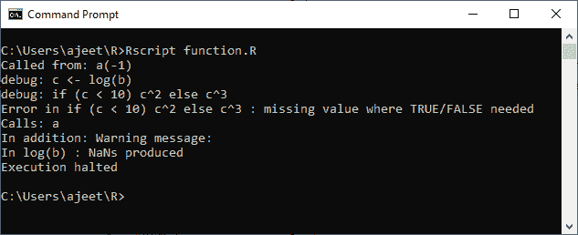
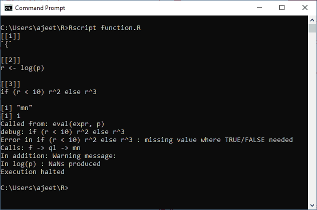
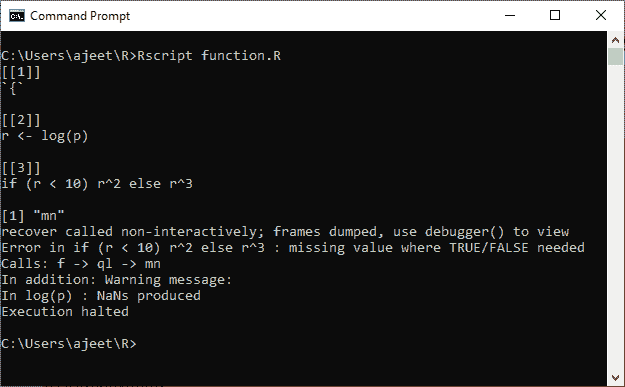

# 什么是 R 调试？

> 原文：<https://www.javatpoint.com/r-debugging>

在计算机编程中，调试是一个多步骤的过程，包括识别问题，隔离问题的来源，然后修复问题或确定解决问题的方法。调试的最后一步是测试改进或变通方法，并确保其有效。

语法正确的程序可能会给我们不正确的结果，因为一些逻辑错误被称为“**错误**”在这种情况下，如果发生这样的错误，那么我们需要找出它们发生的原因和位置，以便我们可以修复它们。识别和修复 bug 的过程称为“**调试**”



## 调试的基本原则

r 程序员发现，他们花在调试程序上的时间比实际编写或编写程序要多。这使得调试技能的价值降低。在 R 语言中，有各种各样的调试原则，帮助程序员把时间花在编写和编码上，而不是调试上。这些原则如下:



### 1.调试的本质

修理窃听器是一个确认的过程。它逐渐证实了我们认为代码真实的许多方面实际上是真实的。当发现一个这样的假设是错误的时，我们在那里找到了一个关于 bug 位置的线索。

**例如**

```

a  0) 
t
```

### 2.从小处着手

坚持小的、简单的测试用例，至少在 R 调试过程的开始。使用大数据对象可能会使问题难以思考。当然，我们最终应该在大的、复杂的情况下测试我们的代码，但是从小处着手。

### 3.模块化调试

Most professional software developers agree that the code should be written in a modular manner. Our first-level code should not be too long for a function call. And those functions should not be too long and should call another function if necessary. This makes the code easier to write and helps others understand when the time comes to extend the code.

我们应该以自上而下的方式进行调试。假设我们有函数 f()的调试状态，它有下面一行。

**例如**

```

Y 
```

目前，拒绝调试(g)。执行该行，看看 g()是否返回我们期望的值。如果发生这种情况，我们只需通过 g()来避免单步耗时的过程。如果 g()返回不正确的值，现在是调用 debug (g)的时候了。

### 4.防错法

如果代码中有一部分变量 z 应该是正数，那么我们可以插入下面一行以获得更好的性能:

Stopifnot(z>0)

当代码中有一个错误，比如 z 值等于-3，那么调用**stopiffnot()**函数，它将把事情带在那里，并显示一条错误消息:

错误:x>0 不是真

## 功能

在 R 中，为了调试的目的，有很多可用的函数。这些函数在消除代码中的错误方面发挥着重要作用。r 提供以下调试功能:

### 1)回溯()

如果我们的代码已经崩溃，并且我们想知道攻击线在哪里，请尝试回溯()。这将(有时)显示问题代码中某处的位置。当 R 功能失败时，屏幕上会显示一个错误。错误发生后，我们可以立即调用 traceback()来查看错误发生在哪个函数上。traceback()函数打印错误发生前调用的函数列表。功能以相反的顺序打印。

让我们看一个例子来理解我们如何使用 traceback()函数

**例**

```

f 
```

当我们运行上述代码时，它将生成以下输出:



在发现以下错误后，我们调用 traceback()函数，当我们运行时，它将显示以下输出:

```
traceback()

```



### 2)调试()

在 R 语言中，debug()函数允许用户逐步执行一个函数。在任何时候，我们都可以打印变量的值，或者在函数中绘制结果图。调试时，我们只需键入“c”就可以继续到当前代码块的末尾。Traceback()不会告诉我们函数错误发生在哪里。要知道是哪一行导致了错误，我们必须使用 debug()单步调试函数。

让我们看一个例子来理解调试函数在 r。

**例**

```

func
```

**输出**



### 3)浏览器()

browser()函数中止函数的执行，直到用户允许它继续。如果我们不想一行一行地浏览完整的代码，但是我们希望在某个点停止它，这样我们就可以检查发生了什么。

在函数的浏览器()中插入调用将在调用浏览器()时暂停函数的执行。这与使用 debug()相同，只是我们可以控制执行暂停的位置。

让我们看一个例子来理解浏览器()函数是如何在 r。

**例**

```

a
```

**输出**



### 4)痕迹()

trace()函数调用允许用户向函数中插入代码位。R 调试函数 trace()的语法对于第一次使用的用户来说有点笨拙。最好使用 debug()。

让我们看一个例子来理解浏览器()函数是如何在 r。

**例**

```

f 
```

**输出**



### 5)恢复()

当我们将执行函数调试时，recover()允许我们检查上层函数中的变量。

通过在选择中键入一个数字，我们被导航到调用堆栈上的函数，并部署在浏览器环境中。

recover()函数用作错误处理程序，使用选项()进行设置(例如，采用(error = retrieval))。

当一个函数抛出一个错误时，在失败点停止执行。我们可以浏览函数调用并检查环境以找到问题的根源。

**例**

```

f 
```

**输出**



## 调试已安装的软件包

安装的 R 包可能会产生错误。我们解决问题的几种方法如下:

*   设置选项(错误=恢复)，然后代码使用 n 逐行进行。
*   在复杂的情况下，我们应该有一个函数代码的副本。在 R 中，函数输入用于打印出可以复制到文本编辑器中的函数代码。我们可以通过将它加载到全局工作区，然后执行调试来编辑它。
*   如果我们的问题没有解决，那么我们就必须下载源代码。我们还可以使用 devtools 包和 install()，load_all()函数来加快我们的过程。

## 错误处理和恢复

异常或错误处理是对中断代码流的奇数代码事件的响应过程。通常，异常处理程序的作用域以尝试开始，以捕获结束。r 为此提供了 try()和 trycatch()函数。

try()函数是 trycatch()的包装函数，它打印错误，然后继续。另一方面，trycatch()让我们可以控制错误函数，也可以选择继续函数的过程。

* * *