# CSV 文件

> 原文：<https://www.javatpoint.com/r-csv-files>

一个**逗号分隔值(CSV)文件**是一个包含数据列表的纯文本文件。这些文件通常用于不同应用程序之间的数据交换。例如，数据库和联系人管理器大多支持 CSV 文件。

这些文件有时可以称为**字符分隔值**或**逗号分隔文件**。他们经常使用逗号字符来分隔数据，但有时也会使用分号等其他字符。这个想法是，我们可以将复杂的数据从一个应用程序导出到一个 CSV 文件，然后将该 CSV 文件中的数据导入到另一个应用程序。

在 excel 电子表格中存储数据是数据科学家最常用的数据存储方式。R 中有许多用于从 excel 电子表格中访问数据的包。用户通常会发现将电子表格保存在逗号分隔的值文件中，然后使用 R 的内置功能来读取和操作数据更容易。

R 允许我们从存储在 R 环境之外的文件中读取数据。让我们开始了解如何将数据读写到 CSV 文件中。该文件应该存在于当前工作目录中，以便 R 可以读取它。我们也可以设置我们的目录并从那里读取文件。

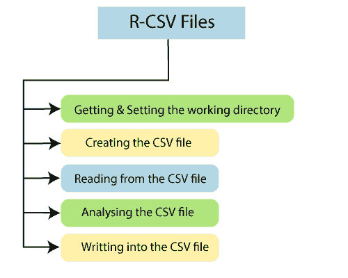

## 获取和设置工作目录

在 R 中，getwd()和 setwd()是两个有用的函数。getwd()函数用于检查 R 工作区指向哪个目录。setwd()函数用于设置一个新的工作目录，以便从该目录中读写文件。

让我们看一个例子来理解 getwd()和 setwd()函数是如何使用的。

**例**

```

# Getting and printing current working directory.
print(getwd())
# Setting the current working directory.
setwd("C:/Users/ajeet")
# Getting and printingthe current working directory.
print(getwd())

```

**输出**

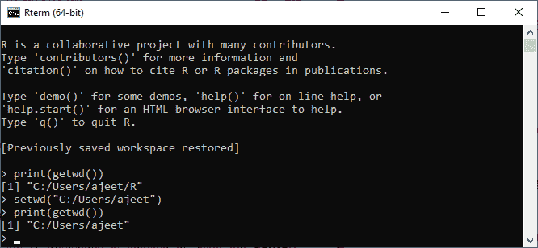

## 创建 CSV 文件

用逗号分隔列中值的文本文件称为 CSV 文件。让我们首先在数据的帮助下创建一个 CSV 文件，这将在下面通过使用保存来提及。使用另存为所有文件(*)的 csv 扩展名。*)选项。

**示例:record.csv**

```

id,name,salary,start_date,dept
1,Shubham,613.3,2012-01-01,IT
2,Arpita,525.2,2013-09-23,Operations
3,Vaishali,63,2014-11-15,IT
4,Nishka,749,2014-05-11,HR
5,Gunjan,863.25,2015-03-27,Finance
6,Sumit,588,2013-05-21,IT
7,Anisha,932.8,2013-07-30,Operations
8,Akash,712.5,2014-06-17,Financ

```

**输出**

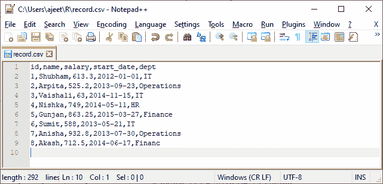

## 正在读取 CSV 文件

r 有一套丰富的函数。r 提供了 read.csv()函数，该函数允许我们读取当前工作目录中可用的 csv 文件。该函数将文件名作为输入，并返回文件名上的所有记录。

让我们使用 record.csv 文件，使用 read.csv()函数从其中读取记录。

**例**

```

data 
```

当我们执行上述代码时，它将给出以下输出

**输出**

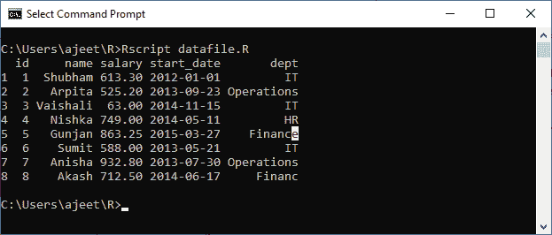

## 分析 CSV 文件

当我们从。csv 文件使用 **read.csv()** 函数，默认情况下，它以数据帧的形式给出输出。在分析数据之前，让我们借助 **is.data.frame()** 函数开始检查输出的形式。之后，我们将借助 **nrow()** 和 **ncol()** 功能检查行数和列数。

**例**

```

csv_data
```

当我们运行上述代码时，它将生成以下输出:

**输出**

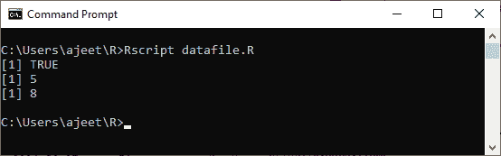

从上面的输出中，很明显我们的数据是以数据帧的形式读取的。因此，我们可以应用数据框的所有功能，这在前面几节中已经讨论过了。


**例:拿最高工资**

```

# Creating a data frame.
csv_data
```

**输出**

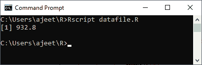

**示例:获取最高工资人员的详细信息**

```

# Creating a data frame.
csv_data
```

**输出**

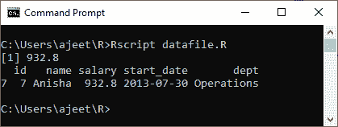

**示例:获取在 IT 部门工作的所有人员的详细信息**

```

# Creating a data frame.
csv_data
```

**输出**

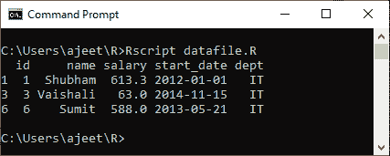

**示例:获取薪资大于 600 且在 IT 部门工作的人员的详细信息。**

```

# Creating a data frame.
csv_data600)
print(details)

```

**输出**

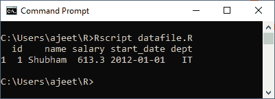

**示例:获取 2014 年或之后加入的人的详细信息。**

```

# Creating a data frame.
csv_dataas.Date("2014-01-01"))
print(details)

```

**输出**

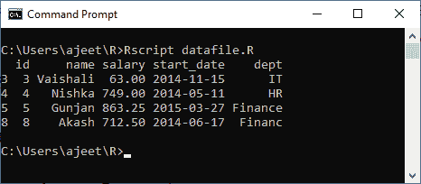

## 写入 CSV 文件

像阅读和分析一样，R 也允许我们写入。csv 文件。为此，R 提供了 write.csv()函数。该函数从现有的数据框创建一个 CSV 文件。该函数在当前工作目录中创建文件。

我们来看一个例子，了解一下 **write.csv()** 函数是如何创建输出 csv 文件的。

**例**

```

csv_dataas.Date("2014-01-01"))

# Writing filtered data into a new file.
write.csv(details,"output.csv")
new_details
```

**输出**

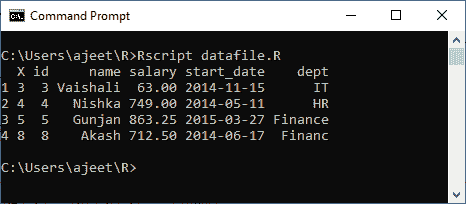

* * *