# 数据库

> 原文：<https://www.javatpoint.com/r-database>

在关系数据库管理系统中，数据以规范化的格式存储。因此，为了完成统计计算，我们需要非常高级和复杂的 SQL 查询。以表的形式出现的大量数据需要 SQL 查询来从中提取数据。

r 可以很容易地连接到许多关系数据库，如 MySql、SQL Server、Oracle 等。当我们从这些数据库中提取信息时，默认情况下，信息是以数据框的形式提取的。一次，数据从数据库来到 R 环境；它将成为一个正常的 R 数据集。借助所有强大的包和函数，数据分析师可以轻松地分析或操作数据。

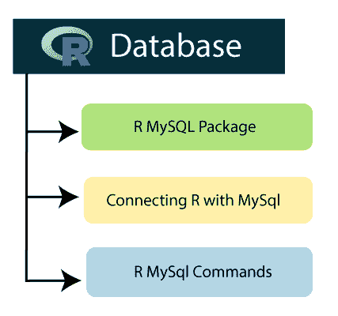

## RMySQL 包

RMySQL 包是 R 最重要的内置包之一，这个包提供了 R 和 MySQL 数据库之间的原生连接。在 R 中，要使用 MySql 数据库，我们首先必须借助熟悉的命令安装 RMySQL 包，如下所示:

```

install.packages("RMySQL")

```

当我们在 R 环境中运行上述命令时，它将开始下载 RMySQL 包。

**输出**

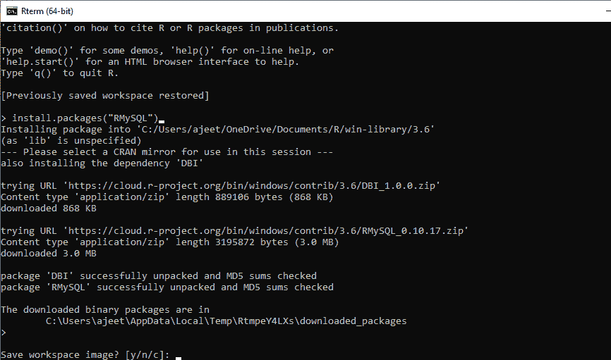

我们已经创建了一个数据库雇员，其中有一个表 employee_info，它有以下记录。

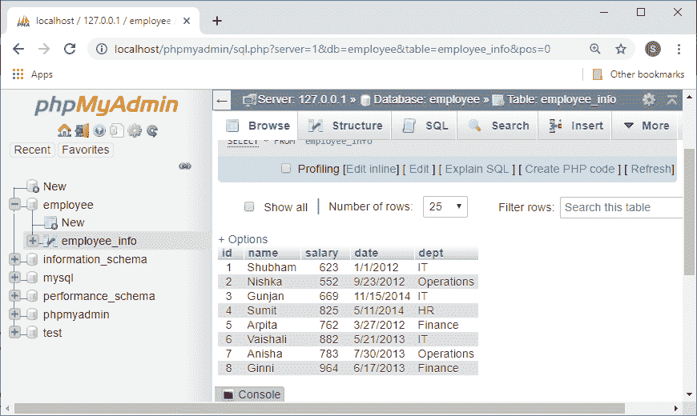

我们将在接下来的主题中使用上面提到的数据。

## 在 R 和 MySql 之间创建连接

要使用 MySql 数据库，需要在 R 和数据库之间创建一个连接对象。为了创建连接，R 提供了 **dbConnect()** 功能。该函数将用户名、密码、数据库名和主机名作为输入参数。让我们看一个例子来理解如何使用 **dbConnect()** 函数来连接数据库。

**例**

```

#Loading RMySQL package into R
library("RMySQL")

# Creating a connection Object to MySQL database.
# Conneting with database named "employee" which we have created befoe with the helpof XAMPP server.
mysql_connect = dbConnect(MySQL(), user = 'root', password = '', dbname = 'employee',
   host = 'localhost')

# Listing the tables available in this database.
 dbListTables(mysql_connect)

```

**输出**

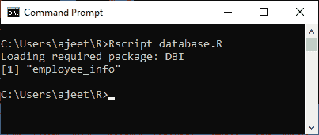

## MySQL 命令

在 R 中，我们可以执行所有的 SQL 命令，如插入、删除、更新等。为了对数据库执行查询，R 提供了 dbSendQuery()函数。查询在 MySQL 中执行，结果集使用 R fetch()函数返回。最后，它作为数据帧存储在 R 中。让我们看看每个 SQL 命令的例子，以了解如何使用 dbSendQuery()和 fetch()函数。

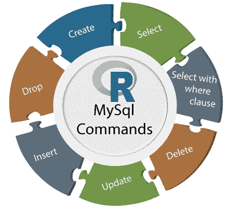

### 创建表格

r 提供了一个额外的函数来在数据库中创建一个表，即 dbWriteTable()。该函数在数据库中创建一个表；如果它不存在，它将覆盖该表。该函数将数据帧作为输入。

**例**

```

#Loading RMySQL package into R
library("RMySQL")

# Creating a connection Object to MySQL database.
# Conneting with database named "employee" which we have created befoe with the helpof XAMPP server.
mysql_connect = dbConnect(MySQL(), user = 'root', password = '', dbname = 'employee',
   host = 'localhost')

#Creating data frame to create a table 
emp.data
```

**输出**

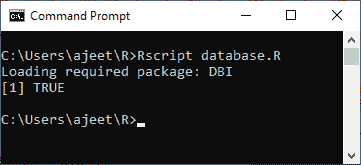
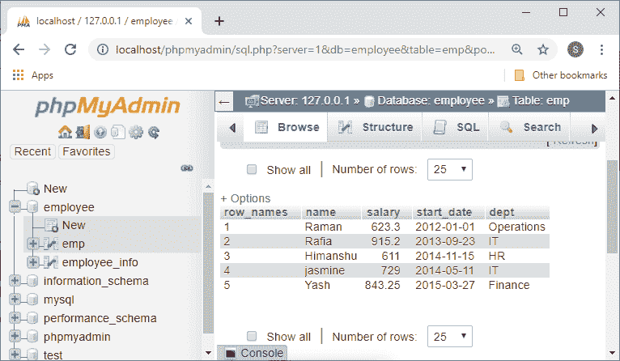

### 挑选

我们可以简单地在 fetch()和 dbSendQuery()函数的帮助下从表中选择记录。让我们看一个例子来理解如何使用这两个函数进行选择查询。

**例**

```

#Loading RMySQL package into R
library("RMySQL")

# Creating a connection Object to MySQL database.
# Conneting with database named "employee" which we have created befoe with the helpof XAMPP server.
mysql_connect = dbConnect(MySQL(), user = 'root', password = '', dbname = 'employee',
   host = 'localhost')

# selecting the record from employee_info table.
record = dbSendQuery(mysql_connect, "select * from employee_info")

# Storing the result in a R data frame object. n = 6 is used to fetch first 6 rows.
data_frame = fetch(record, n = 6)
print(data_frame)

```

**输出**

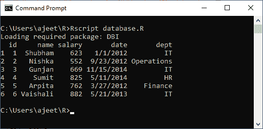

### 使用 where 子句选择

我们可以在 fetch()和 dbSendQuery()函数的帮助下从表中选择特定的记录。让我们看一个例子来理解 select 查询如何使用 where 子句和这两个函数。

**例**

```

#Loading RMySQL package into R
library("RMySQL")

# Creating a connection Object to MySQL database.
# Conneting with database named "employee" which we have created befoe with the helpof XAMPP server.
mysql_connect = dbConnect(MySQL(), user = 'root', password = '', dbname = 'employee',
   host = 'localhost')

# selecting the specific record from employee_info table.
record = dbSendQuery(mysql_connect, "select * from employee_info where dept='IT'")

# Fetching all the records(with n = -1) and storing it as a data frame.
data_frame = fetch(record, n = -1)
print(data_frame)

```

**输出**

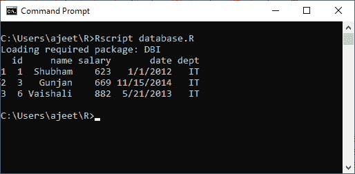

### 插入命令

我们可以在熟悉的方法 dbSendQuery()函数的帮助下将数据插入表中。

**例**

```

#Loading RMySQL package into R
library("RMySQL")

# Creating a connection Object to MySQL database.
# Conneting with database named "employee" which we have created befoe with the helpof XAMPP server.
mysql_connect = dbConnect(MySQL(), user = 'root', password = '', dbname = 'employee',
   host = 'localhost')

# Inserting record into employee_info table.
dbSendQuery(mysql_connect, "insert into employee_info values(9,'Preeti',1025,'8/25/2013','Operations')")

```

**输出**

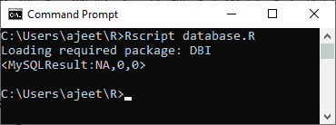
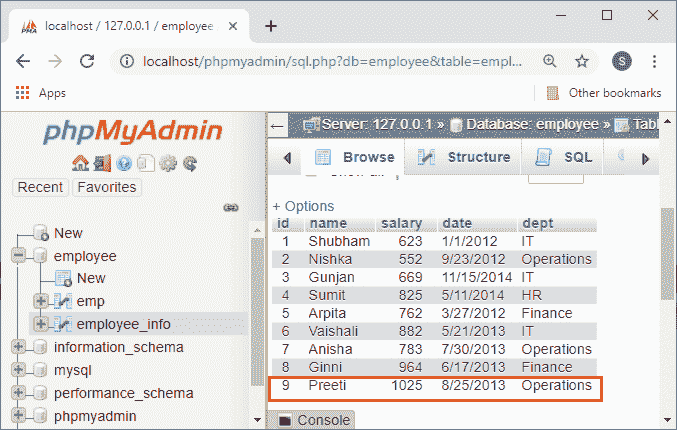

### 更新命令

更新表中的记录要容易得多。为此，我们必须将更新查询传递给 dbSendQuery()函数。

**例**

```

#Loading RMySQL package into R
library("RMySQL")

# Creating a connection Object to MySQL database.
# Conneting with database named "employee" which we have created befoe with the helpof XAMPP server.
mysql_connect = dbConnect(MySQL(), user = 'root', password = '', dbname = 'employee',
   host = 'localhost')

# Updating the record in employee_info table.
dbSendQuery(mysql_connect, "update employee_info set dept='IT' where id=9")

```

**输出**

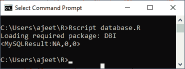
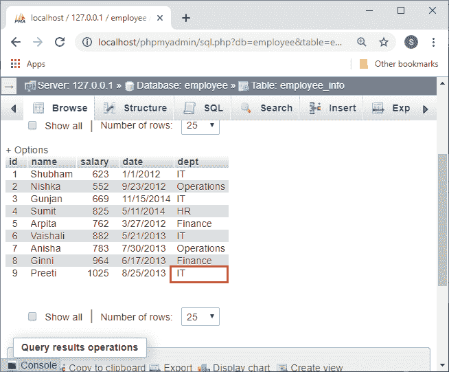

### 删除命令

下面是一个例子，在这个例子中，我们通过在 dbSendQuery()函数中传递删除查询来删除表中的特定行。

**例**

```

#Loading RMySQL package into R
library("RMySQL")

# Creating a connection Object to MySQL database.
# Conneting with database named "employee" which we have created befoe with the helpof XAMPP server.
mysql_connect = dbConnect(MySQL(), user = 'root', password = '', dbname = 'employee',
   host = 'localhost')

# Deleting the specific record from employee_info table.
dbSendQuery(mysql_connect, "delete from employee_info where id=8")

```

**输出**

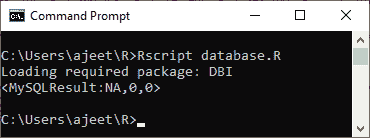
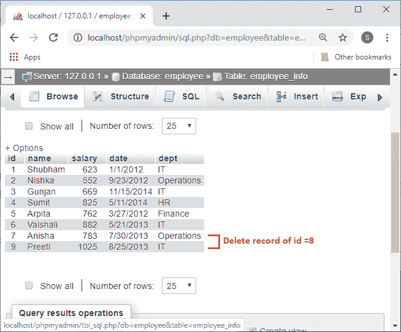

### 删除命令

下面是一个例子，在这个例子中，我们通过在 dbSendQuery()函数中传递适当的删除查询，从数据库中删除一个表。

**例**

```

#Loading RMySQL package into R
library("RMySQL")

# Creating a connection Object to MySQL database.
# Conneting with database named "employee" which we have created befoe with the helpof XAMPP server.
mysql_connect = dbConnect(MySQL(), user = 'root', password = '', dbname = 'employee',
   host = 'localhost')

# Dropping the specific table from the employee database.
dbSendQuery(mysql_connect, "drop table if exists emp")

```

**输出**

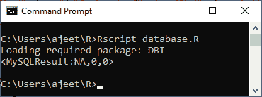
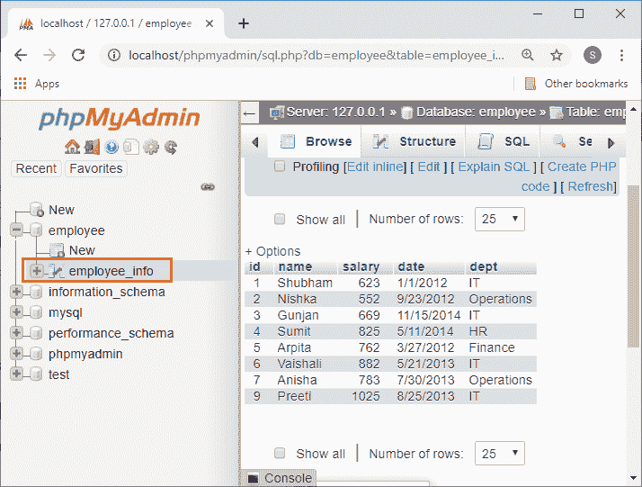

* * *