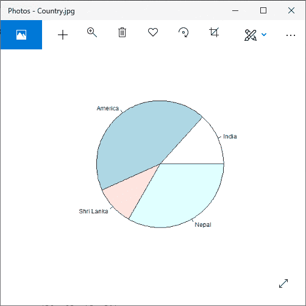
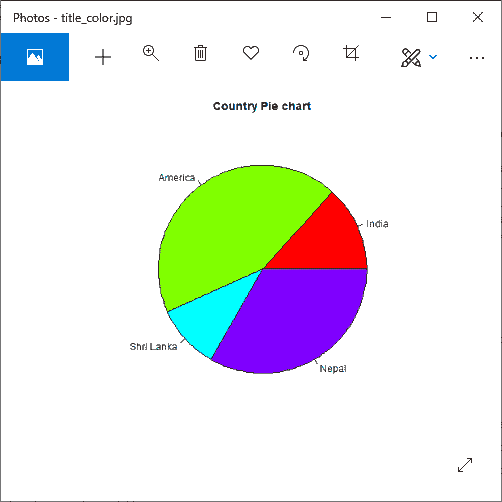
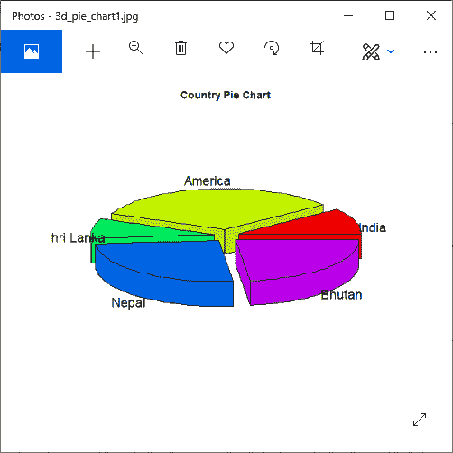
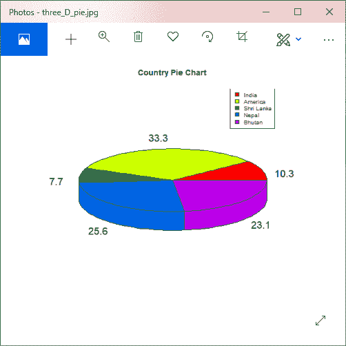

# r 饼图

> 原文：<https://www.javatpoint.com/r-pie-charts>

r 编程语言有几个用来创建图表的库。饼图是不同颜色的圆形切片形式的数值表示。切片标有描述，图表中还显示了每个切片对应的编号。但是，在 R 文档中不建议使用饼图，它们的特性是有限的。作者建议在饼图上画一个条形图或点图，因为人们能够比体积更精确地测量长度。

饼图是在饼图()函数的帮助下创建的，该函数将正数作为向量输入。附加参数用于控制标签、颜色、标题等。

pie()函数有以下语法:

```

pie(X, Labels, Radius, Main, Col, Clockwise)

```

在这里，

1.  **X** 是包含饼图中使用的数值的向量。
2.  **标签**用于对切片进行描述。
3.  **半径**描述饼图的半径。
4.  **Main** 描述图表的标题。
5.  **列**定义调色板。
6.  **顺时针**是一个逻辑值，表示绘制切片的顺时针或逆时针方向。

### 例子

```

# Creating data for the graph.
x 
```

**输出:**



## 标题和颜色

饼图还有几个功能，我们可以通过向饼图()函数添加更多参数来使用。我们可以通过传递主参数给饼图一个标题。它将饼图的标题告诉了 pie()函数。除此之外，我们可以通过传递 col 参数在绘制图表时使用彩虹色托盘。

#### 注意:托盘的长度将与图表中的数值相同。为此，我们将使用 length()函数。

让我们看一个例子来理解这些方法是如何创建一个有吸引力的带有标题和颜色的饼图的。

### 例子

```

# Creating data for the graph.
x 
```

**输出:**



## 切片百分比和图表图例

饼图还有两个附加属性，即切片百分比和图表图例。我们可以以百分比的形式显示数据，也可以使用 legend()函数将图例添加到 R 图中。legend()函数有以下语法。

```

legend(x,y=NULL,legend,fill,col,bg)

```

在这里，

*   x 和 y 是用于定位图例的坐标。
*   传说是传说的文本
*   填充是用于填充图例文本旁边的框的颜色。
*   col 定义图例文本之外的线条和点的颜色。
*   bg 是图例框的背景色。

### 例子

```

# Creating data for the graph.
x 
```

**输出:**


## 三维饼图

在 R 中，我们还可以创建一个三维饼图。为此，R 提供了一个 plotrix 包，其 pie3D()函数用于创建一个吸引人的 3D 饼图。pie3D()函数的参数与 pie()函数相同。让我们看一个例子来理解如何在这个函数的帮助下创建一个三维饼图。

### 例子

```

# Getting the library.
library(plotrix)
# Creating data for the graph.
x 
```

**输出:**



### 例子

```

# Getting the library.
library(plotrix)
# Creating data for the graph.
x 
```

**输出:**



* * *