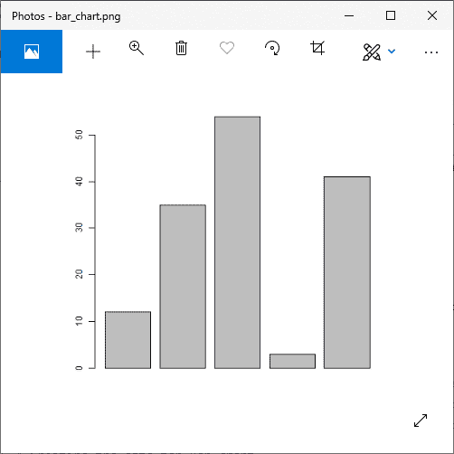
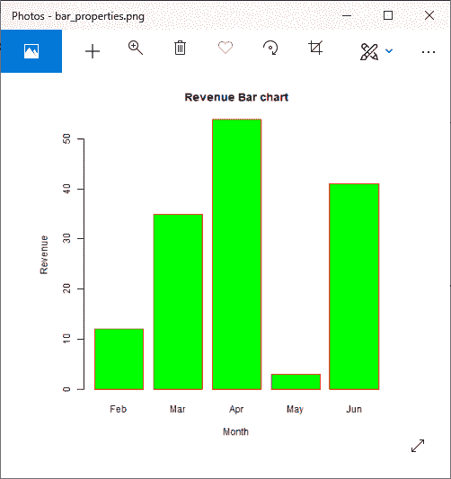
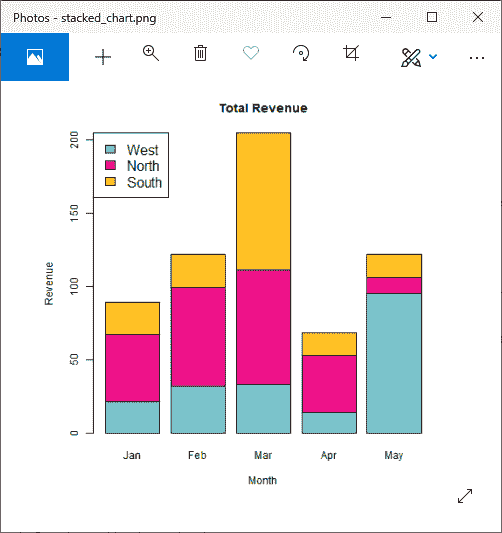

# 条形图

> 原文：<https://www.javatpoint.com/r-bar-charts>

条形图是一种图形表示，其中变量的数值由等宽的线条或矩形的长度或高度来表示。条形图用于汇总一组分类数据。在条形图中，数据通过矩形条显示，矩形条的长度与变量值成正比。

在 R 中，我们可以创建一个条形图，以高效的方式可视化数据。为此，R 提供了 barplot()函数，其语法如下:

```

barplot(h,x,y,main, names.arg,col)

```

| S.No | 参数 | 描述 |
| 1. | H | 包含条形图中使用的数值的向量或矩阵。 |
| 2. | xlab | x 轴的标签。 |
| 3. | 伊兰布 | y 轴的标签。 |
| 4. | 主要的 | 条形图的标题。 |
| 5. | names.arg | 出现在每个栏下的名称向量。 |
| 6. | 山口 | 它用于给图形中的条着色。 |

### 例子

```

# Creating the data for Bar chart
H
```

**输出:**



## 标签、标题和颜色

像饼图一样，我们也可以通过在 barplot()函数中传递更多参数来在条形图中添加更多功能。我们可以在条形图中添加标题，也可以通过分别添加 main 和 col 参数来为条形图添加颜色。我们可以添加另一个参数，即 args.name，它是一个具有相同数量值的向量，这些值作为输入向量来描述每个条的含义。

让我们看一个例子来理解标签、标题和颜色是如何添加到我们的条形图中的。

### 例子

```

# Creating the data for Bar chart
H 
```

**输出:**



## 分组条形图和堆叠条形图

我们可以使用矩阵作为每个条形图的输入值，创建带有条形组和堆栈的条形图。一个或多个变量表示为一个矩阵，用于构建分组条形图和堆叠条形图。

让我们看一个例子来理解这些图表是如何创建的。

### 例子

```

library(RColorBrewer)
months 
```

**输出:**



* * *