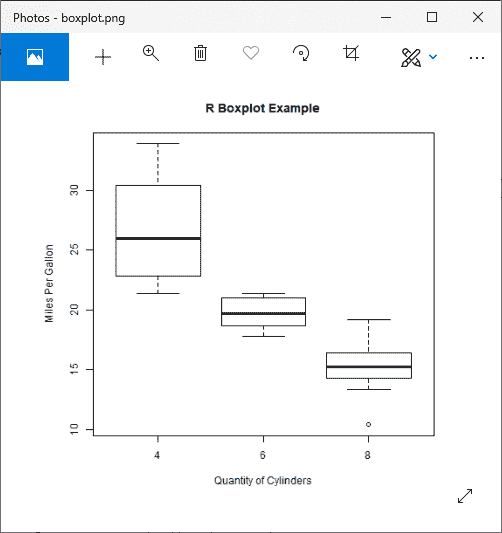
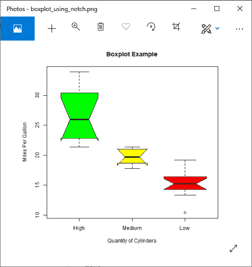
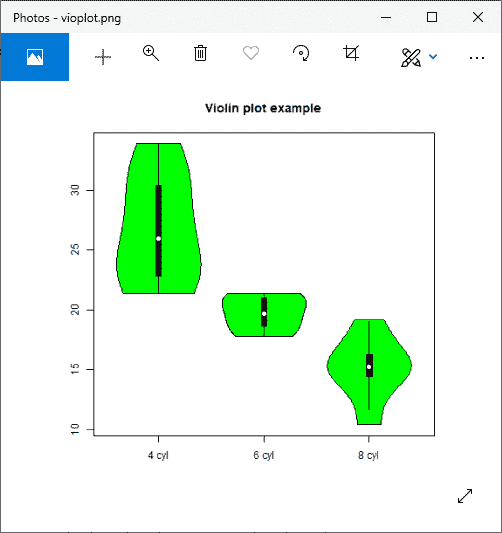
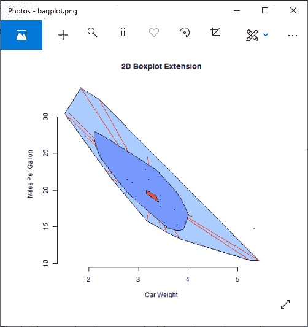

# R 箱线图

> 原文： [https://www.javatpoint.com/r-boxplot](https://www.javatpoint.com/r-boxplot)

箱线图衡量数据在数据集中的分布情况。这将数据集分为三个四分位数。该图表示数据集中的最小值、最大值、平均值、第一个四分位数和第三个四分位数。通过为每个数据集绘制箱线图，箱线图在比较数据集中的数据分布时也很有用。

r 提供 boxplot()函数来创建 boxplot。boxplot()函数有以下语法:

```

boxplot(x, data, notch, varwidth, names, main)

```

在这里，

| S.No | 参数 | 描述 |
| 1. | x | 它是一个向量或公式。 |
| 2. | 数据 | 这是数据帧。 |
| 3. | 等级 | 画一个凹口是一个逻辑值，设置为 true。 |
| 4. | 宽度(w) | 它也是一个设置为 true 的逻辑值，用于绘制与样本大小相同的框的宽度。 |
| 5. | 名称 | 它是将打印在每个箱线图下的一组标签。 |
| 6. | 主要的 | 它被用来给图表起一个标题。 |

让？让我们看一个例子来理解如何在 R 中创建一个箱线图。在下面的例子中，我们将使用 R 环境中的“mtcars”数据集。我们将只使用它的两个列，即“mpg”和“cyl”。以下示例将创建 mpg 和 cyl 之间关系的箱线图，即每加仑的英里数和气缸数。

### 例子

```

# Giving a name to the chart file.
png(file = "boxplot.png")
# Plotting the chart.
boxplot(mpg ~ cyl, data = mtcars, xlab = "Quantity of Cylinders",
        ylab = "Miles Per Gallon", main = "R Boxplot Example")

# Save the file.
dev.off()

```

**输出:**



## 使用凹口的箱线图

在 R 中，我们可以用一个凹口画一个箱线图。它帮助我们发现不同数据组的中位数是如何相互匹配的。让我们看一个例子来理解如何使用 notch 为每个组创建箱线图。

在下面的例子中，我们将使用相同的数据集？mtcars。"

### 例子

```

# Giving a name to our chart.
png(file = "boxplot_using_notch.png")
# Plotting the chart.
boxplot(mpg ~ cyl, data = mtcars, 
        xlab = "Quantity of Cylinders",
        ylab = "Miles Per Gallon", 
        main = "Boxplot Example",
        notch = TRUE, 
        varwidth = TRUE, 
        col = c("green","yellow","red"),
        names = c("High","Medium","Low")
)
# Saving the file.
dev.off()

```

**输出:**



## 小提琴情节

r 提供了一个额外的绘图方案，该方案由一个**箱线图**和一个**核密度**图组合而成。vioplot 程序包中的 vioplot()函数可以帮助创建小提琴图。

让我们看一个例子来理解小提琴情节的创作。

### 例子

```

# Loading the vioplot package 
library(vioplot)
# Giving a name to our chart.
png(file = "vioplot.png")
#Creating data for vioplot function
x1 
```

**输出:**



## 巴格图-二维箱线图扩展

**aplpack** 包中的 bagplot(x，y)函数提供了单变量 boxplot 的两年一次的版本。该包包含所有点数的 50%。二元中位数是近似值。栅栏把自己和外面的点分开，费用被显示出来。

让？让我们看一个例子来理解我们如何在 r 中创建一个二维 boxplot 扩展。

### 例子

```

# Loading aplpack package
library(aplpack)
# Giving a name to our chart.
png(file = "bagplot.png")
#Creating bagplot function
attach(mtcars)
bagplot(wt,mpg, xlab="Car Weight", ylab="Miles Per Gallon",
   main="2D Boxplot Extension")
# Saving the file.
dev.off()

```

**输出:**



* * *