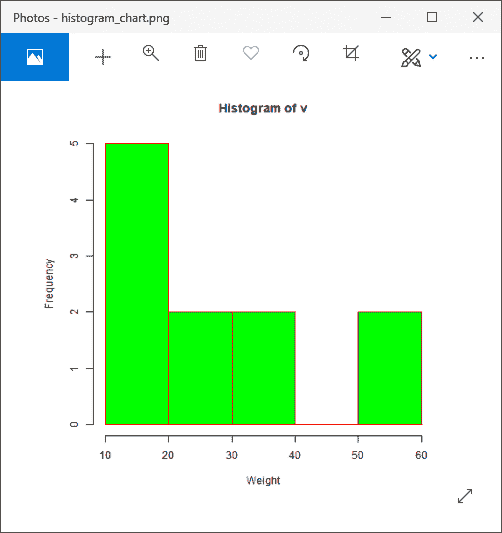
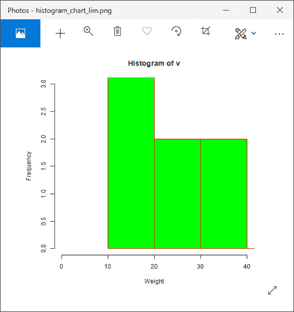
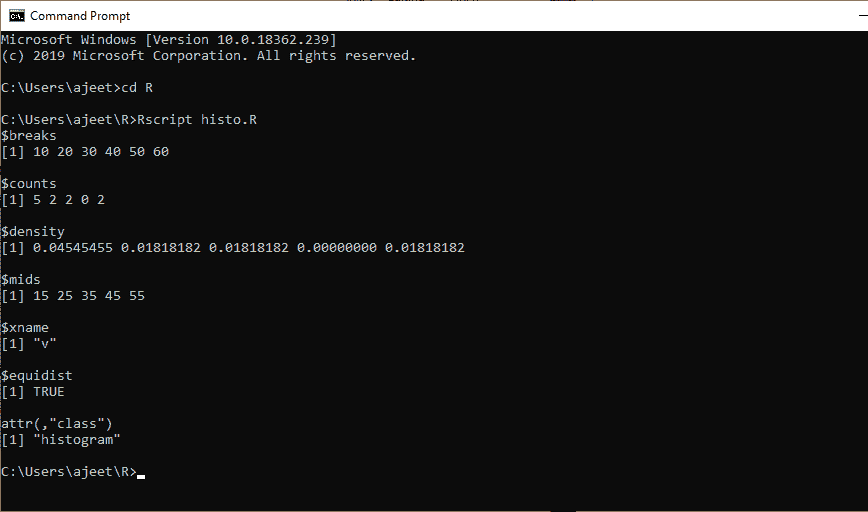
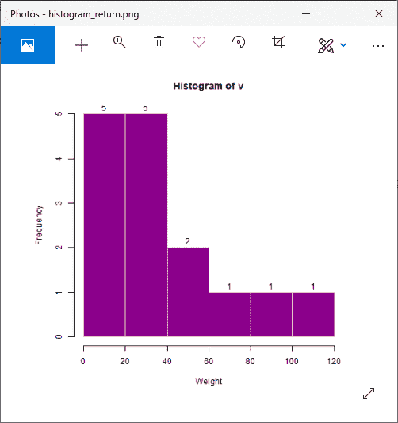
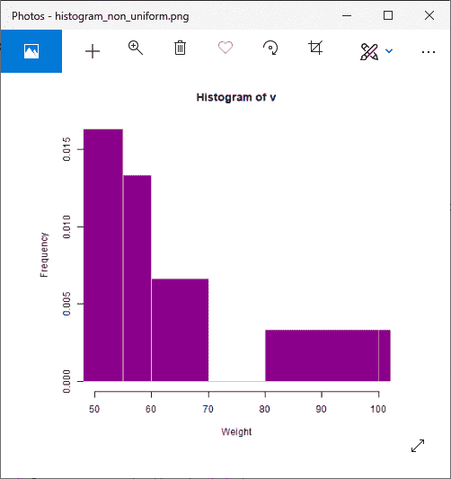

# r 直方图

> 原文：<https://www.javatpoint.com/r-histogram>

直方图是一种条形图，显示与一组数值范围进行比较的数值的频率。直方图用于分布，而条形图用于比较不同的实体。在直方图中，每个条形代表给定范围内数值的高度。

为了创建直方图，R 提供了 hist()函数，该函数以向量为输入，使用更多的参数来添加更多的功能。hist()函数有以下语法:

```

hist(v,main,xlab,ylab,xlim,ylim,breaks,col,border)

```

在这里，

| S.No | 参数 | 描述 |
| 1. | v | 它是一个包含数值的向量。 |
| 2. | 主要的 | 它表示图表的标题。 |
| 3. | 山口 | 它用于设置条形的颜色。 |
| 4. | 边界 | 它用于设置每个条形的边框颜色。 |
| 5. | xlab | 它用来描述 x 轴。 |
| 6. | 伊兰布 | 它用来描述 y 轴。 |
| 7. | xlim(构造函数) | 它用于指定 x 轴上的数值范围。 |
| 8. | 太棒了 | 它用于指定 y 轴上的数值范围。 |
| 9. | 休息 | 它用来指每一条的宽度。 |

让？让我们看一个例子，在这个例子中，我们借助所需的参数，如 v、main、col 等，创建了一个简单的直方图。

### 例子

```

# Creating data for the graph.
v 
```

**输出:**



让？让我们再看一些例子，在这些例子中，我们使用了 hist()函数的不同参数来添加更多的功能或创建一个更有吸引力的图表。

### 示例:xlim & ylim 参数的使用

```

# Creating data for the graph.
v 
```

**输出:**



### 示例:查找 hist()的返回值

```

# Creating data for the graph.
v 
```

**输出:**



### 示例:使用文本()为标签使用直方图返回值

```

# Creating data for the graph.
v 
```

**输出:**



### 示例:使用非均匀宽度的直方图

```

# Creating data for the graph.
v 
```

**输出:**



* * *