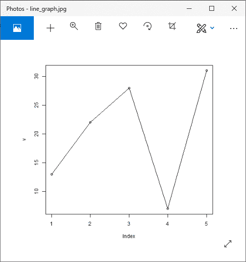
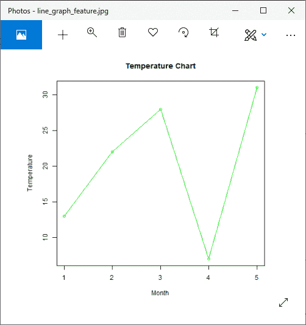
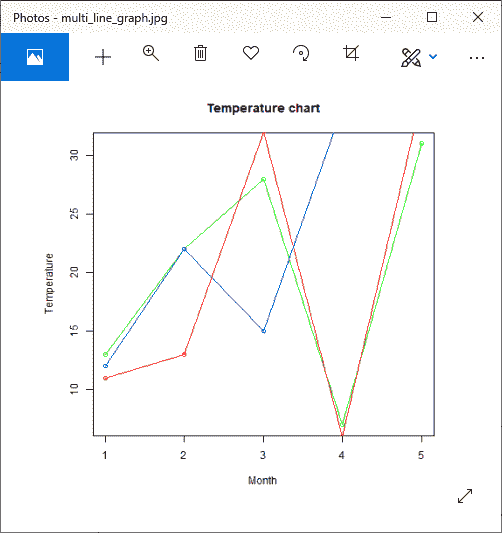
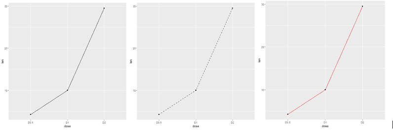

# r 线图

> 原文：<https://www.javatpoint.com/r-line-graphs>

线图是随着时间不断变化的信息的图形表示。折线图也可以称为折线图。在折线图中，有一些点连接数据以显示连续的变化。折线图中的线可以根据数据上下移动。我们可以使用折线图来比较不同的事件、信息和情况。

折线图用于通过在一系列点之间绘制线段来连接这些点。折线图用于识别数据趋势。对于线图构造，R 提供了 plot()函数，其语法如下:

```

plot(v,type,col,xlab,ylab)

```

在这里，

| S.No | 参数 | 描述 |
| 1. | v | 它是一个包含数值的向量。 |
| 2. | 类型 | 这个参数取值？我？只画线条还是？p？只画点，用“o”画线和点。 |
| 3. | xlab | 它是 x 轴的标签。 |
| 4. | 伊兰布 | 这是 y 轴的标签。 |
| 5. | 主要的 | 这是图表的标题。 |
| 6. | 山口 | 它用于为点和线提供颜色 |

让？让我们看一个基本的例子来理解如何使用 plot()函数来创建折线图:

### 例子

```

# Creating the data for the chart.
v 
```

**输出:**



## 折线图标题、颜色和标签

像其他图表一样，在折线图中，我们可以通过添加更多的参数来添加更多的特征。我们可以给线和点添加颜色，给轴添加标签，还可以给图表添加标题。让？让我们看一个例子来理解如何在 plot()函数中使用这些参数来创建一个吸引人的线图。

### 例子

```

# Creating the data for the chart.
v 
```

**输出:**



## 包含多条线的折线图

在前面的例子中，我们创建了每个图中只包含一条线的线图。r 允许我们创建一个包含多条线的线图。r 提供 lines()函数在折线图中创建一条线。

line()函数接受一个额外的输入向量来创建一条线。让？让我们看一个例子来理解这个函数是如何使用的:

### 例子

```

# Creating the data for the chart.
v 
```

**输出:**



## 使用 ggplot2 的折线图

在 R 中，还有另一种创建折线图的方法，即使用 ggplot2 包。ggplot2 包提供 geom_line()，geom_step()和 geom_path()函数来创建线图。要使用这些功能，我们首先必须安装 ggplot2 包，然后将其加载到当前的工作库中。

让？让我们看一个例子来理解如何使用 ggplot2 创建折线图。在下面的例子中，我们将使用预定义的牙齿生长数据集，该数据集描述了维生素 C 对豚鼠牙齿生长的影响。

### 例子

```

library(ggplot2)
#Creating data for the graph
data_frame
```

**输出:**



* * *