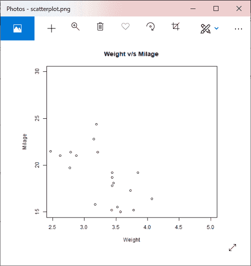
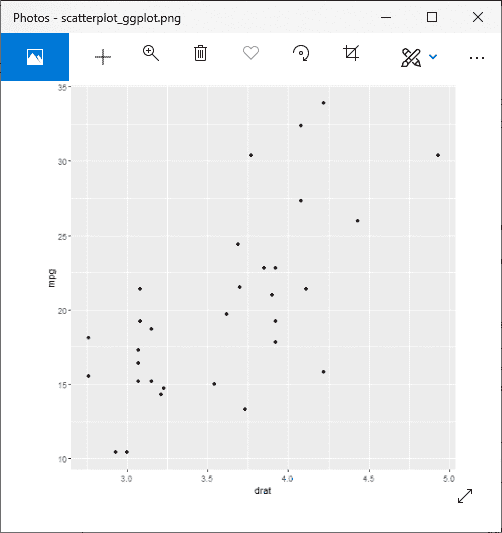
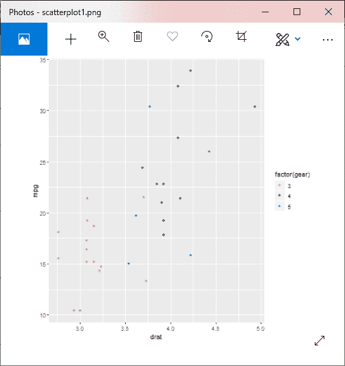
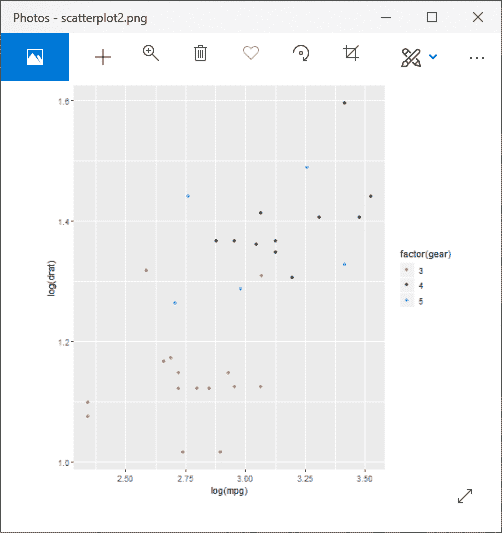
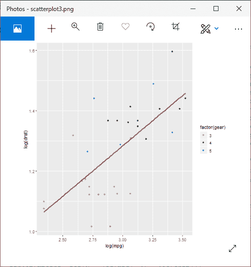
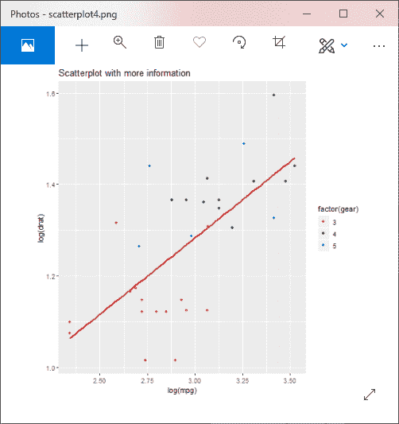
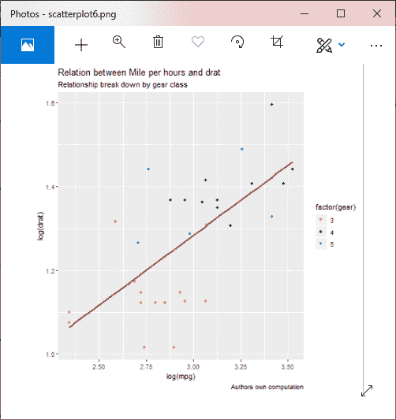
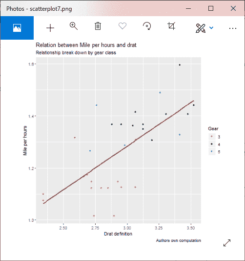
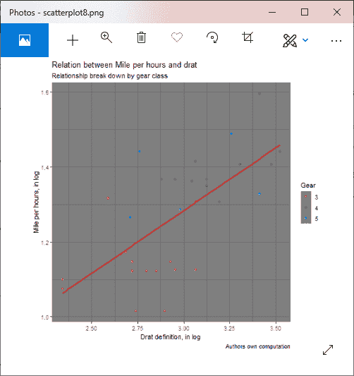

# r 出图

> 原文：<https://www.javatpoint.com/r-scatterplots>

散点图用于比较变量。当我们需要定义一个变量受另一个变量影响的程度时，需要进行变量之间的比较。在散点图中，数据表示为点的集合。散点图上的每个点定义了两个变量的值。为纵轴选择一个变量，为横轴选择另一个变量。在 R 中，有两种创建散点图的方法，即使用 plot()函数和使用 ggplot2 包的函数。

在 R 中创建散点图有以下语法:

```

plot(x, y, main, xlab, ylab, xlim, ylim, axes)

```

在这里，

| S.No | 因素 | 描述 |
| 1. | x | 它是其值为水平坐标的数据集。 |
| 2. | y | 它是其值为垂直坐标的数据集。 |
| 3. | 主要的 | 这是图表的标题。 |
| 4. | xlab | 它是横轴上的标签。 |
| 5. | 伊兰布 | 它是垂直轴上的标签。 |
| 6. | xlim(构造函数) | 用于绘图的是 x 值的极限。 |
| 7. | 太棒了 | 这是 y 值的极限，用于绘图。 |
| 8. | 轴线 | 它指示是否应该在绘图上绘制两个轴。 |

让我们看一个例子来理解我们如何使用图函数构造散点图。在我们的示例中，我们将使用数据集“mtcars”，这是 R 环境中可用的预定义数据集。

### 例子

```

#Fetching two columns from mtcars
data 
```

**输出:**



## 使用 ggplot2 的散点图

在 R 中，还有另一种创建散点图的方法，即借助 ggplot2 包。

ggplot2 包提供了用于创建散点图的 ggplot()和 geom_point()函数。函数的作用是:获取一系列输入项。第一个参数是输入向量，第二个是 aes()函数，我们在其中添加了 x 轴和 y 轴。

让我们借助一个使用熟悉的数据集“mtcars”的例子，开始了解如何使用 ggplot2 包。

### 例子

```

#Loading ggplot2 package
library(ggplot2)
# Giving a name to the chart file.
png(file = "scatterplot_ggplot.png")
# Plotting the chart using ggplot() and geom_point() functions.
ggplot(mtcars, aes(x = drat, y = mpg)) +geom_point()
# Saving the file.
dev.off()

```

**输出:**



我们可以添加更多的特征，并制作更有吸引力的散点图。下面是一些添加了不同参数的示例。

### 示例 1:带组的散点图

```

#Loading ggplot2 package
library(ggplot2)
# Giving a name to the chart file.
png(file = "scatterplot1.png")
# Plotting the chart using ggplot() and geom_point() functions.
#The aes() function inside the geom_point() function controls the color of the group.
ggplot(mtcars, aes(x = drat, y = mpg)) +
geom_point(aes(color=factor(gear)))
# Saving the file.
dev.off()

```

**输出:**



### 示例 2:轴的变化

```

#Loading ggplot2 package
library(ggplot2)
# Giving a name to the chart file.
png(file = "scatterplot2.png")
# Plotting the chart using ggplot() and geom_point() functions.
#The aes() function inside the geom_point() function controls the color of the group.
ggplot(mtcars, aes(x = log(mpg), y = log(drat))) +geom_point(aes(color=factor(gear)))
# Saving the file.
dev.off()

```

**输出:**



### 示例 3:具有拟合值的散点图

```

#Loading ggplot2 package
library(ggplot2)
# Giving a name to the chart file.
png(file = "scatterplot3.png")
#Creating scatterplot with fitted values.
# An additional function stst_smooth is used for linear regression.
ggplot(mtcars, aes(x = log(mpg), y = log(drat))) +geom_point(aes(color = factor(gear))) + stat_smooth(method = "lm",col = "#C42126",se = FALSE,size = 1)
#in above example lm is used for linear regression and se stands for standard error.
# Saving the file.
dev.off()

```

**输出:**



## 向图表中添加信息

### 示例 4:添加标题

```

#Loading ggplot2 package
library(ggplot2)
# Giving a name to the chart file.
png(file = "scatterplot4.png")
#Creating scatterplot with fitted values.
# An additional function stst_smooth is used for linear regression.
new_graph
```

**输出:**



### 示例 5:添加带有动态名称的标题

```

#Loading ggplot2 package
library(ggplot2)
# Giving a name to the chart file.
png(file = "scatterplot5.png")
#Creating scatterplot with fitted values.
# An additional function stst_smooth is used for linear regression.
new_graph
```

**输出:**


### 示例 6:添加副标题

```

#Loading ggplot2 package
library(ggplot2)
# Giving a name to the chart file.
png(file = "scatterplot6.png")
#Creating scatterplot with fitted values.
# An additional function stst_smooth is used for linear regression.
new_graph
```

**输出:**



### 示例 7:更改 x 轴和 y 轴的名称

```

#Loading ggplot2 package
library(ggplot2
# Giving a name to the chart file.
png(file = "scatterplot7.png")
#Creating scatterplot with fitted values.
# An additional function stst_smooth is used for linear regression.
new_graph
```

**输出:**



### 示例 8:添加主题

```

#Loading ggplot2 package
library(ggplot2
# Giving a name to the chart file.
png(file = "scatterplot8.png")
#Creating scatterplot with fitted values.
# An additional function stst_smooth is used for linear regression.
new_graph
```

**输出:**



* * *