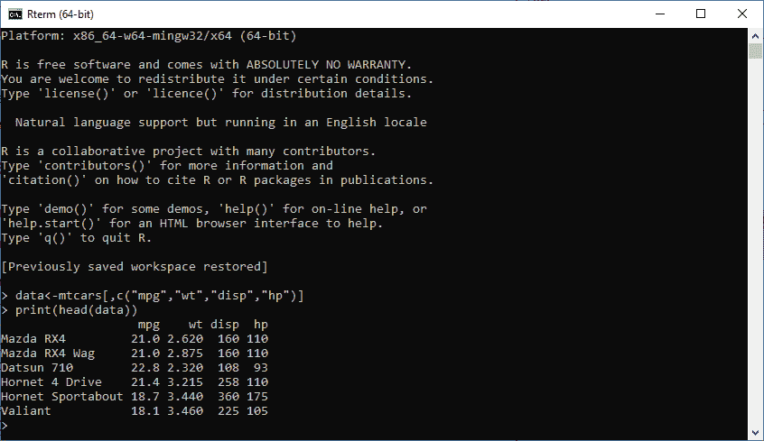
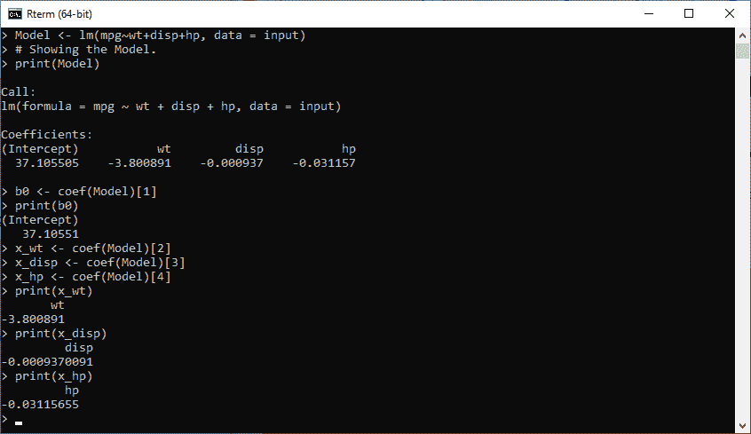
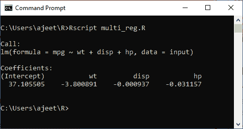

# 多元线性回归

> 原文：<https://www.javatpoint.com/r-multiple-linear-regression>

多元线性回归是简单线性回归的扩展，用于基于多个不同的预测变量(x)预测结果变量(y)。借助于三个预测变量(x1，x2，x3)，y 的预测用下面的等式表示:

y = b<sub>0</sub>+b<sub>1</sub>* x<sub>1</sub>+b<sub>2</sub>* x<sub>2</sub>+b<sub>3</sub>* x<sub>3</sub>

“b”值代表回归权重。他们测量结果和预测变量之间的关联。"

**或**

多元线性回归是线性回归在两个以上变量之间关系的延伸。在简单线性回归中，我们有一个预测因子和一个响应变量。但是在多元回归中，我们有不止一个预测变量和一个响应变量。

多元回归的一般数学方程如下

y = b<sub>0</sub>+b<sub>1</sub>* x<sub>1</sub>+b<sub>2</sub>* x<sub>2</sub>+b<sub>3</sub>* x<sub>3</sub>+⋯b<sub>n</sub>* x<sub>n</sub>

在这里，

*   **y** 是一个响应变量。
*   **b0、b1、b2...bn** 为系数。
*   **x1，x2，...xn** 是预测变量。

在 R 中，我们借助 **lm()** 函数创建回归模型。模型将在输入数据的帮助下确定系数的值。我们可以使用这些系数来预测预测变量集合的响应变量的值。

多元回归中 lm()函数的语法如下

```

lm(y ~ x1+x2+x3...., data)

```

在继续之前，我们首先为多元回归创建数据。我们将使用 R 环境中的“mtcars”数据集。该模型的主要任务是建立“mpg”作为响应变量与“wt”、“disp”和“hp”作为预测变量之间的关系。

为此，我们将从“mtcars”数据集中创建这些变量的子集。

```

data
```

**输出:**



## 创建关系模型和寻找系数

现在，我们将使用之前创建的数据来创建关系模型。我们将使用 lm()函数，该函数接受两个参数，即公式和数据。让我们开始理解 lm()函数是如何用来创建关系模型的。

**例**

```

#Creating input data.
input 
```

**输出:**

从上面的输出可以清楚地看到，我们的模型已经成功建立。现在，我们的下一步是在模型的帮助下找到系数。

```
b0
```

**输出:**



## 回归模型的方程

现在，我们有系数值和截距。让我们开始创建一个数学方程，用于预测新值。首先，我们将创建一个方程，然后当提供一组新的重量、排量和马力值时，我们使用该方程来预测里程。

让我们看一个例子，在这个例子中，我们预测了一辆重量=2.51，disp=211，hp=82 的汽车的行驶里程。

**例**

```

#Creating equation for predicting new values.
y=b0+x_wt*x1+x_disp*x2+x_hp*x3\
#Applying equation for prediction new values
y=b0+x_wt*2.51+x_disp*211+x_hp*82

```

**输出:**



* * *