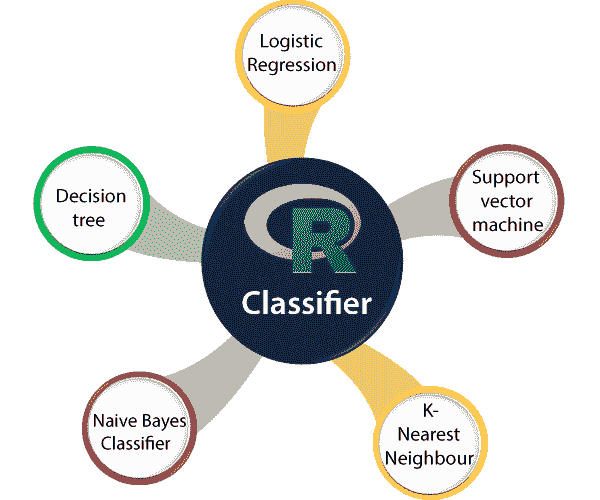

# r 分类

> 原文：<https://www.javatpoint.com/r-classification>

分类算法的思想非常简单。我们通过分析训练数据集来预测目标类。我们使用训练数据集来获得更好的边界条件，可以用来确定每个目标类。一旦边界条件确定，下一个任务就是预测目标类。整个过程被称为分类。

分类算法有一些要点:

*   **分类器**
    是将输入数据映射到特定类别的算法。
*   **分类模型**
    分类模型试图从为训练给出的输入值中得出一些结论。这个结论将预测新数据的类标签/类别。
*   **特征**
    它是被观察事件的一个单独的可测量属性。
*   **二元分类**
    这是一个有两种可能结果的分类任务。例如，性别分类，它只有两种可能的结果，即男性和女性。
*   **多类分类**
    是两类以上进行分类的分类任务。多类分类的一个例子是:动物可以是狗或猫，但不能同时是狗和猫。
*   **多标签分类**
    这是一个分类任务，其中每个样本都映射了一组目标标签。多标签分类的一个例子是:一篇可以同时关于一个人、地点和运动的新闻文章。

## 分类算法的类型

在 R 中，分类算法大致分为以下类型:

*   **线性分类器**
    在机器学习中，统计分类的主要任务是利用一个对象的特征来寻找它属于哪个类。这个任务是通过基于特征的线性组合的值做出分类决策来实现的。在 R 中，有如下三种线性分类算法:
    1.  逻辑回归
    2.  朴素贝叶斯分类器
    3.  费希尔线性判别式
*   **支持向量机**
    支持向量机是一种有监督的学习算法，它分析用于分类和回归分析的数据。在 SVM，每个数据项被绘制成 n 维空间中的一个点，每个属性的值，即特定坐标的值。
    **最小二乘支持向量机**是 r
*   **二次分类器**
    二次分类算法基于贝叶斯定理。这些分类器算法在分类方法上不同于逻辑回归。在逻辑回归中，对于特定的观测值(X = x)，可以直接推导出一类观测值(Y = k)的概率。但是在二次分类中，观察是按照以下两个步骤进行的:
    1.  在第一步中，我们为每个组或类识别输入 X 的分布。
    2.  之后，我们借助贝叶斯定理翻转分布，计算概率。
*   **核估计**
    核估计是估计连续随机变量的**概率密度函数** (PDF)的非参数方式。它是非参数的，因为它假设变量没有隐式分布。本质上，在每个基准上，创建一个以基准为中心的核心函数。它确保内核关于基准对称。然后，通过将所有这些核函数相加并除以数据的数量来估计 PDF，以确保它满足 PDF 的两个属性:在 R 中，k 最近邻是用于分类的最常用的核估计算法。
    1.  PDF 的每个可能值都应该是非负值。
    2.  PDF 在其支持集上的固定积分应该等于 1。In R, the k-nearest neighbor is the most used kernel estimation algorithm for classification.
*   **决策树**
    决策树是一种监督学习算法，用于分类和回归任务。在 R 中，决策树分类器是在 R 机器学习脱字符号包的帮助下实现的。随机森林算法是 r
*   **神经网络**
    神经网络是另一种分类器算法，其灵感来自人脑，用于执行特定的任务或功能。这些算法主要用于 r .中的图像分类。要实现神经网络算法，我们必须安装**神经网络**包。
*   **学习矢量量化**
    学习矢量量化是一种分类算法，用于二进制和多类问题。通过学习训练数据集，LVQ 模型创建了表示类区域的码本向量。它们包含根据匹配级别放置在相应类周围的元素。如果元素匹配，它将移近目标类，如果不匹配，它将继续。

* * *