# 时间序列分析

> 原文：<https://www.javatpoint.com/r-time-series-analysis>

任何在固定时间间隔内测量的度量都会创建一个时间序列。由于产业的必要性和相关性，时间序列分析在商业上很重要，特别是在预测方面(需求、供应和销售等)。).其中每个数据点与时间戳相关联的一系列数据点称为时间序列。

股票市场上一天中不同时间点的股价是时间序列中最简单的例子。一年中不同月份一个地区的降雨量就是另一个例子。r 提供了几个用于创建、操作和绘制时间序列数据的函数。在 R 对象中，时间序列数据被称为时间序列对象。它就像一个矢量或数据帧。

## 创建时间序列

r 提供了创建时间序列的函数。ts()函数有以下语法:

```

Timeseries_object_name
```

在这里，

| S.No | 参数 | 描述 |
| 1. | 数据 | 它是包含时间序列中使用的值的向量或矩阵。 |
| 2. | 开始 | 这是第一次观察的开始时间 |
| 3. | 目标 | 这是最后一次观察的结束时间 |
| 4. | 频率 | 它指定每单位时间的观察次数。 |

让我们看一个例子来理解 ts()函数是如何用于创建时间序列的。

### 示例:

在下面的例子中，我们将考虑从 2013 年 1 月开始的某个地方的年降雪量细节。我们将创建一个为期 12 个月的 R 时间序列对象并绘制出来。

```

# Getting the data points in form of a R vector.
snowfall 
```

**输出:**

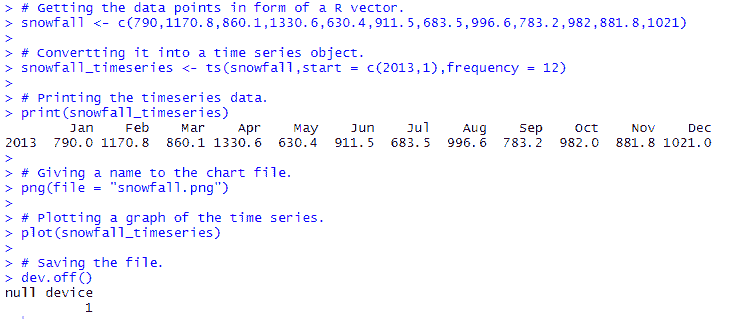
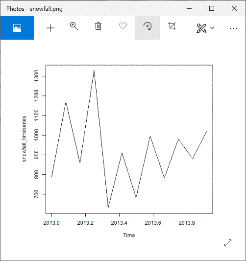

## 什么是平稳时间序列？

平稳时间序列是一个时间序列，如果:

1.  时间序列的平均值随时间是不变的。这意味着趋势组件被声明为空。
2.  方差不应随时间增加。
3.  季节性影响应该是最小的。

这意味着它没有或趋势季节性模式，这类似于随机白噪声，与观察到的时间间隔无关。

简而言之，平稳时间序列是其统计特性如均值、方差和自相关等的序列。都是不变的。

## 提取趋势、季节性和误差

我们可以将时间序列分解为三个部分，如季节性、趋势和随机波动。

时间序列分解是将一个时间序列转换成多个时间序列的数学过程。

**季节性:**

在一定时间内重复的模式

**趋势:**

矩阵的潜在趋势。

**随机:**

它是去除季节和趋势序列后的原始时间序列的残差。

## 加法和乘法分解

加法和乘法分解是用于分析序列的模型。当季节变化似乎是常数时，意味着当季节变化在时间序列的值增加时没有变化，那么我们使用加法模型，否则我们使用乘法模型。

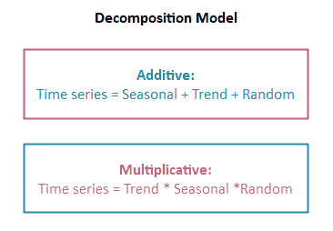

让我们看一个循序渐进的过程，了解如何使用加法和乘法模型分解时间序列。对于加性模型，我们使用 ausbeer 数据集，对于乘性模型，我们使用 AirPassengersdataset。

**第一步:加载数据并创建时间序列**

**对于加法模型**

```

#Importing library fpp
library(fpp)
#Using ausbeer data
data(ausbeer)
#Creating time series for ausbeer dataset
timeserie.beer = tail(head(ausbeer, 17*4+2),17*4-4)
# Giving a name to the chart file.
png(file = "time.png")
plot(as.ts(timeserie_beer), col="magenta")
# Saving the file.
dev.off()

```

**输出:**

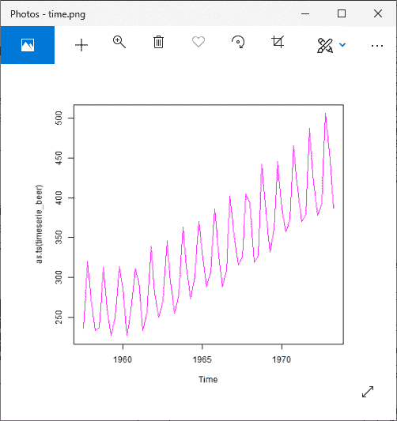

**对于乘法模型**

```

#Importing library Ecdat
library(Ecdat)
#Using AirPassengers data
data(AirPassengers)
#Creating time series  for AirPassengers dataset
timeserie_air = AirPassengers
# Giving a name to the file.
png(file = "time.png")
plot(as.ts(timeserie_air))
# Saving the file.
dev.off()

```

**输出:**

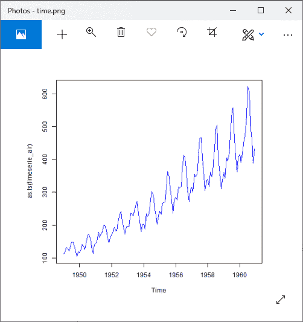

**第二步:检测趋势**

**对于加法模型**

```

#Detecting trend
trend.beer = ma(timeserie.beer, order = 4, centre = T)
# Giving a name to the file.
png(file = "time.png")
plot(as.ts(timeserie.beer),col="red")
lines(trend.beer,col="red")
plot(as.ts(trend.beer),col="red")
# Saving the file.
dev.off()

```

**输出 1:**

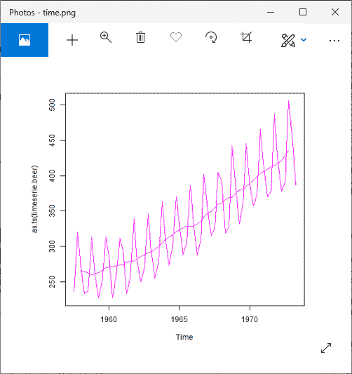

**输出 2:**


**对于乘法模型:**

```

#Detecting trend
trend.air = ma(timeserie.air, order = 12, centre = T)
# Giving a name to the file.
png(file = "time.png")
plot(as.ts(timeserie.air),col="blue")
lines(trend.air,col="blue")
plot(as.ts(trend.air),col="blue")
# Saving the file.
dev.off()

```

**输出 1:**

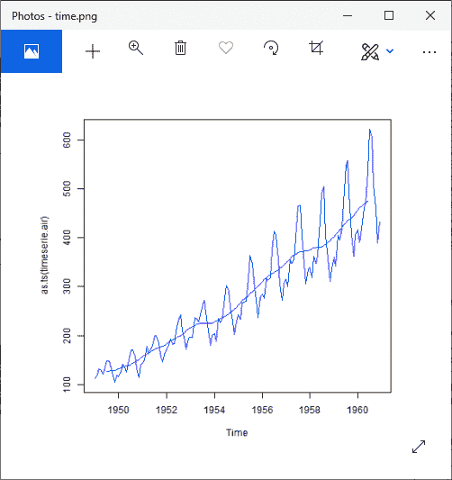

**输出 2:**

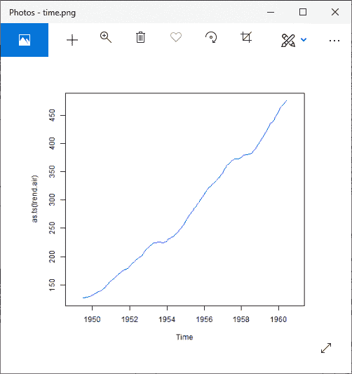

**第三步:时间序列的去趋势**

**对于加法模型**

```

#Detrend the time series.
detrend.beer=timeserie.beer-trend.beer
# Giving a name to the file.
png(file = "time.png")
plot(as.ts(detrend.beer),col="magenta")
# Saving the file.
dev.off()

```

**输出:**

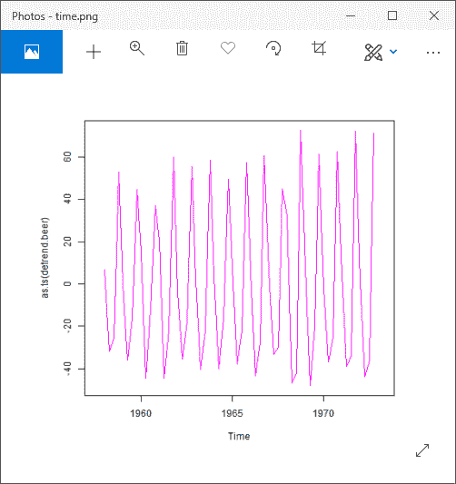

**对于乘法模型**

```

#Detrend of time series
detrend.air=timeserie.air / trend.air
# Giving a name to the file.
png(file = "time.png")
plot(as.ts(detrend.air),col="blue")
# Saving the file.
dev.off()

```

**输出:**

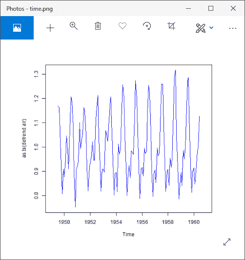

**第四步:季节性平均**

**对于加法模型**

```

#Average the seasonality
m.beer = t(matrix(data = detrend.beer, nrow = 4))
seasonal.beer = colMeans(m.beer, na.rm = T)
# Giving a name to the file.
png(file = "time.png")
plot(as.ts(rep(seasonal.beer,16)),col="magenta")
# Saving the file.
dev.off()

```

**输出:**

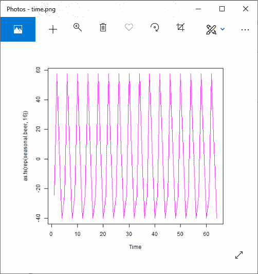

**对于乘法模型**

```

#Average the seasonality 
m.air = t(matrix(data = detrend.air, nrow = 12))
seasonal.air = colMeans(m.air, na.rm = T)
# Giving a name to the file.
png(file = "time.png")
plot(as.ts(rep(seasonal.air,12)),col="blue")
# Saving the file.
dev.off()

```

**输出:**

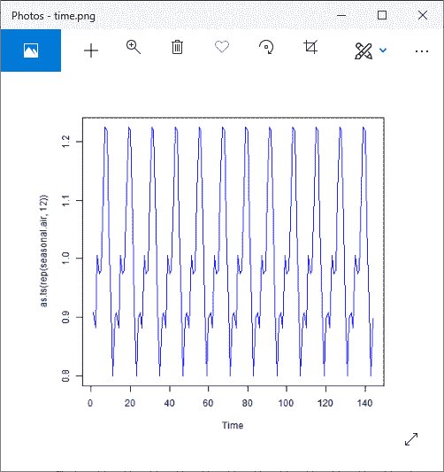

**第五步:检查剩余随机噪声**

**对于加法模型**

```

# Examining the Remaining Random Noise
random.beer = timeserie.beer - trend.beer - seasonal.beer
# Giving a name to the file.
png(file = "time.png")
plot(as.ts(rep(random.beer)),col="magenta")
# Saving the file.
dev.off()

```

**输出:**

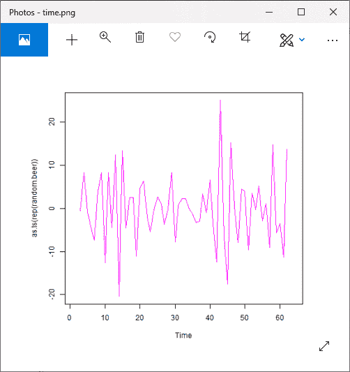

**对于乘法模型**

```

# Examining the Remaining Random Noise
random.air = timeserie.air / (trend.air * seasonal.air)
# Giving a name to the file.
png(file = "time.png")
plot(as.ts(random.air),col="blue")
# Saving the file.
dev.off()

```

**输出:**

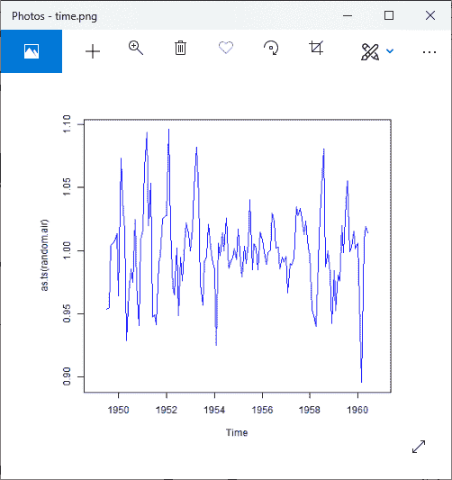

**第五步:重构原始信号**

**对于加法模型**

```

#Reconstruction of original signal
recomposed.beer=trend.beer+seasonal.beer+random.beer
# Giving a name to the file.
png(file = "time.png")
plot(as.ts(recomposed.beer),col="magenta")
# Saving the file.
dev.off()

```

**输出 1:**


**对于乘法模型**

```

#Reconstruction of original signal
recomposed.air = trend.air*seasonal.air*random.air
# Giving a name to the file.
png(file = "time.png")
plot(as.ts(recomposed.air),col="blue")
# Saving the file.
dev.off()

```

**输出:**

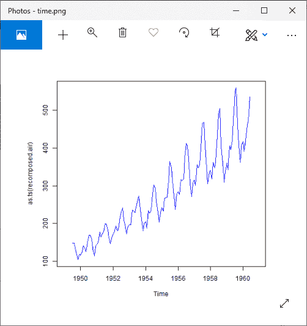

### 使用分解()进行时间序列分解

**对于加法模型**

```

#Importing libraries
library(forecast)
library(timeSeries)
library(fpp)
#Using ausbeer data
data(ausbeer)
#Creating time series
timeserie.beer = tail(head(ausbeer, 17*4+2),17*4-4)
#Detect trend
trend.beer = ma(timeserie.beer, order = 4, centre = T)
#Detrend of time series
detrend.beer=timeserie.beer-trend.beer
#Average the seasonality
m.beer = t(matrix(data = detrend.beer, nrow = 4))
seasonal.beer = colMeans(m.beer, na.rm = T)
#Examine the remaining random noise
random.beer = timeserie.beer - trend.beer - seasonal.beer
#Reconstruct the original signal 
recomposed.beer = trend.beer+seasonal.beer+random.beer
#Decomposed the time series
ts.beer = ts(timeserie.beer, frequency = 4)
decompose.beer = decompose(ts.beer, "additive")
# Giving a name to the file.
png(file = "time.png")
par(mfrow=c(2,2))
plot(as.ts(decompose.beer$seasonal),col="magenta")
plot(as.ts(decompose.beer$trend),col="magenta")
plot(as.ts(decompose.beer$random),col="magenta")
plot(decompose.beer,col="magenta")
# Saving the file.
dev.off()

```

**输出:**

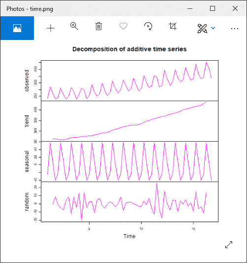

**对于乘法模型**

```

#Importing libraries
library(forecast)
library(timeSeries)
library(fpp)
library(Ecdat)
#Using Airpassengers data
data(AirPassengers)
#Creating time series
timeseries.air = AirPassengers
#Detect trend
trend.air = ma(timeseries.air, order = 12, centre = T)
#Detrend of time series
detrend.air=timeseries.air / trend.air
#Average the seasonality
m.air = t(matrix(data = detrend.air, nrow = 12))
seasonal.air = colMeans(m.air, na.rm = T)
#Examine the remaining random noise
random.air = timeseries.air / (trend.air * seasonal.air)
#Reconstruct the original signal
recomposed.air = trend.air*seasonal.air*random.air
#Decomposed the time series
ts.air = ts(timeseries.air, frequency = 12)
decompose.air = decompose(ts.air, "multiplicative")

# Giving a name to the file.
png(file = "time.png")

par(mfrow=c(2,2))

plot(as.ts(decompose.air$seasonal),col="blue")
plot(as.ts(decompose.air$trend),col="blue")
plot(as.ts(decompose.air$random),col="blue")
plot(decompose.air,col="blue")

# Saving the file.
dev.off()

```

**输出:**

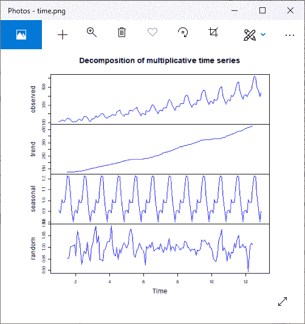

* * *