# 随机森林

> 原文：<https://www.javatpoint.com/r-random-forest>

随机森林也被称为决策树森林。它是流行的基于**决策树的**集成模型之一。这些模型的准确性高于其他决策树。该算法用于分类和回归应用。

在一个随机的森林中，我们创建了大量的决策树，在每一棵决策树中，每一个观察都被喂养。最终输出是每个观察最常见的结果。我们通过向所有树中输入新的观察值，对每个分类模型进行多数投票。

对构建树时未使用的情况进行误差估计。这被称为**袋外(OOB)** 误差估计值，以百分比表示。

决策树容易过度拟合，这是它的主要缺点。原因是，如果加深，树木能够适应数据中的所有类型的变化，包括噪声。可以通过部分修剪来解决这个问题，但结果往往不尽如人意。

r 允许我们通过提供 randomForest 包来创建随机森林。randomForest 包提供了 randomForest()函数，帮助我们创建和分析随机森林。R 中有以下随机林的语法:

```

randomForest(formula, data)

```

### 示例:

让我们开始了解 randomForest 包及其功能是如何使用的。为此，我们举了一个使用心脏病数据集的例子。让我们一步步开始我们的编码部分。

1)在第一步中，我们必须加载三个必需的库，即 ggplot2、cowplot 和 randomForest。

```

#Loading ggplot2, cowplot, and randomForest packages 
library(ggplot2)
library(cowplot)
library(randomForest)

```

2)现在，我们将使用[中的心脏病数据集。然后，从这个数据集，我们读取 CSV 格式的数据，并将其存储在变量中。](https://archive.ics.uci.edu/ml/machine-learning-databases/heart-disease/processed.cleveland.data)

```

#Fetching heart-disease dataset
url
```

3)现在，我们在 head()函数的帮助下打印数据，该函数只打印前六行，如下所示:

```

#Head print six rows of data.
head(data)

```

当我们运行上述代码时，它将生成以下输出。

**输出:**

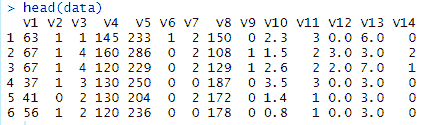

4)从上面的输出中，很明显没有任何列被标记。现在，我们命名这些列，并按照以下方式标记这些列:

```

colnames(data) 
```

**输出:**

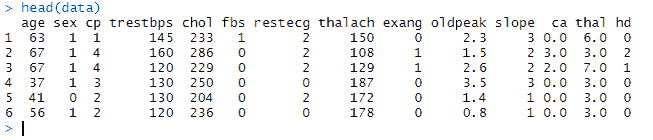

5)让我们借助 str()函数来检查数据的结构，以便更好地进行分析。

```

str(data)

```

**输出:**

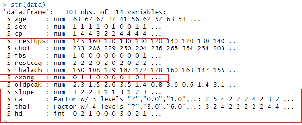

6)在上面的输出中，我们突出显示了我们将在分析中使用的那些列。从输出中可以清楚地看出，有些列是混乱的。性别应该是一个因素，其中 0 代表“女性”，1 代表“男性”。cp(胸痛)也被认为是一个因素，1 到 3 级代表不同类型的疼痛，4 级代表没有胸痛。

ca 和 thal 是因素，但其中一个级别是“？”当我们需要它是 NA 的时候。我们必须清理数据集中的数据，如下所示:

```

#Changing the "?" to NAs? 
data[data=="?"] 
```

**输出:**

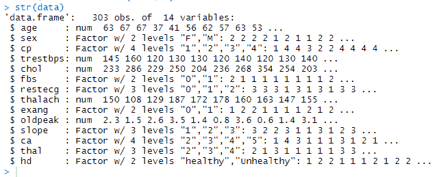

7)现在，我们通过为随机数发生器设置种子来随机采样东西，这样我们就可以再现我们的结果。

```

set.seed(42) 

```

8) NWxt，我们使用 rfImput()函数估算数据集中 NAs 的值。以下列方式:

```

data.imputed
```

**输出:**

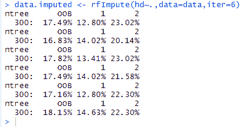

9)现在，我们通过以下方式借助 random forest()函数构建适当的随机森林:

```

Model
```

**输出:**

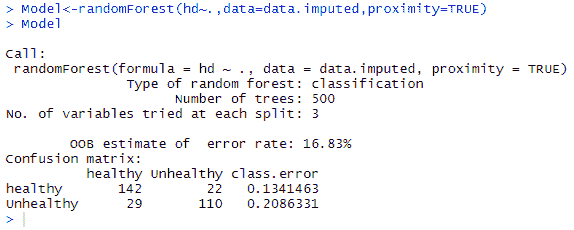

10)现在，如果 500 棵树足以进行最佳分类，我们将绘制错误率。我们创建一个数据帧，它将按照以下方式格式化错误率信息:

```

oob_error_data
```

11)我们将绘制误差率的 ggplot 称为:

```

11)	 We call the ggplot for plotting error rate in the following way:
ggplot(data=oob_error_data,aes(x=Trees,y=Error))+geom_line(aes(color=Type))

```

**输出:**

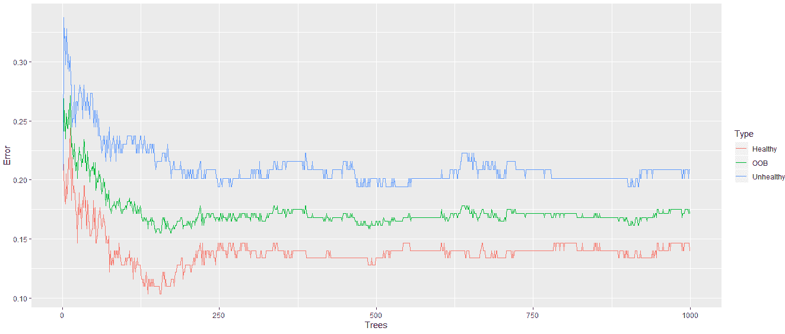

从上面的输出中，很明显，当我们的随机森林有更多的树时，错误率会降低。

12)现在，我们添加 1000 棵树，并检查错误率是否会进一步下降？所以我们用 1000 棵树做了一个随机森林，并像以前一样找到了错误率。

```

Model
```

**输出:**

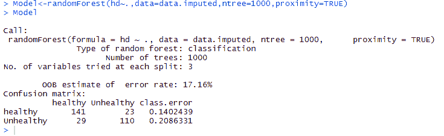

```

oob_error_data
```

**输出:**

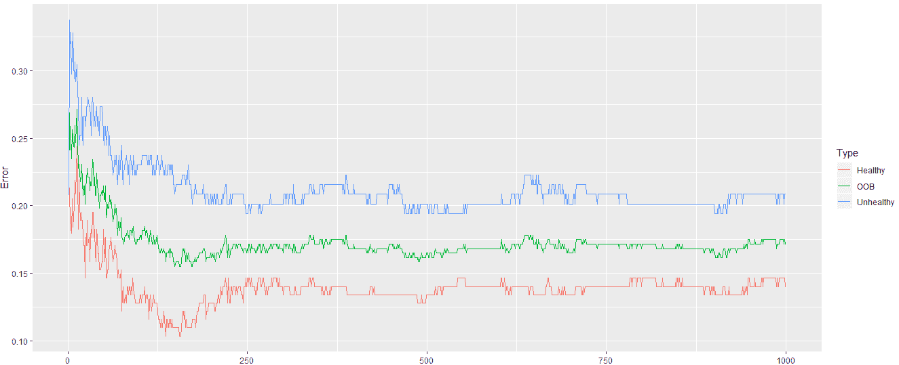

从上面的输出可以清楚地看出，误差率是稳定的。

13)现在，我们需要确保我们正在考虑树中每个内部节点的最佳变量数量。这将通过以下方式完成:

```

#Creating a vector that can hold ten values.
oob_values
```

**输出:**

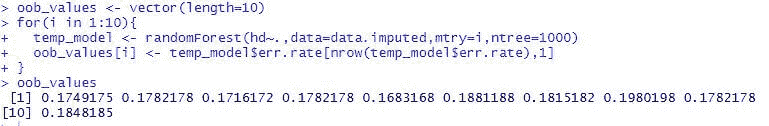

14)现在，我们使用随机森林绘制带有样本的 MDS 图。这将向我们展示它们是如何相互关联的。这将通过以下方式完成:

```

#Creating a distance matrix with the help of dist() function.
distance_matrix
```

**输出:**

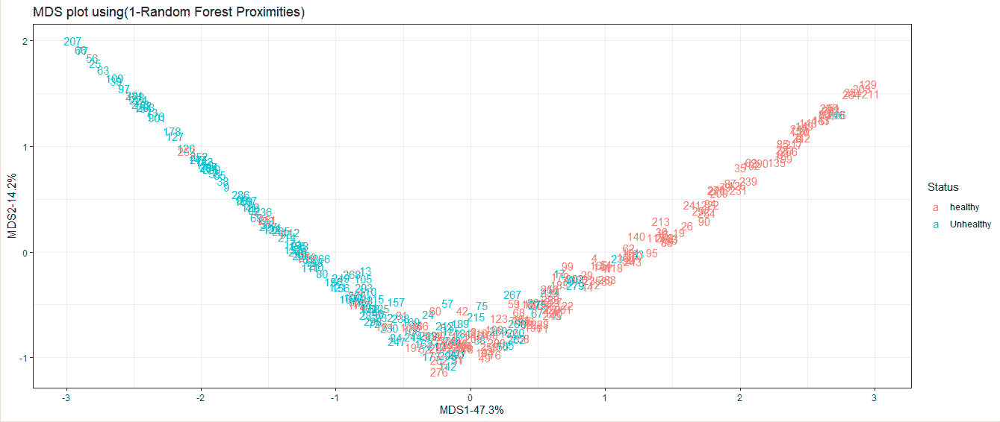

* * *