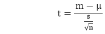
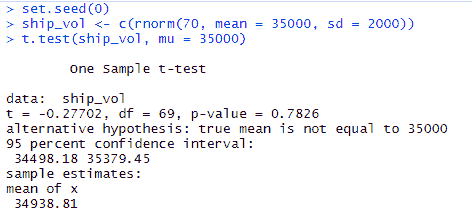
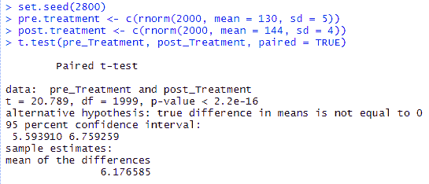
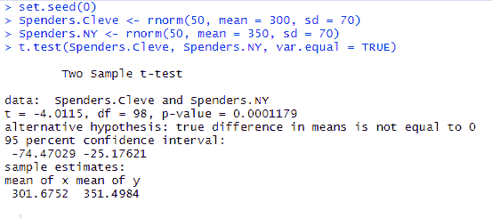
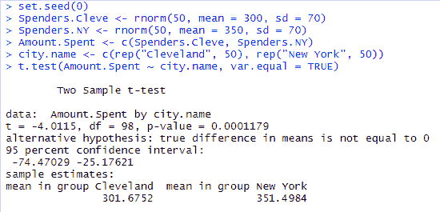
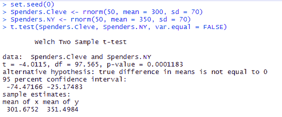

# 测试中的测试

> 原文：<https://www.javatpoint.com/t-test-in-r>

在统计学中，T 检验是最常见的检验之一，用于确定两组的平均值是否相等。测试的假设是两组样本均来自波动相等的正态分布。零假设是两种手段相同，另一种是两者不相同。众所周知，在零假设下，我们可以计算一个 t 统计量，它将遵循 n1 + n2 - 2 自由度的 t 分布。


在 R 中，有各种类型的 T 检验，如**单样本**和**韦尔奇 T 检验**。r 提供了 t.test()函数，该函数提供了多种 t.test。

对于不同的测试，测试()函数有以下语法

**独立 2 组 T 检验**

```

t.test(y~x) 

```

这里，y 是数字，x 是二进制因子。

**独立 2 组 T 检验**

```

t.test(y1,y2) 

```

这里，y1 和 y2 是数字。

**配对 T 检验**

```

t.test(y1,y2,paired=TRUE) 

```

这里，y1 和 y2 是数字。

**一个样本 T 检验**

```

t.test(y,mu=3)

```

何勋爵：mu=3

## 如何进行核磁共振测试

在 T 检验中，为了指定相等的方差和集合方差估计，我们设置 var.equal=True。我们也可以使用 alternative="less "或 alternative="greater "来指定单尾测试。

让我们看看单样本、配对样本和独立样本 T 检验是如何进行的。

### 单样本检验

单样本检验是一种将向量的平均值与理论平均值进行比较的检验。有以下公式用于计算 T 检验:



在这里，

1.  m 是平均值。
2.  ？是理论上的意思。
3.  s 是标准差。
4.  n 是观测值的数量。

为了评估 **t 检验**的统计显著性，我们需要计算 **p 值**。p 值范围从 0 到 1，解释如下:

*   如果 p 值低于 0.05，这意味着我们非常有信心拒绝零假设。以便 H3 被接受。
*   如果 p 值高于 0.05，则表明我们没有足够的证据拒绝零假设。

我们通过查看 t 检验的相应绝对值来构造 p 值。

在 R 中，我们使用 t.test()函数的以下语法在 R 中执行单样本 T-test

```

t.test(x, ?=0)

```

在这里，

1.  x 是我们感兴趣的变量的名称。
2.  ？由等于平均值的零假设描述。

**例**

让我们来看一个单样本 T 检验的例子，在这个例子中，我们检验一批木材的体积是否比平时少(？ <sub>0</sub> =0。

```

set.seed(0)
ship_vol 
```

**输出:**



### 配对样本 T 检验

为了执行配对样本测试，我们需要两个向量数据 y1 和 y2。然后，我们将使用语法 t.test 运行代码(y1，y2，paired = TRUE)。

**示例:**

假设，我们在一家大型健康诊所工作，我们正在测试一种新药 Procardia，其目的是降低高血压。我们找了 13000 个收缩压高的个体(x 150 = 150 mmHg，SD = 10 mmHg)，我们给他们提供了一个月的 Procardia，然后再次测量他们的血压。我们发现平均收缩压下降到 144 毫米汞柱，标准偏差为 9 毫米汞柱。

```

set.seed(2800)
pre.treatment 
```

**输出:**



### 独立样本检验

根据我们数据的结构及其方差的相等性，独立样本 T 检验可以采用以下三种形式之一:

1.  独立样本检验，其中 y1 和 y2 是数字。
2.  独立样本 T 检验，其中 y1 是数字，y2 是二进制。
3.  不假设方差相等的独立样本 T 检验。

独立样本 t 检验有以下 t.test()函数的一般形式:

```

t.test(y1,y2, paired=FALSE)

```

默认情况下，R 假设 y1 和 y2 的版本不相等，因此默认使用韦尔奇的测试。为了进行切换，我们设置标志 var.equal=TRUE。

让我们看一些例子来检验这个假设。在这个假设中，克莱夫兰人和纽约人每月在外面吃饭的花费是不同的。

**例 1:独立样本 T 检验，其中 y1 和 y2 为数字**

```

set.seed(0)
Spenders.Cleve 
```

**输出:**



**例 2:其中 y1 为数字，y2 为二进制**

```

set.seed(0)
Spenders.Cleve 
```

**输出:**



**例 3:假设方差不相等**

```

set.seed(0)
Spenders.Cleve 
```

**输出:**



* * *