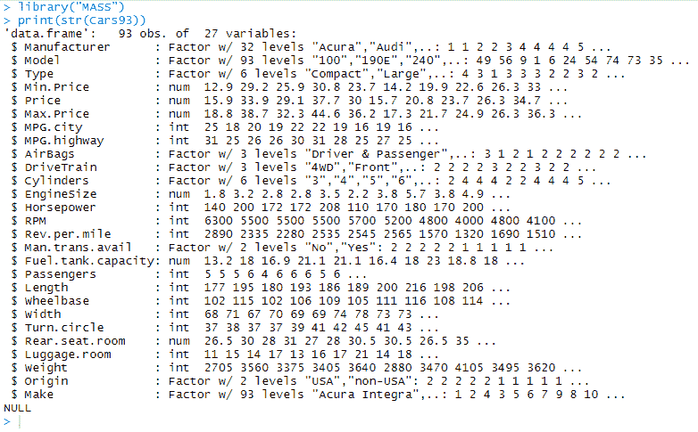
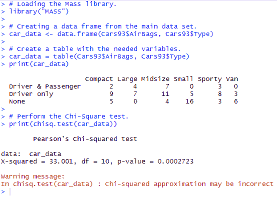

# 卡方检验

> 原文：<https://www.javatpoint.com/chi-square-test-in-r>

**卡方检验**用于分析频率表(即列联表)，由两个分类变量组成。卡方检验评估两个变量的类别之间是否存在显著关系。

卡方检验是一种统计方法，用于确定两个分类变量之间是否具有显著相关性。这些变量应该来自相同的人群，并且应该是明确的，如是/否、红色/绿色、男性/女性等。

r 提供 **chisq.test()** 功能进行卡方检验。该函数将数据作为输入，数据是表格形式，包含观察中变量的计数值。


在 R 中，chisq.test()函数有以下语法:

```

chisq.test(data)

```

让我们看一个例子，其中我们将采用“海量”库中的 Cars93 数据。这个数据代表了 1993 年不同型号汽车的销量。

**数据:**

```

library("MASS")
print(str(Cars93))

```

**输出:**



**示例:**

```

# Loading the Mass library.
library("MASS")
# Creating a data frame from the main data set.
car_data
```

**输出:**



* * *