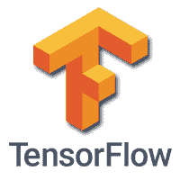

# tensorflow 教程

> 哎哎哎:# t0]https://www . javatppoint . com/tensorlow

TensorFlow 教程是为初学者和专业人士设计的。我们的教程提供了机器学习和深度学习概念的所有基本和高级概念，如深度神经网络、图像处理和情感分析。

TensorFlow 是著名的深度学习框架之一，由 **Google** 团队开发。这是一个免费的开源软件库，用 **Python** 编程语言设计，本教程的设计方式使得我们可以轻松高效地在 TensorFlow 上实现深度学习项目。

## 先决条件

TensorFlow 完全基于 Python。所以，有 Python 的基础知识是必不可少的。对基础数学和人工智能概念的良好理解使我们能够轻松理解张量流。

## 观众

本教程对对 python 感兴趣并专注于研究和开发许多机器学习和深度学习算法的学生很有帮助。本教程的目的是描述所有的张量流对象和方法。

## 问题

我们保证我们不会发现这个张量流教程有任何问题。但是如果有任何错误，请在联系表格中发布问题。

* * *