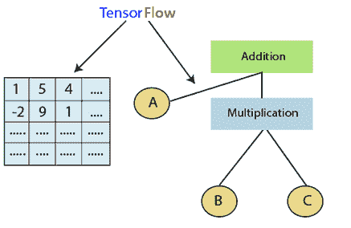
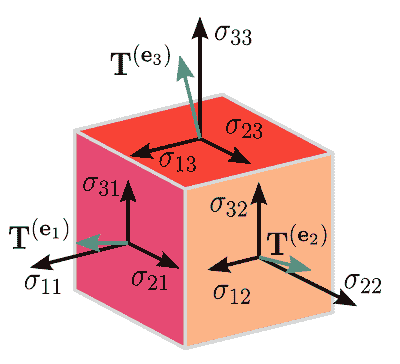
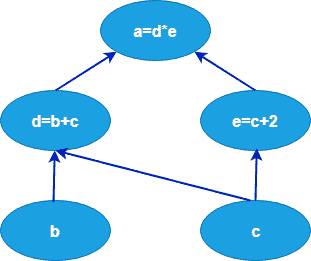
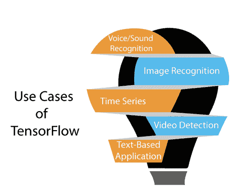
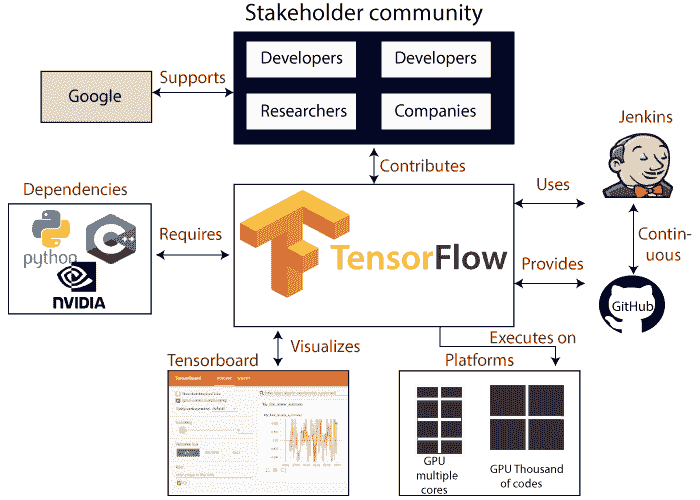
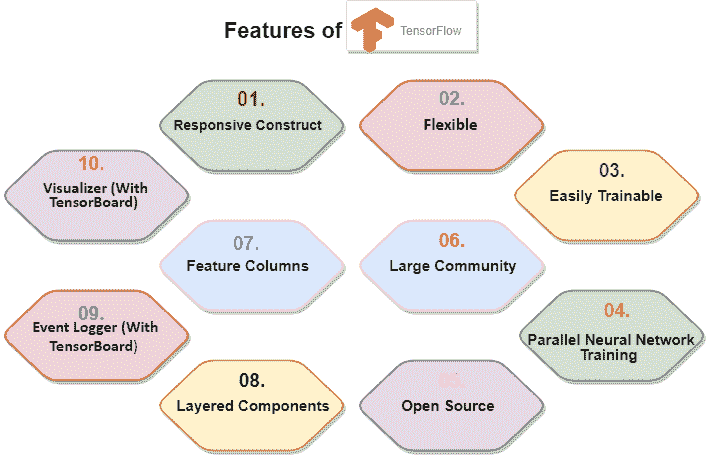
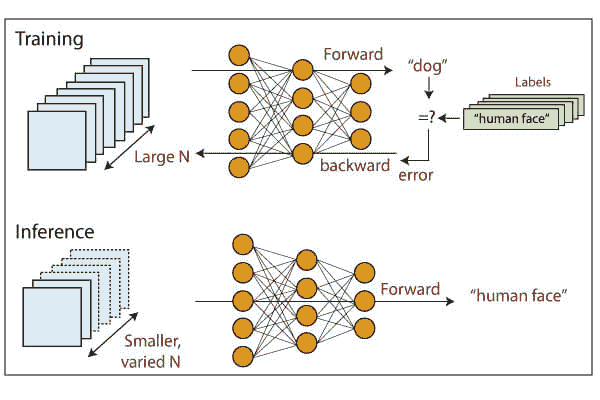
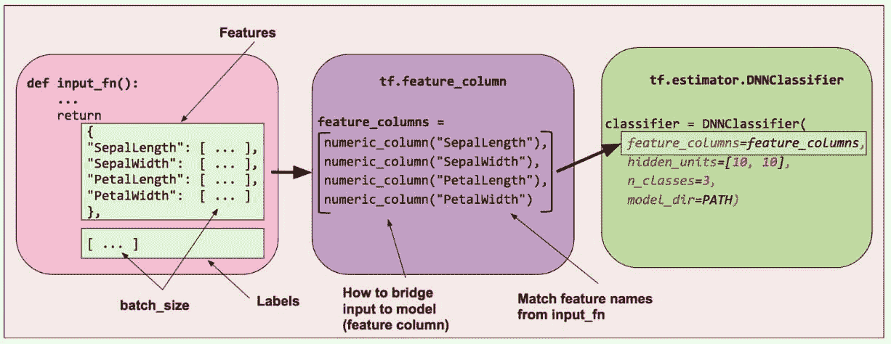

# 什么是 TensorFlow？

> 哎哎哎:# t0]https://www . javatppoint . com/tensorlow-introduction

**TensorFlow** 是**机器学习**和**深度学习**的热门框架。是**2015 年 11 月 9 日**发布的由**谷歌大脑团队**开发的**免费**和**开源**库。它完全基于 Python 编程语言，用于数值计算和数据流，使得机器学习更快更容易。

TensorFlow 可以训练和运行深度神经网络，用于图像识别、手写数字分类、递归神经网络、**单词嵌入**、**自然语言处理**、视频检测等等。TensorFlow 运行在多个**中央处理器**或**图形处理器**以及移动操作系统上。

【TensorFlow 这个词由两个词组成，即 Tensor 和 Flow

1.  **张量**是多维数组
2.  **流**用于定义运行中的数据流。

TensorFlow用于定义在多维数组或张量上运行的数据流。

## TensorFlow的历史

很多年前，当给出大量数据时，深度学习开始超过所有其他机器学习算法。谷歌已经看到，它可以利用这些深度神经网络来升级其服务:

*   谷歌搜索引擎
*   谷歌邮箱
*   照片

他们建立了一个名为 TensorFlow 的框架，允许研究人员和开发人员在一个 **AI** 模型中一起工作。一旦它被批准和推广，它允许很多人使用它。

它于 2015 年首次发布，而第一个稳定版本将于 **2017** 推出。它是 Apache 开源许可下的开源平台。我们可以免费使用、修改和重组修订版，而无需向谷歌支付任何费用。

## TensorFlow的分量

### 张量

TensorFlow 这个名字来源于它的核心框架“ **Tensor** ”张量是表示所有类型数据的 n 维向量或矩阵。张量中的所有值都包含具有已知形状的相似数据类型。数据的形状是矩阵或数组的维数。

张量可以从输入数据或计算结果中生成。在TensorFlow中，所有的运算都在图中进行。组是一组连续发生的计算。每个事务称为一个连接的操作节点。

### 图形

TensorFlow 利用了一个图形框架。该图表收集并描述了培训期间完成的所有计算。

### 优势

*   它被固定在多个中央处理器或图形处理器和移动操作系统上运行。
*   该图的可移植性允许保存当前或以后使用的计算。图形可以保存，因为它可以在将来执行。
*   图中的所有计算都是通过将张量连接在一起完成的。

考虑以下表达式 a= (b+c)*(c+2)

我们可以将这些功能分解为以下组件:

d=b+c
e=c+2
a=d*e

**现在，我们可以在下面用图形表示这些操作:**

### 会议

会话可以从图形中执行操作。要用张量的值填充图形，我们需要打开一个会话。在会话中，我们必须运行一个操作符来创建输出。

## 为什么 TensorFlow 受欢迎？

TensorFlow 对所有人来说都是更好的库，因为每个人都可以访问它。TensorFlow 库集成了不同的 **API** 来创建类似 **CNN(卷积神经网络)**或 **RNN(递归神经网络)**的规模深度学习架构。

TensorFlow基于图形计算；它可以让开发者用张量板创建神经网络的结构。这个工具有助于调试我们的程序。它运行在中央处理器和图形处理器上。

> 与其他深度学习框架相比， ***TensorFlow** 在 **GitHub** 上吸引了最可观的人气。*

## TensorFlow的用例/应用

与其他流行的深度学习框架相比，TensorFlow 提供了惊人的功能和服务。TensorFlow 用于创建具有许多层的大规模**神经网络**。

主要用于**分类**、**感知**、**理解**、**发现预测**、**创造**等深度学习或机器学习问题。

### 1.语音/声音识别

语音和声音识别应用程序是深度学习最著名的用例。如果神经网络有适当的输入数据，神经网络能够理解音频信号。

**例如:**

**语音识别**用于物联网、汽车、安防、UX/UI。

**情感分析**多用于客户关系管理 **(CRM)** 。

**探伤(发动机噪音)**多用于汽车、航空。

**语音搜索**多用于客户关系管理(CRM)

### 2.图像识别

图像识别是第一个使深度学习和机器学习流行起来的应用。电信、社交媒体和手机制造商大多使用图像识别。它还用于人脸识别、图像搜索、运动检测、机器视觉和照片聚类。

**例如**图像识别用于从图像中识别和识别人和物体。图像识别用于理解任何图像的上下文和内容。

对于对象识别，TensorFlow 有助于在较大的图像中对任意对象进行分类和识别。

这也在工程应用中用于识别形状，用于建模目的( **3d** 从 **2d** 图像重建)以及由脸书用于照片标记。

**例如，**深度学习使用 TensorFlow 来分析成千上万张猫的照片。因此，深度学习算法可以学习识别猫，因为该算法用于找到物体、动物或人的一般特征。

### 3.时间序列

深度学习是使用时间序列算法来检查时间序列数据，以提取有意义的统计数据。例如，它使用时间序列来预测股票市场。

建议是时间序列最常见的用例。**亚马逊**、**谷歌**、**脸书**、**网飞**都在使用深度学习进行建议。因此，深度学习算法用于分析客户活动，并将其与数百万其他用户进行比较，以确定客户可能喜欢购买或观看的内容。

**比如**可以根据我们已经看过的电视剧或者电影，给我们推荐大家喜欢的电视剧或者电影。

### 4.视频检波

深度学习算法用于视频检测。它用于游戏、安全、机场和用户界面/UX 领域的运动检测、实时威胁检测。

**例如，** NASA 正在为小行星的物体聚类和轨道分类开发深度学习网络。因此，它可以对近地天体(**近地天体**)进行分类和预测。

### 5.基于文本的应用

基于文本的应用也是一种流行的深度学习算法。情感分析、社交媒体、威胁检测和欺诈检测是基于文本的应用程序的例子。

**比如**谷歌翻译支持 100 多种语言。

目前正在使用 TensorFlow 的*部分**公司有谷歌、AirBnb、易贝、英特尔、DropBox、Deep Mind、空客、CEVA、Snapchat、SAP、优步、Twitter、可口可乐、IBM。***

## TensorFlow的特征

TensorFlow 有一个交互式的**多平台**编程接口，与其他可用的深度学习库相比，该接口是可扩展和可靠的。

TensorFlow 的这些特性将告诉我们 TensorFlow 的受欢迎程度。

### 1.响应结构

我们可以可视化图表的每个部分，这在使用 **Numpy** 或 **SciKit** 时不是一个选项。要开发深度学习应用程序，首先，创建深度学习应用程序需要两三个组件，并且需要一种编程语言。

### 2.灵活的

根据其可操作性，它是TensorFlow的基本特征之一。它具有模块化和我们想要独立制作的部分。

### 3.易于训练

在分布式计算中，它很容易在中央处理器和图形处理器上训练。

### 4.并行神经网络训练

TensorFlow 向管道提供的意义在于，我们可以训练多个神经网络和各种**GPU**，这使得模型在大规模系统上非常高效。

### 5.大型社区

谷歌已经开发了它，并且已经有一个庞大的软件工程师团队在持续改进稳定性。

### 6.开放源码

机器学习库最好的一点是它是开源的，所以任何人都可以像使用互联网一样使用它。因此，人们可以操纵图书馆，并提出各种各样的有用产品。它已经成为了另一个自己动手做的社区，有一个巨大的论坛，供刚开始使用它的人和那些觉得很难使用它的人使用。

### 7.特征列

TensorFlow具有特征列，这些特征列可以被认为是原始数据和估计量之间的中间体；相应地，**用我们的模型桥接**输入数据。

下面的特性描述了特性列是如何实现的。

### 8.统计分布的可用性

该库提供的分布函数包括伯努利、贝塔、奇 2、均匀、伽玛，这些函数是必不可少的，尤其是在考虑概率方法(如贝叶斯模型)的情况下。

### 9.分层组件

TensorFlow 从 tf.contrib.layers 等函数中生成权重和偏差的分层运算，还提供批处理规范化、卷积层和丢弃层。所以**TF . contribut . layers . optimizer**有 **Adagrad** 、 **SGD** 、 **Momentum** 这样的优化器，常用来解决数值分析的优化问题。

### 10.可视化工具(带张量板)

我们可以检查模型的不同表示，并在 TensorBoard 的帮助下调试模型时进行必要的更改。

### 11.事件记录器(带 TensorBoard)

这就像 UNIX 一样，我们使用 **tail - f <log_fail></log_fail>**来监控 cmd 的任务输出。它使用 TensorBoard 检查、记录图表和生产中的事件和摘要。

* * *