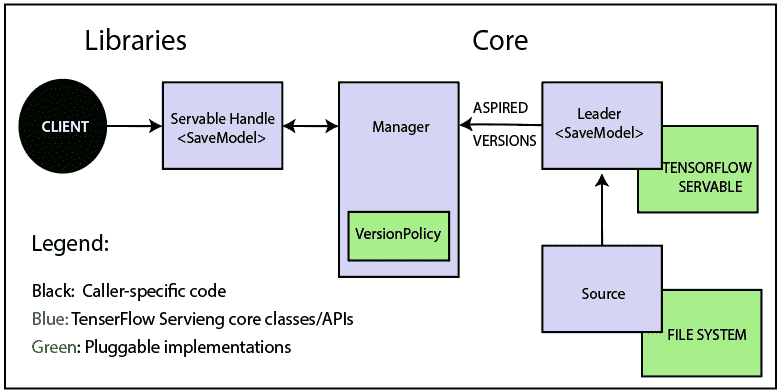
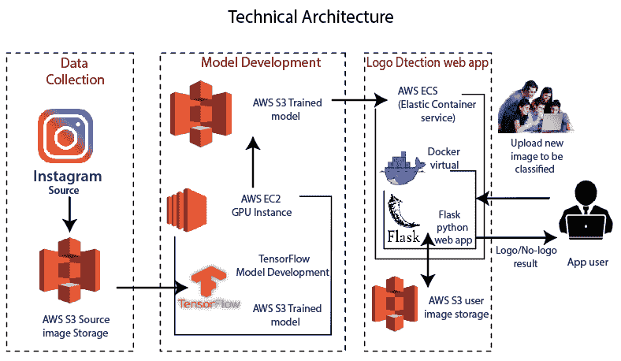

# TensorFlow的体系结构

> 哎哎哎:# t0]https://www . javatppoint . com/tensorlow-architecture

TensorFlow 运行时是一个跨平台的库。使这种规模组合变得灵活的系统架构。我们对 TensorFlow 编程概念有基本的了解，例如计算图、操作和会话。

要理解 TensorFlow 架构，需要先了解一些术语。术语有 TensorFlow Servable、servable Streams、TensorFlow 模型、加载器、源、管理器和核心。TensorFlow 架构中的术语及其功能描述如下。

TensorFlow 架构适合读取和修改核心 TensorFlow 代码。

### 1.tensorflow 发球

这些是 TensorFlow 服务中未完成的中央单元。Servables 是客户端用来执行计算的对象。

servable 的大小是灵活的。单个 servable 可以包含从查找表到接口模型元组中唯一模型的任何内容。Servable 应该是任何类型和接口，能够实现灵活性和未来的改进，例如:

*   流式结果
*   异步操作模式。
*   实验性原料药

### 2.可服务版本

TensorFlow 服务器可以在任何单个服务器实例的生命周期内处理一个或多个版本的 servables。它为新的算法配置打开了大门，权重和其他数据可以随着时间的推移而加载。它们还可以使一个 servable 的多个版本同时充电。它们还允许同时加载多个版本的 servable，支持逐步展开和实验。

### 3.可服务的流

任何可服务的版本序列，按版本号递增排序。

### 4\. TensorFlow模型

服务代表一个或多个服务表中的一个模型。机器学习模型包括一个或多个算法和查找嵌入表。一个 servable 也可以像模型的一部分一样提供服务；例如，一个大的查找表可以作为许多实例。

### 5\. TensorFlow加载器

加载程序管理一个服务的生命周期。加载器应用编程接口支持独立于特定学习算法、数据或产品用例的公共基础设施。

### 6.TensorFlow架构中的源

简单来说，源是找到并提供可服务的模块。每个引用一次提供零个或多个可服务流。对于每个可服务流，一个源只为每个可服务提供一个加载器实例。

每个源还提供零个或多个可服务流。对于每个可服务流，一个源只提供一个加载器实例，并使其可供加载。

### 7.TensorFlow管理器

TensorFlow 管理器处理 Servables 的整个生命周期，包括:

*   正在加载 Servables
*   提供服务
*   正在卸载 Servables

经理观察来源并跟踪所有版本。经理试图实现原因，但它可以拒绝加载一个渴望的版本。

经理也可以推迟“T0”卸货例如，根据确保始终至少加载一个版本的策略，管理器可以等到较新版本完成加载后再卸载。

**例如，** GetServableHandle()，供客户端访问加载的 servable 实例。

### 8\. TensorFlow核心

这管理 servables 的以下方面:

*   生命周期
*   韵律学
*   TensorFlow 将核心满意度 servables 和 loaders 作为不透明对象。

### 9.可服务者的生活

**TensorFlow 技术架构:**

*   源为可服务版本创建加载器，然后将加载器作为期望版本发送给管理器，管理器将加载它们并将其提供给客户端请求。
*   Loader 包含元数据，它需要加载 servable。
*   源使用回调来传达阿司匹林版本的管理器。
*   管理器应用有效的版本策略来确定下一步要采取的操作。
*   如果管理器决定让加载器加载一个新版本，客户端会向管理器请求 servable，并明确指定一个版本或请求当前版本。管理器返回 servable 的句柄。动态管理器应用版本操作，并决定加载它的较新版本。
*   动态管理器命令加载程序有足够的内存。
*   客户端请求模型最新版本的句柄，动态管理器返回 servable 新版本的句柄。

### 10\. TensorFlow加载器

TensorFlow 就是这样一个算法后端。例如，我们将实现一个新的加载器来加载、提供访问和卸载机器学习模型的一种新类型的 servable 的实例。

### 11.TensorFlow体系结构中的批处理程序

将 TensorFlow 请求批处理到单个应用程序中可以显著降低执行推理的成本，尤其是在存在硬件加速器和图形处理器的情况下。TensorFlow 服务有一个索赔批处理设备，它允许客户将超出请求的特定类型假设快速批处理到批处理中。并要求算法系统能更有效地处理。

* * *