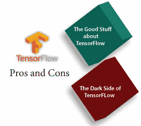
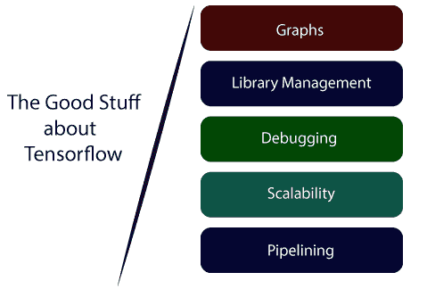
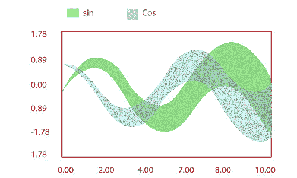
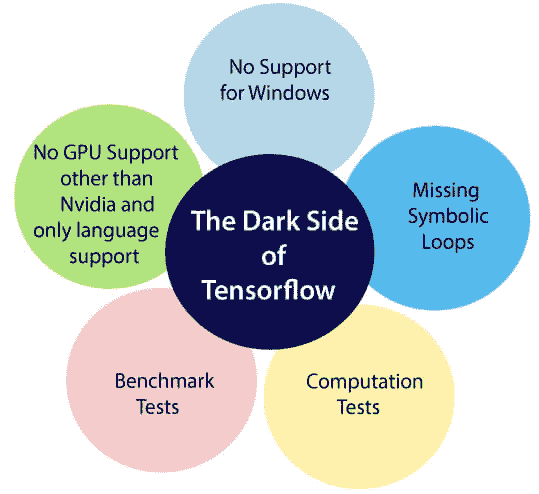

# 张量流的优缺点

> 原文：<https://www.javatpoint.com/advantage-and-disadvantage-of-tensorflow>

TensorFlow 是由谷歌设计开发的开源机器学习概念。它提供了一种非常高级和抽象的方法来组织低级数值编程。以及支持库，可以让我们的软件在普通的中央处理器上运行而不发生变化。

它支持的平台包括 **Linux** 、 **macOS** 、 **Windows** 、**安卓**。

**TensorFlow** 模型在谷歌云机器学习引擎中也可以不用传统的计算机平台运行。

技术越先进，越有用，但任何事物都有它的缺点，机器学习库也是如此。当比较 TensorFlow 和其他库如 **Torch** 、 **SciKit** 、**antao**、 **Neon** 时，库让我们操作的几个特性存在缺陷。这个库是由谷歌设计和更新的，所以不用说，它自最初发布以来已经取得了长足的进步。

## 张量流的优点

**1)图表:**

张量流有更好的计算图形可视化。与 Torch 和 antano 等其他库相比，这些库是固有的。

**2)库管理:**

谷歌支持它。并且具有性能无缝、更新快、新功能频繁发布等优点。

**3)调试:**

它帮助我们执行一个图的子部分，这使它在我们引入和检索离散数据时占据上风

**4)可扩展性:**

这些库部署在硬件机器上，硬件机器是计算机的蜂窝设备，具有复杂的设置。

**5)流水线操作:**

TensorFlow 被设计成使用各种后端软件(GPU、ASIC)等。并且高度平行。

**6)** 它有一种独特的方法，允许监控我们模型的训练进度并跟踪几个指标。

**7)** TensorFlow 拥有优秀的社区支持。

**8)** 性能高，匹配行业最佳。

## 张量流的缺点

**1)缺少符号循环:**

当我们说变长序列时，这个特征是更需要的。不幸的是，TensorFlow 不提供功能，但有限折叠是解决这个问题的正确方法。

**2)不支持窗户:**

有各种各样的用户对窗口环境而不是 Linux 感到舒适，而 TensorFlow 并不能满足这些用户。但是我们不必担心，如果我们是窗口用户，我们也可以通过 conda 或 python 包库(pip)安装它。

**3)基准测试:**

与竞争对手相比，TensorFlow 在速度和使用率上都有所欠缺。

**4)不支持 Nvidia GPU，仅支持语言:**

目前，单个支持的图形处理器是 **NVIDIA** 和 Python 唯一的完全语言支持，这使得它成为一个缺点，因为在深度学习中还有其他语言的提升，以及 **Lau** 。

**5)计算速度:**

这是 TF 落后的一个领域，但我们更关注生产环境，而不是性能，这仍然是正确的选择。

**6)** 不支持 OpenCL。

**7)** 它需要高级微积分的基础知识和**线性代数**以及对**机器学习**的良好理解。

**8)** TensorFlow 结构独特，不易发现错误，调试困难。

**9)** 不需要任何超低级的物质。

**10)** 是很低的水平，学习曲线陡峭。

* * *