# 唐斯多夫游乐场

> 吴奇珍:t0]https://www . javatppoint . com/tensorlow-play ground

TensorFlow 游乐场是一个用 **d3.js** (JavaScript)编写的 web 应用程序。而且不用数学去学习**神经网络**是最好的应用。在我们的网络浏览器中，我们可以创建一个**神经网络**，并立即看到我们的结果。它是根据 Apache 许可证 2.0**2004 年 1 月**([http://www.apache.org/licenses/](https://www.apache.org/licenses/))获得许可的。

**丹尼尔·斯米科夫和山·卡特**创造了它，并基于之前许多作品的延续。其贡献成员是**费尔南达·维加斯**和**马丁·瓦滕伯格**以及大图和谷歌大脑团队，以获取反馈和指导。

**TensorFlow 游乐场**是一款允许用户使用 TensorFlow 机器学习库测试人工智能(AI)算法的 web app。

TensorFlow 游乐场不熟悉高级数学和用神经网络编码进行深度学习和其他机器学习应用。神经网络操作是交互式的，并在操场上表现出来。

开源图书馆是为教育需求而设计的。

现在转到链接[http://playground.tensorflow.org](http://playground.tensorflow.org)。

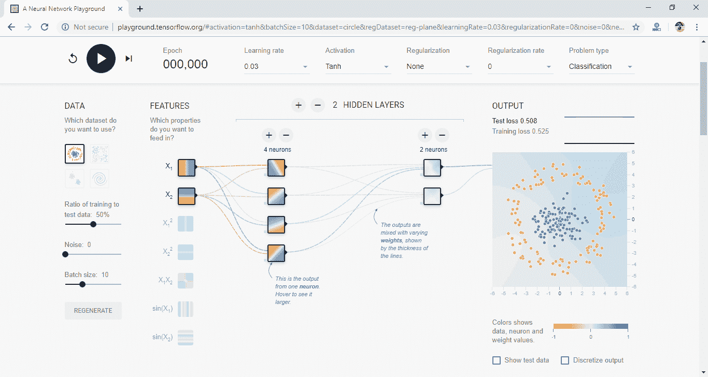

网站顶部是**历元、学习率、激活、正则化率、问题类型、**，下面一一介绍。

每次对训练集进行训练时，**历元**数增加，如下图所示。

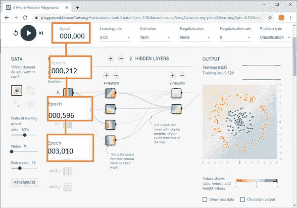

**学习速率**决定学习速度；因此，我们需要选择合适的学习速率。

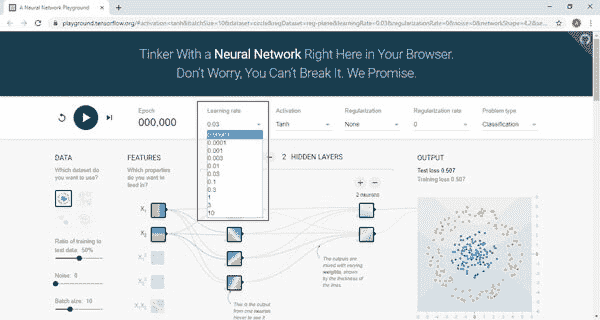

节点的**激活功能**定义该节点或数据集的输出。标准计算机芯片电路可以是**激活功能**的数字**网络**，根据其输入可以是“开”(1)或“关”(0)。

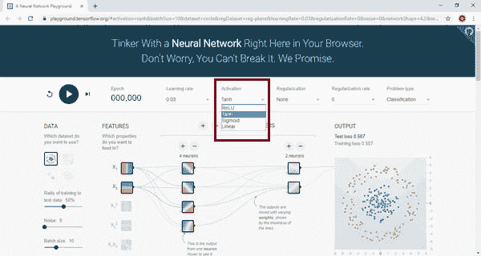
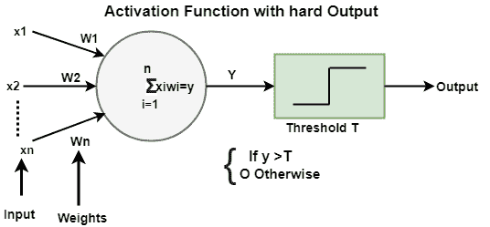

## 软输出激活功能

*   ReLU **(整流线性单位)** g(y) =最大值(0，y)
*   Tanh ( **双曲正切)**t(y)=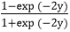
    T4】
*   Sigmoid **(逻辑 Sigmoid)** σ(y) = 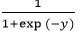
*   线性(例如，α=1) l(y)= αy

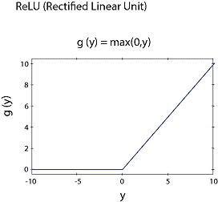

**正则化**用于避免过拟合。

TensorFlow 游乐场实现了两种类型的正规化:L2 L1。

正则化可以增加或减少强连接或弱连接的权重，以使模式分类更加清晰。

**L1** 和 **L2** 是流行的正则化方法。

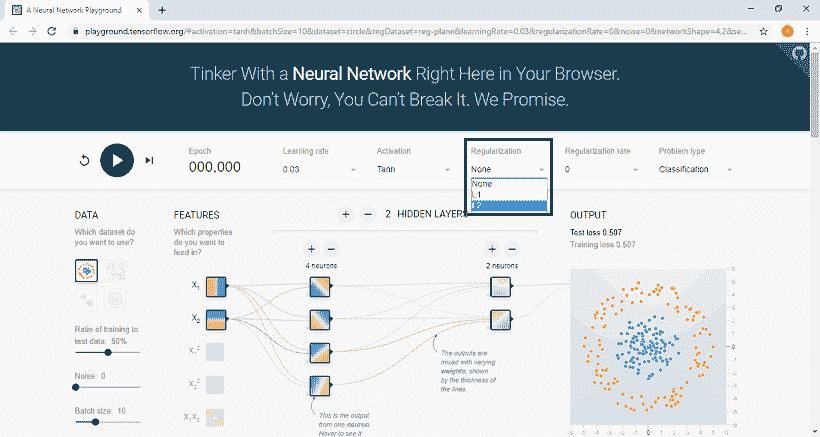

### L1 正则化

*   L1 在稀疏特征空间中很有用，在稀疏特征空间中需要从众多特征空间中选择几个。
*   L1 将进行选择并分配重要的权重值，并将使未选择的权重很小(或为零)

### L2 正则化

*   L2 能够处理相关的输入
*   L2 将控制与相关级别相同的权重值。

辍学也是一种正规化的方法。

更高的**正则化率**会使权重的范围更加有限。

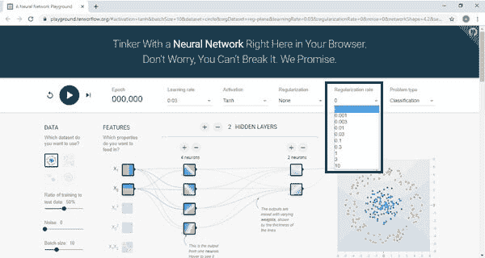

在问题类型中，从以下两类问题中进行选择:

*   分类
*   回归

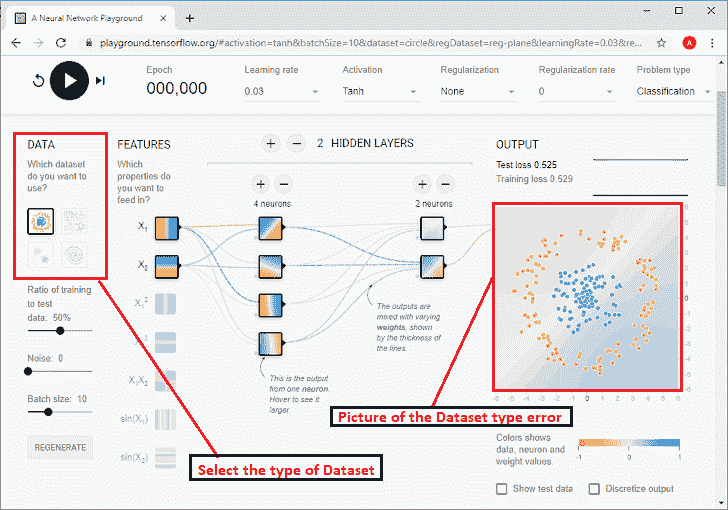

我们必须根据我们在这里指定的数据集来看看我们要解决什么类型的**问题**。基于我们下面定义的数据集求解。

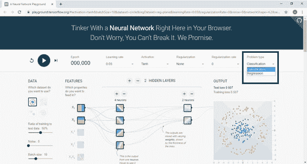

总的来说，有四种类型的分类，下面给出了两种类型的回归问题。

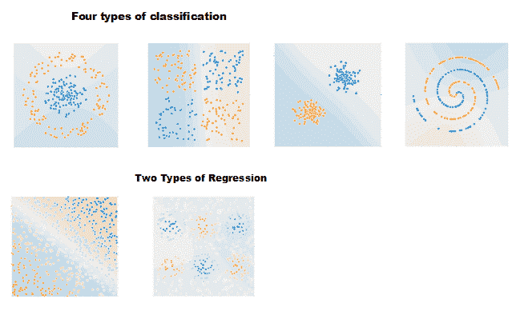

这里蓝色和橙色的点构成了数据集，暗示着

橙色圆点的值为-1。蓝点值为+1

使用测试数据训练的**比率**，使用这里的控制模块控制训练集的百分比。

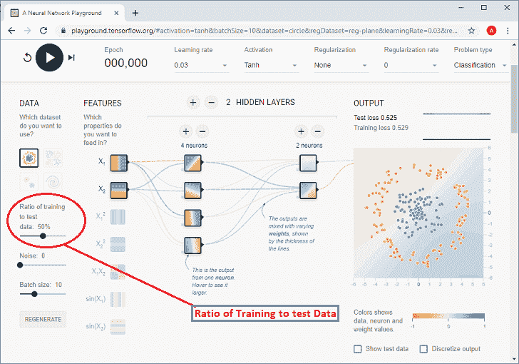

**例如:**如果是 50%，那么点和它是一样的，因为那是它的默认设置，但是如果我们改变控制使其为 10%。然后我们可以看到那边的点变得不像给定的数字。

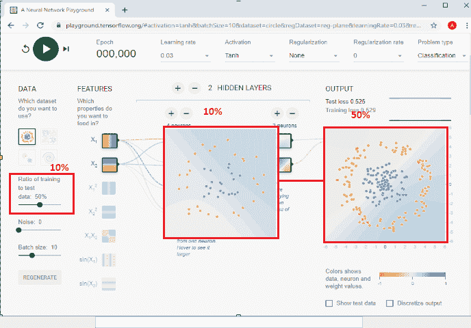

可以控制数据集的**噪声**水平。我们可以用控制模块做到这一点。随着噪声的增加，数据模式变得更加不可靠。当噪声为零时，该问题在其区域中被清楚地区分。然而，通过使其超过 50，我们可以看到蓝点和橙色点都混合在一起，并使其强制分配。

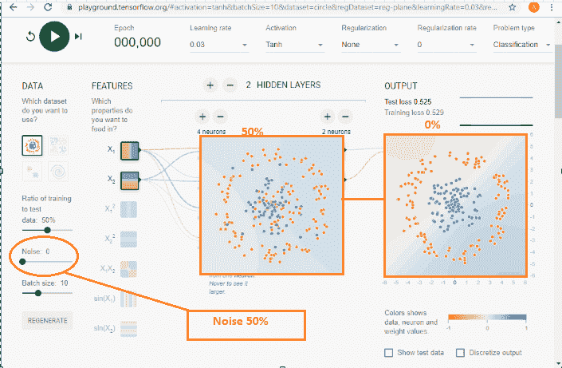

**批次**的大小决定了每次训练迭代使用的数据速率，我们根据下面的截图进行控制。我们可以使用下面的。

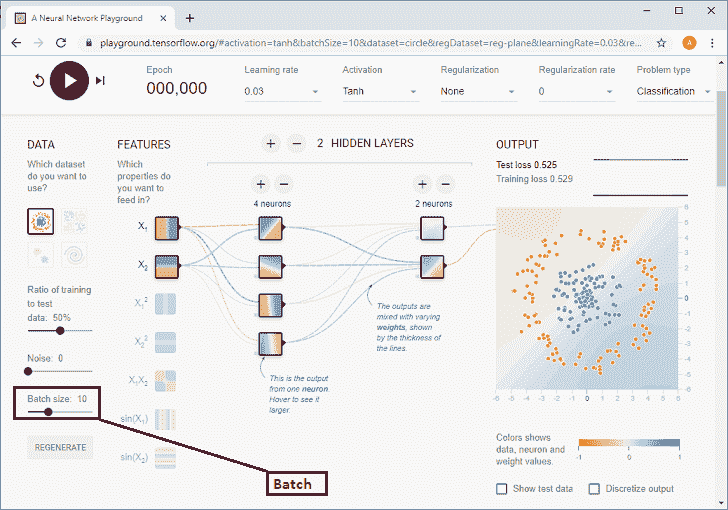

现在，我们需要进行功能选择。**特征选择**将使用这里给出的 x1 和 x2；

*   **X1** 是横轴上的值。
*   **X2** 是纵轴上的数值。

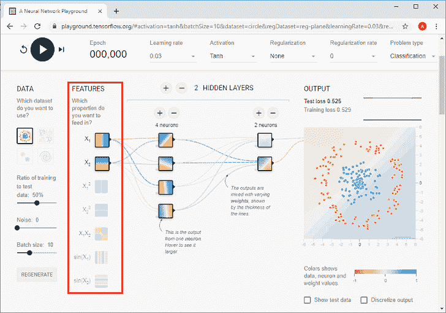

x1 和 x2 的示例-点的 x1 值约为 3.1，x2 值约为 4，就像我们在下图中看到的那样。

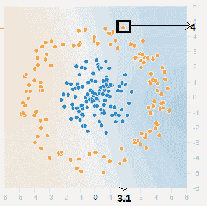

下面列出了**隐藏层**结构，在这里我们最多可以设置**六个**隐藏层。如果我们想通过添加隐藏层来控制隐藏层的数量，那么点击加号。此外，我们可以在每个隐藏层中添加多达 8 个神经元，并通过单击加号将一个神经元添加到隐藏层来控制这一点。

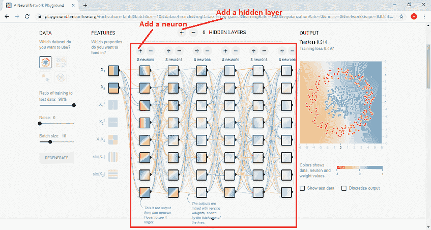

按箭头按钮开始**神经网络**训练，其中**历元**将增加 1，而**反向传播**用于训练神经网络。如果我们需要刷新整体练习，那么我们可以通过点击**刷新**按钮来完成。

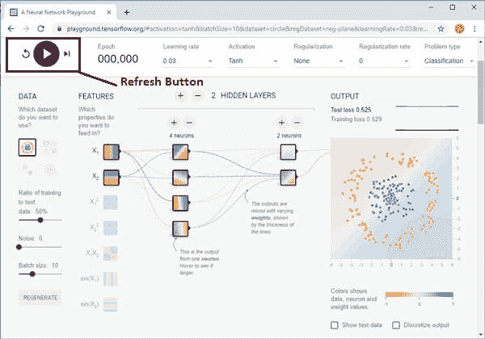

**神经网络**将**测试损失**和**训练损失**降至最低。测试损失和培训损失的变化将显示在位于下方右侧的小性能曲线中。测试损失将有一条**白色**性能曲线，训练损失将有一条**灰色**性能曲线。如果损失减少，曲线就会下降。

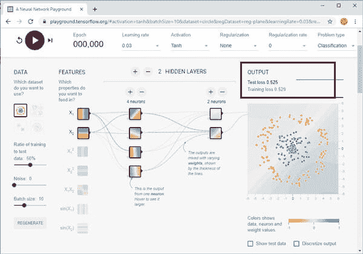

## 神经网络模型/感知器

神经网络模型或感知器是由称为神经元的简单组件组成的网络，这些组件接收输入，根据数据改变其内部状态。并根据数据和激活产生输出(0 和 1)。我们只有一个输入输出，最多也就是最容易接近的神经网络**浅层神经网络**中的一个隐藏层。

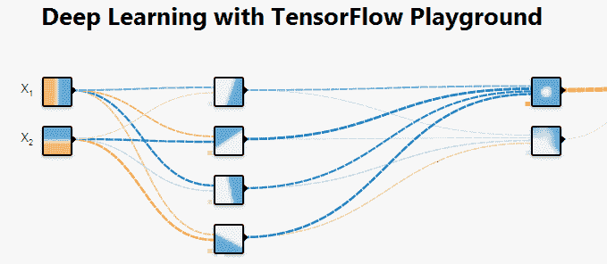

### 所有的颜色都意味着在操场上

橙色和蓝色用于可视化的方式不同，但在现实中，橙色显示负值，蓝色显示正值。

数据点是橙色或蓝色的，分别对应一个正点和一个负点。

在隐藏层中，线条由神经元之间连接的权重来着色。蓝色表示实际重量，橙色表示负重量。

在输出图层中，根据原始值，点被着色为橙色或蓝色。背景色显示网络对特定区域的预测。

## 用例

### 为什么我们可以增加隐藏层的神经元？

我们可以从隐藏层中单个神经元的基本模型(浅层神经网络)开始。让我们选择数据集“圆”，特征“X1”和“X2”，0.03 的学习率和“ReLU”刺激。

我们会按下运行按钮，等待一百个时代的完成，然后点击“暂停”

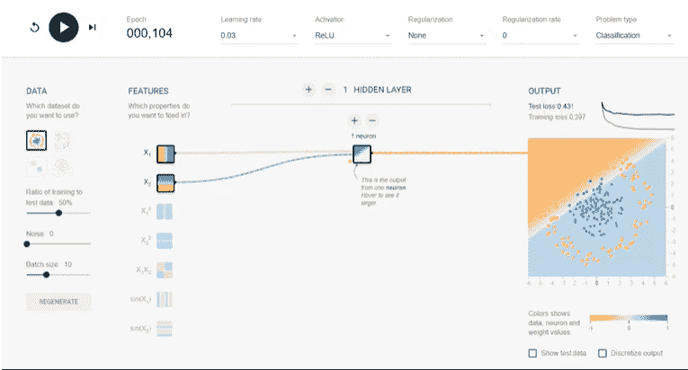

完成 100 个时代后，培训损失和测试超过 0.4。现在我们将使用添加按钮在隐藏层中添加四个神经元，然后再次运行。

现在，我们的测试和训练损失是 0.02，输出很好地分为两类(橙色和蓝色)。隐藏层中神经的加入提供了分配不同权重和并行计算的灵活性。然而，在一定程度后添加神经元将是昂贵的，几乎没有好处。

### 为什么我们对分类问题使用非线性激活函数？

在神经网络中，我们使用非线性激活函数来处理分类问题，因为我们的输出标签在 0 和 1 之间，其中线性激活函数可以提供 **-∞到+∞** 之间的任何数字。结果，输出在任何时候都不会收敛。

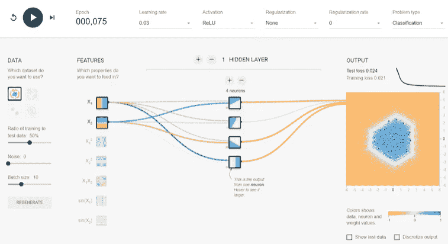

在上图中，我们运行了相同的模型，但是线性激活，并且它没有收敛。100 个时代后测试训练效率大于 0.5。

### 为什么我们可以增加操场的隐藏层？

现在，我们再添加一个具有双神经元的隐藏层，并按下运行按钮。我们的测试和精度降低到 0.02 以下只有 50 个纪元，几乎是任何单一隐藏层模型的一半。和神经元类似，增加隐藏层并不是所有情况下的正确选择。它变得昂贵而没有增加任何好处。这幅画解释得很好。即使运行 100 个纪元，我们也不能取得好的结果。

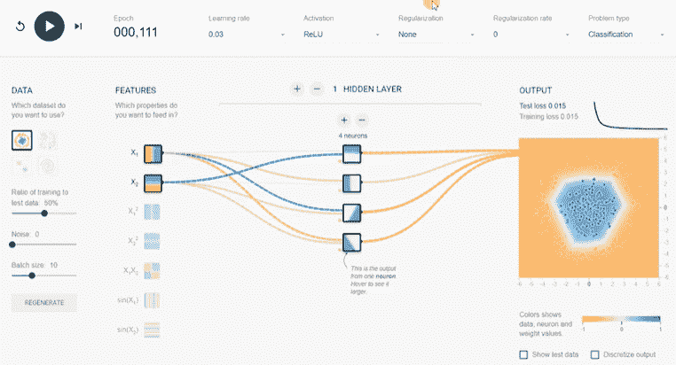

为什么 ReLU 激活是所有隐藏层的绝佳选择，因为 z 为正时导数为 **1** ，z 为负时导数为 **0** 。

我们将运行训练不同的激活函数(ReLU、sigmoid、tanh 和 linear)，我们将看到影响。

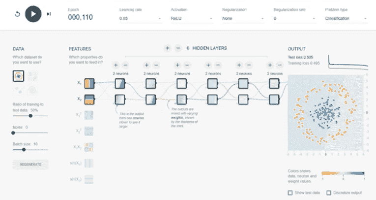

### 为什么 ReLU 激活是隐藏层的正确选择？

整流线性单位(ReLU)是所有隐藏层的选择，因为如果 z 为正，它的导数为 1，如果 z 为负，它的导数为 0。另一方面，sigmoid 和 tanh 函数都不适合隐藏层，因为如果 z 很大或很小。那么任务的范围就变得很小，这就减缓到了梯度下降。

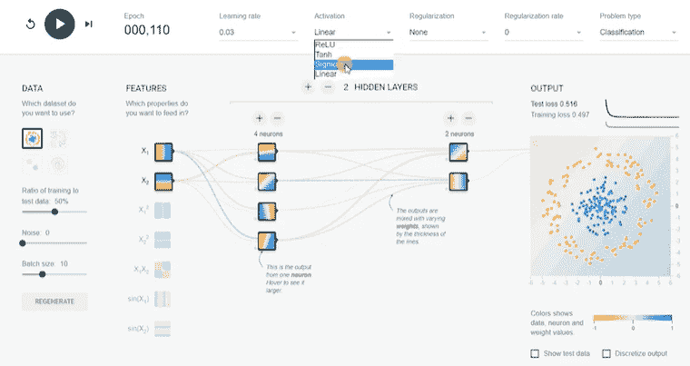

在上图中，很明显 ReLU 优于所有其他激活功能。Tanh 在我们选择的数据集上表现非常好，但不如 ReLU 函数高效。这就是 ReLU 在深度学习中如此盛行的主要原因。

### 增加/减少或改变任何输入特征的动作

所有可用的功能都无助于建模问题。使用所有功能或不相关的功能将是昂贵的，并可能影响最终的准确性。在实际应用中，要找出哪种方法对这个问题最有用，需要大量的反复试验。我们将探索模型中的不同功能。

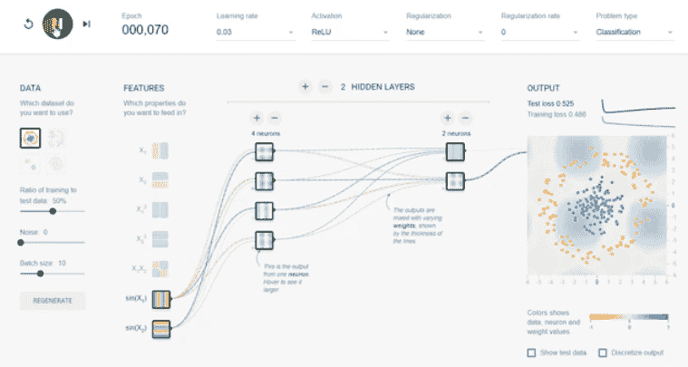

* * *