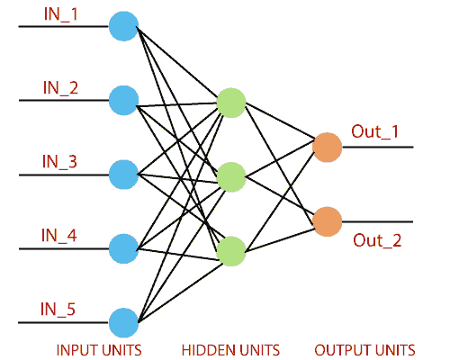
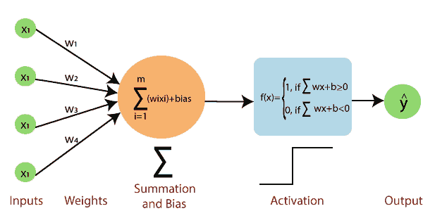
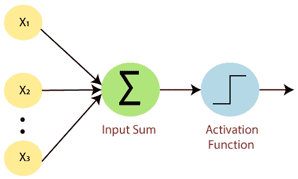
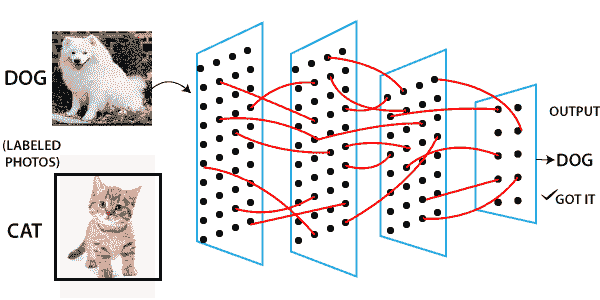
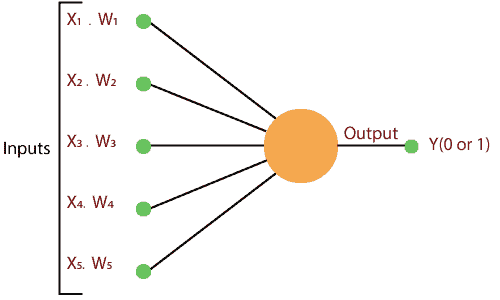
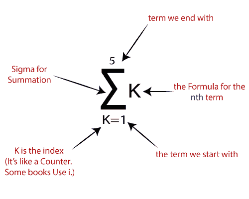
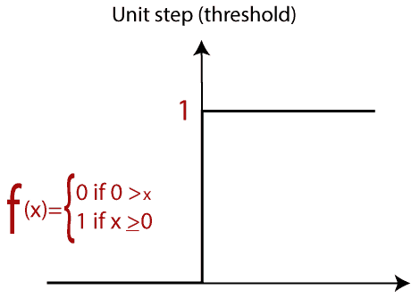
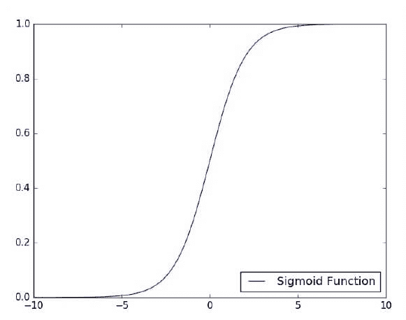
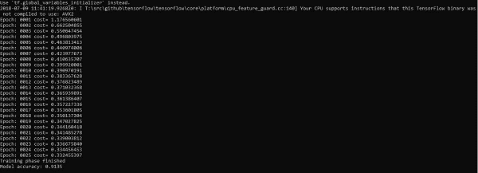
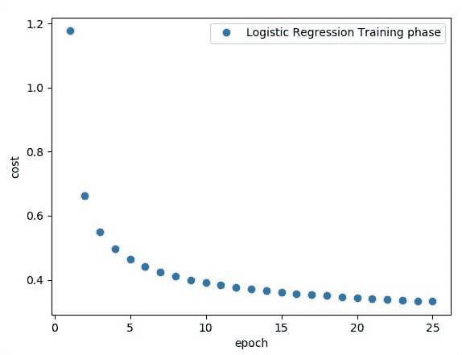

# TensorFlow中的单层感知器

> 原文：<https://www.javatpoint.com/single-layer-perceptron-in-tensorflow>

感知器是任何神经网络的单一处理单元。 **Frank Rosenblatt** 最早在 **1958 年提出**是一个简单的神经元，用于将其输入分为一两类。感知器是一种线性分类器，用于监督学习。它有助于组织给定的输入数据。

感知器是一个神经网络单元，它进行精确的计算来检测输入数据中的特征。感知器主要用于将数据分为两部分。因此也被称为**线性二元分类器**。



感知器使用阶跃函数，如果其输入的加权和为 0 和-1，则返回+1。

激活函数用于将输入映射到所需的值之间，如(0，1)或(-1，1)。

一个普通的神经网络是这样的:



### 感知器由 4 部分组成。

*   **输入值或一个输入层:**感知器的输入层由人工输入神经元构成，将初始数据带入系统进行进一步处理。
*   **重量和偏差:**
    **重量:**它代表单位之间联系的维度或强度。如果节点 1 到节点 2 的权重具有更高的数量，则神经元 1 对神经元的影响更大。
    **偏差:**与线性方程中相加的截距相同。它是一个附加参数，任务是修改输出以及另一个神经元的输入的加权和。
*   **净和:**计算总和。
*   **激活功能:**一个神经元能不能被激活，是由一个激活功能决定的。激活函数计算一个加权和，并进一步加上偏差以给出结果。



标准神经网络如下图所示。



### 它是如何工作的？

感知器按照下面给出的简单步骤工作:

**a.** 在第一步中，将所有输入 x 乘以它们的权重 **w** 。



**b.** 在这一步，将所有增加的值相加，称之为**加权和**。



**c.** 在最后一步，将加权和应用到正确的**激活函数**中。

**例如:**

单位阶跃激活函数



有两种类型的架构。这些类型主要关注ANN的功能，如下所示-

*   单层感知器
*   多层感知器

## 单层感知器

单层感知器是第一个神经网络模型，由弗兰克·罗森布鲁斯于 1958 年提出。它是最早的学习模式之一。我们的目标是找到一个由权重向量 w 和偏差参数 b 衡量的线性决策函数。

为了理解感知器层，有必要理解ANN。

ANN是一种信息处理系统，其机制受到生物神经回路功能的启发。ANN由几个相互连接的处理单元组成。

这是建立神经模型时的第一个建议。神经元局部记忆的内容包含一个权重向量。

单向量感知器是通过计算输入向量与向量的相应元素的乘积之和来计算的，其中每一个都按权重增加向量的相应分量的量。输出中显示的值是激活功能的输入。

让我们集中讨论使用 TensorFlow 实现单层感知器来解决图像分类问题。绘制单层感知器的最佳示例是通过“**逻辑回归**的表示。”



现在，我们必须做以下训练逻辑回归的必要步骤-

*   在每次训练开始时，用随机值初始化权重。
*   对于训练集的每个元素，用期望输出和实际输出之间的差值来计算误差。计算出的误差用于调整重量。
*   重复该过程，直到整个训练集的错误小于指定的限制，直到达到最大迭代次数。

**单层感知器完整代码**

```

# Import the MINST dataset
from tensorflow.examples.tutorials.mnist import input_data 
mnist = input_data.read_data_ ("/tmp/data/", one_hot=True)

import tensorflow as tf 
import matplotlib.pyplot as plt 
# Parameters 
learning_rate = 0.01 
training_epochs = 25 
batch_size = 100 
display_step = 1 

# tf Graph Input 
x = tf.placeholder("float", [none, 784]) # MNIST data image of shape 28*28 = 784 
y = tf.placeholder("float", [none, 10]) # 0-9 digits recognition => 10 classes 
# Create model 
# Set model weights 
W = tf.Variable(tf.zeros([784, 10])) 
b = tf.Variable(tf.zeros([10])) 
# Constructing the model
activation=tf.nn.softmaxx(tf.matmul (x, W)+b) # Softmax
 of function 
# Minimizing error using cross entropy
cross_entropy = y*tf.log(activation) 
cost = tf.reduce_mean\ (-tf.reduce_sum\ (cross_entropy, reduction_indice = 1))
optimizer = tf.train.GradientDescentOptimizer(learning_rate).minimize(cost)
#Plot settings 
avg_set = [] 
epoch_set = [] 
# Initializing the variables where init = tf.initialize_all_variables()
# Launching the graph
with tf.Session() as sess:
   sess.run(init)

# Training of the cycle in  the dataset
   for epoch in range(training_epochs):
      avg_cost = 0.
      total_batch = int(mnist.train.num_example/batch_size)

# Creating loops at all the batches in the code
      for i in range(total_batch):
batch_xs, batch_ys = mnist.train.next_batch(batch_size)
         # Fitting the training by the batch data sess.run(optimizr,  feed_dict = {
x: batch_xs, y: batch_ys})
 # Compute all the average of loss avg_cost += sess.run(cost, \ feed_dict = {
x: batch_xs, \ y: batch_ys}) //total batch
      # Display the logs at each epoch steps 
      if epoch % display_step==0: 
      print("Epoch:", '%04d' % (epoch+1), "cost=", "{:.9f}".format (avg_cost))
            avg_set.append(avg_cost) epoch_set.append(epoch+1)
   print ("Training phase finished")

   plt.plot(epoch_set,avg_set, 'o', label = 'Logistics Regression Training')   
   plt.ylabel('cost') 
   plt.xlabel('epoch') 
   plt.legend() 
   plt.show() 

# Test the model
   correct_prediction = tf.equal (tf.argmax (activation, 1),tf.argmax(y,1)) 

# Calculating the accuracy of dataset
accuracy = tf.reduce_mean(tf.cast (correct_prediction, "float")) print 
("Model accuracy:", accuracy.eval({x:mnist.test.images, y: mnist.test.labels}))

```

**代码的输出:**



逻辑回归被认为是预测分析。逻辑回归主要用于描述数据，并用于解释因变量二元与一个或多个名义变量或自变量之间的关系。



#### 注意:重量表示特定节点的强度。

* * *