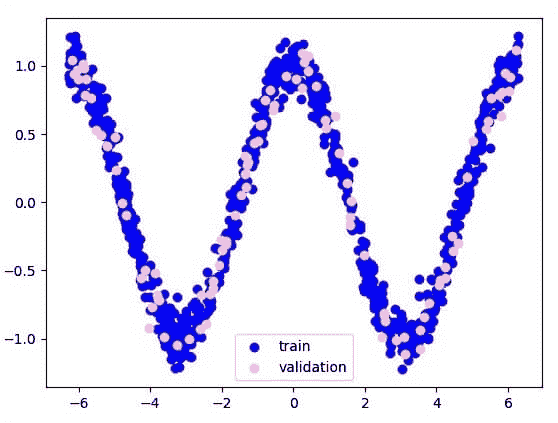
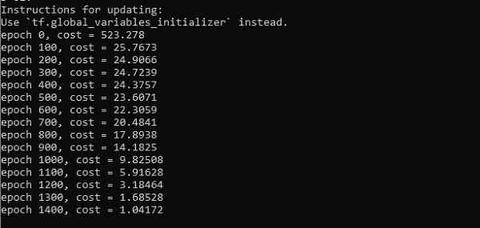
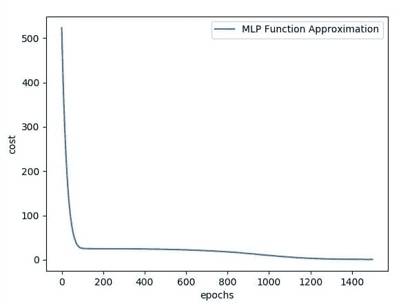

# 张量流中的隐层感知器

> 原文：<https://www.javatpoint.com/hidden-layer-perceptron-in-tensorflow>

隐藏层是介于**输入层**和**输出层**之间的一层人工神经网络。人工神经元接收一组加权输入，并通过激活函数产生输出。这是近和神经系统的一部分，工程师在其中模拟人脑中进行的活动类型。

在一些技术中建立了隐神经网络。在许多情况下，加权输入是随机分配的。另一方面，它们通过一个称为**反向传播**的过程进行微调和校准。

感知器隐藏层中的人工神经元就像大脑中的生物神经元一样工作——它接收概率输入信号，并对其进行处理。它把它们转换成对应于生物神经元轴突的输出。

输入图层之后的图层被称为隐藏图层，因为它们直接解析为输入图层。最简单的网络结构是在隐藏层有一个神经元直接输出值。

深度学习可以指在我们的神经网络中有许多隐藏的层。它们很深，因为从历史上看，它们的训练速度慢得难以想象，但使用现代技术和硬件进行准备可能需要几秒钟或几分钟。

单个隐藏层将构建一个简单的网络。

感知器隐藏层的代码如下所示:

```

#Importing the essential modules in the hidden layer
import tensorflow as tf 
import numpy as np 
import mat
plotlib.pyplot as plt 
import math, random 

np.random.seed(1000) 
function_to_learn = lambda x: np.cos(x) + 0.1*np.random.randn(*x.shape) 
layer_1_neurons = 10 
NUM_points = 1000 

#Train the parameters of hidden layer
batch_size = 100 
NUM_EPOCHS = 1500 

all_x = np.float32(np.random.uniform(-2*math.pi, 2*math.pi, (1, NUM_points))).T 
   np.random.shuffle(all_x) 

train_size = int(900) 
#Train the first 700 points in the set x_training = all_x[:train_size]
y_training = function_to_learn(x_training)

#Training the last 300 points in the given set x_validation = all_x[train_size:] 
y_validation = function_to_learn(x_validation) 

plt.figure(1) 
plt.scatter(x_training, y_training, c = 'blue', label = 'train') 
plt.scatter(x_validation, y_validation, c = 'pink', label = 'validation') 
plt.legend() 
plt.show()

X = tf.placeholder(tf.float32, [None, 1], name = "X")
Y = tf.placeholder(tf.float32, [None, 1], name = "Y")

#first layer 
#Number of neurons = 10 
w_h = tf.Variable(
   tf.random_uniform([1, layer_1_neurons],\ minval = -1, maxval = 1, dtype = tf.float32)) 
b_h = tf.Variable(tf.zeros([1, layer_1_neurons], dtype = tf.float32)) 
h = tf.nn.sigmoid(tf.matmul(X, w_h) + b_h)

#output layer 
#Number of neurons = 10 
w_o = tf.Variable(
   tf.random_uniform([layer_1_neurons, 1],\ minval = -1, maxval = 1, dtype = tf.float32)) 
b_o = tf.Variable(tf.zeros([1, 1], dtype = tf.float32)) 

#building the model
model = tf.matmul(h, w_o) + b_o 

#minimize the cost function (model - Y) 
train_op = tf.train.AdamOptimizer().minimize(tf.nn.l2_loss(model - Y)) 

#Starting the Learning phase
sess = tf.Session() sess.run(tf.initialize_all_variables()) 

errors = [] 
for i in range(NUM_EPOCHS): 
   for start, end in zip(range(0, len(x_training), batch_size),\ 
      range(batch_size, len(x_training), batch_size)): 
      sess.run(train_op, feed_dict = {X: x_training[start:end],\ Y: y_training[start:end]})
   cost = sess.run(tf.nn.l2_loss(model - y_validation),\ feed_dict = {X:x_validation}) 
   errors.append(cost) 

   if i%100 == 0: 
      print("epoch %d, cost = %g" % (i, cost)) 

plt.plot(errors,label='MLP Function Approximation') plt.xlabel('epochs') 
plt.ylabel('cost') 
plt.legend() 
plt.show()

```

**输出**

下面是函数层近似的说明-



这里两个数据以 w 的形状表示。

这两个数据是:**列车**和**验证**，它们以不同的颜色描述，如图例部分所示。




* * *