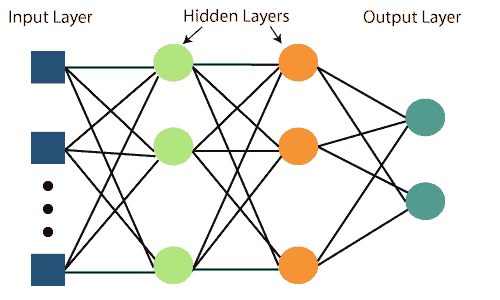
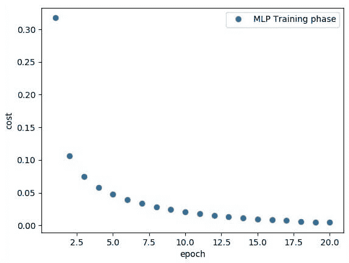

# 张量流中的多层感知器

> 原文：<https://www.javatpoint.com/multi-layer-perceptron-in-tensorflow>

多层感知器定义了最复杂的人工神经网络结构。它基本上由多层感知器形成。TensorFlow 是由发布的一个非常流行的深度学习框架，这个笔记本将指导用这个库构建神经网络。如果我们想了解什么是多层感知器，我们必须使用 Numpy 从头开始开发多层感知器。

多层感知器学习的图示如下-



MLP 网络用于监督学习格式。MLP 网络的典型学习算法也称为**反向传播算法**。

多层感知器(MLP)是前馈人工神经网络，它从一组输入生成一组输出。MLP 的特征在于几层输入节点，在输入节点之间连接成有向图，在输入和输出层之间连接成有向图。MLP 使用反向传播来训练网络。MLP 是一种深度学习方法。

现在，我们将重点放在一个图像分类问题的 MLP 实现上。

```

# Import MINST data 
from tensorflow.examples.tutorials.mnist import input_data 
mnist = input_data.read_data_sets("/tmp/data/", one_hot = True) 

import tensorflow as tf 
import matplotlib.pyplot as plt 

# Parameters 
learning_rate = 0.001 
training_epochs = 20 
batch_size = 100 
display_step = 1 

# Network Parameters 
n_hidden_1 = 256 

# 1st layer num features
n_hidden_2 = 256 # 2nd layer num features 
n_input = 784 # MNIST data input (img shape: 28*28) n_classes = 10 
# MNIST total classes (0-9 digits) 

# tf Graph input 
x = tf.placeholder("float", [None, n_input]) 
y = tf.placeholder("float", [None, n_classes]) 

# weights layer 1 
h = tf.Variable(tf.random_normal([n_input, n_hidden_1])) # bias layer 1 
bias_layer_1 = tf.Variable(tf.random_normal([n_hidden_1])) 
# layer 1 layer_1 = tf.nn.sigmoid(tf.add(tf.matmul(x, h), bias_layer_1)) 

# weights layer 2 
w = tf.Variable(tf.random_normal([n_hidden_1, n_hidden_2])) 

# bias layer 2 
bias_layer_2 = tf.Variable(tf.random_normal([n_hidden_2])) 

# layer 2 
layer_2 = tf.nn.sigmoid(tf.add(tf.matmul(layer_1, w), bias_layer_2)) 

# weights output layer 
output = tf.Variable(tf.random_normal([n_hidden_2, n_classes])) 

# biar output layer 
bias_output = tf.Variable(tf.random_normal([n_classes])) # output layer 
output_layer = tf.matmul(layer_2, output) + bias_output

# cost function 
cost = tf.reduce_mean(tf.nn.sigmoid_cross_entropy_with_logits(
   logits = output_layer, labels = y)) 

#cost = tf.reduce_mean(tf.nn.sigmoid_cross_entropy_with_logits(output_layer, y)) 
# optimizer 
optimizer = tf.train.AdamOptimizer(learning_rate = learning_rate).minimize(cost) 

# optimizer = tf.train.GradientDescentOptimizer(
   learning_rate = learning_rate).minimize(cost) 

# Plot settings 
avg_set = [] 
epoch_set = [] 

# Initializing the variables 
init = tf.global_variables_initializer() 

# Launch the graph 
with tf.Session() as sess: 
   sess.run(init) 

   # Training cycle
   for epoch in range(training_epochs): 
      avg_cost = 0\. 
      total_batch = int(mnist.train.num_examples / batch_size) 

      # Loop over all batches 
      for i in range(total_batch): 
         batch_xs, batch_ys = mnist.train.next_batch(batch_size) 
         # Fit training using batch data sess.run(optimizer, feed_dict = {
            x: batch_xs, y: batch_ys}) 
         # Compute average loss 
         avg_cost += sess.run(cost, feed_dict = {x: batch_xs, y: batch_ys}) / total_batch
      # Display logs per epoch step 
      if epoch % display_step == 0: 
         print 
         Epoch:", '%04d' % (epoch + 1), "cost=", "{:.9f}".format(avg_cost)
      avg_set.append(avg_cost) 
      epoch_set.append(epoch + 1)
   print 
   "Training phase finished" 

   plt.plot(epoch_set, avg_set, 'o', label = 'MLP Training phase') 
   plt.ylabel('cost') 
   plt.xlabel('epoch') 
   plt.legend() 
   plt.show() 

   # Test model 
   correct_prediction = tf.equal(tf.argmax(output_layer, 1), tf.argmax(y, 1)) 

   # Calculate accuracy 
   accuracy = tf.reduce_mean(tf.cast(correct_prediction, "float")) 
   print 
   "Model Accuracy:", accuracy.eval({x: mnist.test.images, y: mnist.test.labels})

```

**上述代码行产生以下输出-**



## 创建交互式部分

使用 TensorFlow 运行代码时，我们有两个基本选项:

*   构建图形并运行会话[完成所有设置，然后执行一个会话以实现一个会话来评估张量并运行操作]。
*   创建我们的编码并运行。

对于第一部分，我们将使用更适合木星笔记本这样的环境的交互式会话。

```

sess = tf.InteractiveSession()

```

## 创建占位符

使用 TensorFlow 时，最好在变量赋值之前创建占位符。这里我们将为输入(“Xs”)和输出(“Ys”)创建占位符。

占位符“X”:表示分配给输入或图像的“空间”。

*   每个输入都有 784 个像素，以 28 宽×28 高的矩阵分布。
*   “形状”参数通过张量的尺寸来定义张量的大小。

* * *