# TensorFlow中的ANN

> 原文：<https://www.javatpoint.com/artificial-neural-network-in-tensorflow>

神经网络或**ANN** (ANN)建模与人脑相同。人脑有一种在特定情况下思考和分析任何任务的能力。

但是机器怎么能那样思考呢？为此，设计了一个被称为神经网络的人工大脑。神经网络由许多**感知器**组成

**感知器**是单层神经网络。它是一个二元分类器，也是监督学习的一部分。ANN中生物神经元的简单模型称为感知器。

人工神经元有输入和输出。

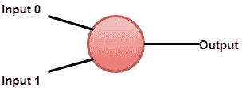

**感知器模型的数学表示。**

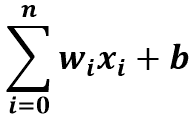

人脑有传递信息的神经元，同样，神经网络也有执行相同任务的节点。节点是数学函数。

神经网络是基于生物神经网络的结构和功能。神经网络本身会根据输入和输出进行改变或学习。由于ANN的学习和性能的提高，流经系统的信息会影响其结构。

一个**神经网络**也被定义为:

> *由几个简单的、高度互联的处理元件组成的计算系统，这些处理元件通过对外部输入的动态响应来处理信息*。

一个神经网络可以由多个感知器组成。那里有三层-

*   **输入图层**:输入图层是来自数据的真实值。
*   **隐藏层**:隐藏层在输入输出层之间，其中三层或三层以上为深网。
*   **输出层**:是输出的最终预估。

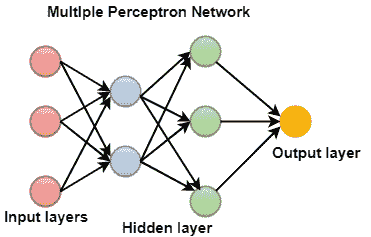

## ANN的类型

神经网络的工作原理与人类神经系统的功能相同。神经网络有几种类型。这些网络实现基于确定输出所需的一组参数和数学运算。

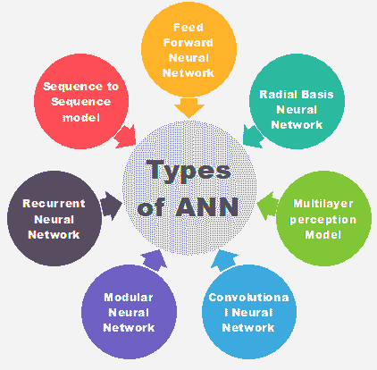

### 前馈神经网络(人工神经元)

**FNN** 是最纯粹的ANN形式，其中输入和数据只在一个方向上传播。数据仅向前流动；这就是为什么它被称为**前馈神经网络**。数据通过输入节点，从输出节点退出。节点不是循环连接的。它不需要有隐藏层。在 FNN，不需要多层。它也可以有单层。

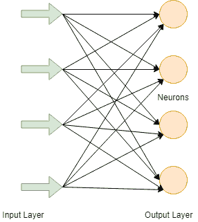

它具有通过使用分类激活函数实现的前传播波。所有其他类型的神经网络都使用反向传播，但 FNN 不能。在 FNN，产品的投入和重量之和被计算出来，然后被输入到产出中。FNN 采用**人脸识别****计算机视觉**等技术。

### 径向基函数神经网络

**RBFNN** 求一个点到中心的距离，认为它工作平稳。径向基函数神经网络分为两层。在内层，特征与径向基函数相结合。特性提供了一个考虑使用的输出。也可以使用其他度量，而不是欧几里德度量。

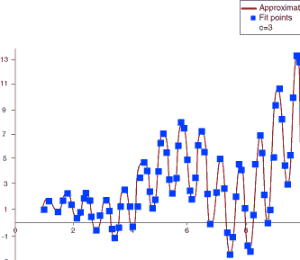

**重拨基础功能**

*   我们定义了受体 t。
*   受体周围画有对峙的地图。
*   对于径向基函数，通常使用高斯函数。所以我们可以定义径向距离 **r=||X-t||** 。

**重拨功能=φ(r)= exp(-r2/2σ2)**，其中σ > 0

该神经网络用于电力恢复系统。在当今时代，电力系统的规模和复杂性都在增加。这两个因素都增加了大停电的风险。停电后，需要尽快可靠地恢复供电。

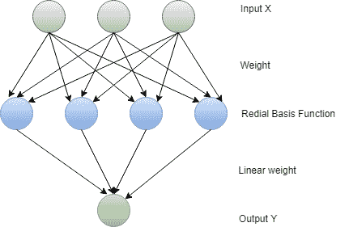

### 多层感知器

一个**多层感知器**有三层或更多层。不能线性分离的数据借助这个网络进行分类。该网络是一个完全连接的网络，这意味着每个节点都与下一层的所有其他节点相连。多层感知器中使用了**非线性激活函数****。它的输入和输出层节点连接成一个有向图。这是一种深度学习的方法，因此为了训练网络，它使用**反向传播**。它广泛应用于语音识别和机器翻译技术。**

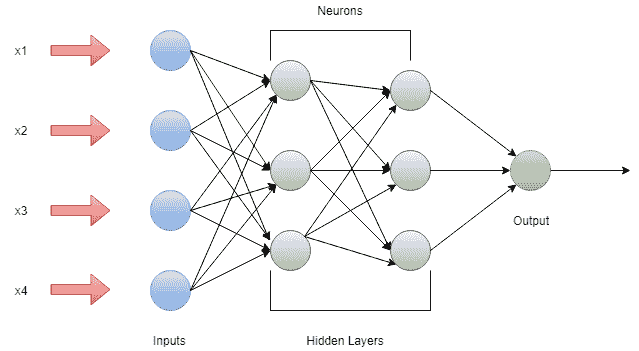

### 卷积神经网络

在图像分类和图像识别中，一个**卷积神经网络**起着至关重要的作用，或者我们可以说它是那些的主要类别。人脸识别、物体检测等。，是 CNN 被广泛使用的一些领域。这与 FNN 相似，神经元中存在可学习的权重和偏差。

CNN 将一幅图像作为输入，在狗、猫、狮子、老虎等特定类别下进行分类处理。正如我们所知，计算机将图像视为像素，并取决于图片的分辨率。基于图像分辨率，它会看到 h * w * d，其中 h=高度 w=宽度，d=尺寸。例如，一幅 RGB 图像是矩阵的 6 * 6 * 3 阵列，而灰度图像是图案的 4 * 4 * 3 阵列。

在美国有线电视新闻网中，每个输入图像将通过一系列卷积层以及池化、完全连接的层、过滤器(也称为核)。并应用软最大值函数对概率值为 0 和 1 的对象进行分类。

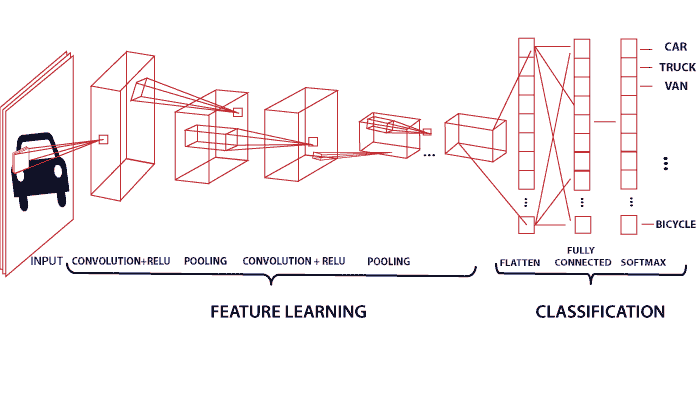

### 递归神经网络

**递归神经网络**基于预测。在这个神经网络中，特定层的输出被保存并反馈给输入。这将有助于预测该层的结果。在递归神经网络中，第一层以与 FNN 层相同的方式形成，在随后的层中，递归神经网络过程开始。

输入和输出都是相互独立的，但在某些情况下，需要预测句子的下一个单词。

那么它将取决于句子的前一个单词。RNN 以其主要和最重要的特征而闻名，即**隐藏状态**。隐藏状态会记住关于序列的信息。

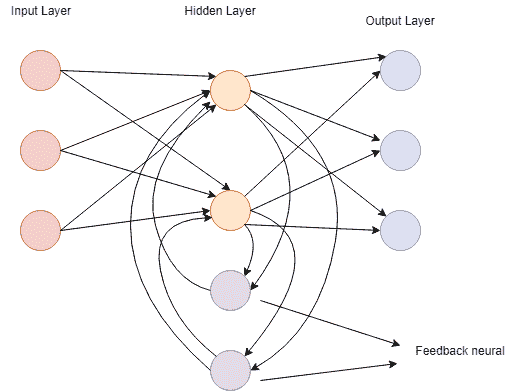

RNN 有一个存储器来存储计算后的结果。RNN 在每个输入上使用相同的参数，在所有隐藏层或数据上执行相同的任务，以产生输出。与其他神经网络不同，RNN 参数复杂度较低。

### 模块化神经网络

在**模块化神经网络**中，几个不同的网络在功能上是独立的。在 MNN，任务被分成子任务，由几个系统执行。在计算过程中，网络之间不直接通信。所有的接口都是独立工作来实现输出的。组合网络比平面和无限制网络更强大。中介承担每个系统的生产，处理它们以产生最终的输出。

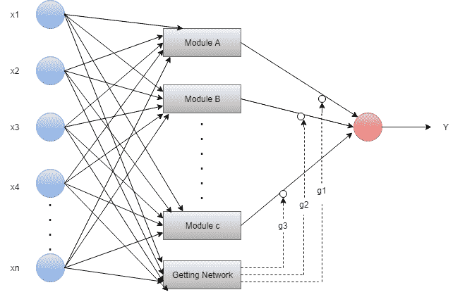

### 序列到序列网络

它由两个递归神经网络组成。这里，编码器处理输入，解码器处理输出。编码器和解码器可以用于相同或不同的参数。

序列到序列模型应用于聊天机器人、机器翻译和问答系统。

## ANN的组成部分

### 神经元

**神经元**类似于生物神经元。神经元只不过是激活功能。人工神经元或激活功能在执行分类任务时具有打开的“**开关”特征。我们可以说当输入高于特定值时；输出应该改变状态，即 0 到 1，-1 到 1 等。乙状线函数是**ANN**中常用的激活函数。**

**F (Z) = 1/1+EXP (-Z)**

### 节点

生物神经元以分级网络连接，一些神经元的输出是其他神经元的输入。这些网络被表示为节点的连接层。每个节点接受多个加权输入，并将这些输入加到神经元上，生成一个输出。

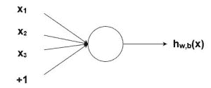

### 偏见

在神经网络中，我们根据给定的输入(x)预测输出(y)。我们创建一个模型，即(mx + c)，它帮助我们预测输出。当我们训练模型时，它会找到常数 m 和 c 本身的适当值。

常数 c 是偏差。偏差以最适合给定数据的方式帮助模型。我们可以说偏见给了表现最好的自由。

### 算法

**神经网络中需要算法**。生物神经元具有自我理解和工作能力，但一个人工神经元将如何以同样的方式工作？为此，有必要训练我们的人工神经元网络。为此，使用了许多算法。每种算法都有不同的工作方式。

在神经网络的训练中使用了五种算法

*   梯度下降
*   牛顿法
*   共轭梯度
*   准牛顿定律
*   莱文伯格·马夸特

## 梯度下降

**梯度下降算法**也被称为**最速下降算法**。这是最直接的算法，需要来自梯度向量的信息。GD 算法是一阶方法。

为简单起见，我们表示**(w(I))**=**(I)**和**∇ƒ(w(I))**=**g(I)**。方法从 w (0) 开始，在训练方向**d(I)**=-**g(I)**移动到 **w (i+1)** 直到满足停车标准。

所以梯度下降法以下面的方式迭代。

**w(I+1)**=**w(I)**-**g(I)**n(I)。

### 牛顿法

**牛顿法**是二阶算法。它利用了黑森矩阵。其主要任务是利用损失函数的二阶导数寻找更好的训练方向。

牛顿法迭代如下。

**w(I+1)**=**w(I)**-**H(I)-1**。 **g (i)** 对于 i = 0，1.....

这里，H (i)-1 。g (i) 被称为牛顿的一步。参数的变化可能向最大值而不是最小值移动。下图是用牛顿法训练神经网络的示意图。参数的改进是通过获得训练方向和合适的训练速率来实现的。

### 共轭梯度

**共轭梯度**介于梯度下降法和牛顿法之间。共轭梯度避免了牛顿法要求的与评估、黑森矩阵反演和存储相关的信息要求。

在重心算法中，搜索是在共轭方向上进行的，这给出了比梯度下降方向更快的收敛。训练是在关于黑森矩阵的共轭方向上进行的。参数的改进是通过计算共轭训练方向，然后在该方向上计算合适的训练速率来实现的。

### 拟牛顿法

牛顿法的应用在计算方面是昂贵的。要评估黑森矩阵，需要做很多运算。为了解决这个缺点，发展了**拟牛顿法**。也称为变量矩阵法。在算法的每一次迭代中，它都建立逆 hessian 的近似，而不是直接计算 hessian。损失函数一阶导数的信息用于计算近似值。

参数的改进是通过获得一个拟牛顿训练方向，然后找到一个令人满意的训练率。

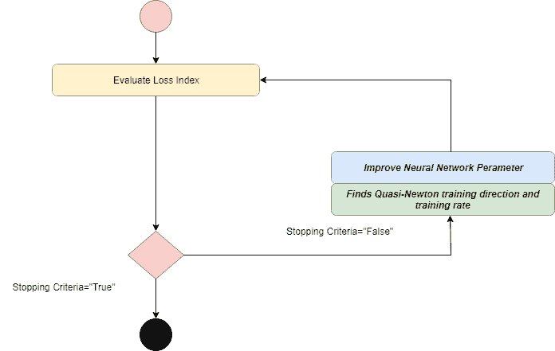

### 莱文伯格·马夸特

**Levenberg Marquardt** 也称为阻尼最小二乘法。该算法是专门为损失函数设计的。该算法不计算黑森矩阵。它使用**雅可比矩阵**和**梯度向量**。

在勒温伯格马夸特中，第一步是找到损失、梯度和黑森近似，然后调整饺子参数。

## ANN的优缺点

### ANN的优势

1.  它将信息存储在整个网络上，而不是数据库中。
2.  经过ANN的训练，即使信息不完整，数据也可能给出结果。
3.  如果ANN的一个或多个单元损坏，它不会阻止ANN生成输出。
4.  ANN具有分布式内存，有助于产生所需的输出。
5.  ANN可以使机器变得可学习。
6.  ANN具有并行处理能力，这意味着它可以同时执行多个任务。

### ANN的缺点

1.  根据它们的结构，它需要一个具有并行处理能力的处理器。
2.  网络无法解释的行为是ANN的主要问题。当ANN产生一个试探性的解决方案时，它不会给出任何线索。
3.  对于ANN结构的确定，没有提供具体的规则。
4.  没有关于网络持续时间的信息。
5.  向网络展示问题太典型了。

* * *