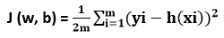
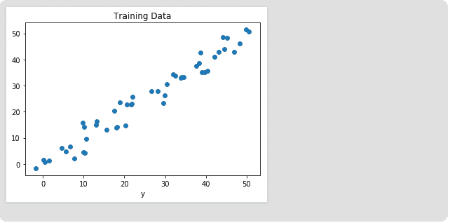
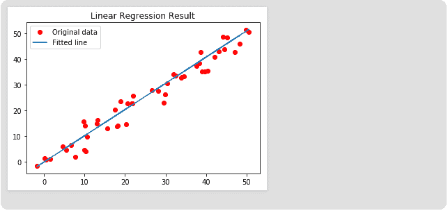

# TensorFlow中的线性回归

> 原文：<https://www.javatpoint.com/linear-regression-in-tensorflow>

线性回归是一种基于监督学习的机器学习算法。它执行回归函数。回归基于自变量对目标预测值进行建模。它主要用于检测变量和预测之间的关系。

线性回归是线性模型；例如，假设输入变量(x)和单个输出变量(y)之间存在线性关系的模型。特别是，y 可以通过输入变量(x)的线性组合来计算。

线性回归是一种流行的统计方法，它允许我们从一组连续的数据中学习一个函数或关系。比如给我们一些 x 的数据点和对应，我们需要知道它们之间的关系，这就叫假设。

在线性回归的情况下，假设是一条直线，即，

**h (x) = wx + b**

其中 **w** 是一个叫做**权重**的向量， **b** 是一个叫做**偏差**的标量。权重和偏差称为模型的参数。

We need to estimate the value of w and b from the set of data such that the resultant hypothesis produces at least cost 'j,' which has been defined by the below **cost function**. 

其中 m 是特定数据集中的数据点。

这个成本函数被称为**均方误差**。

对于 j 值最小的参数优化，我们将使用一种常用的优化算法，称为梯度下降。下面是梯度下降的伪代码:

```

Repeat until Convergence {
    w = w - ? * ?J/?w
    b = b - ? * ?J/?b
}

```

哪里？是一个名为**学习率**的**超参数**。

## 线性回归的实现

我们将开始在 Tensorflow 中导入必要的库。我们将使用带有TensorFlow的 **Numpy** 进行计算，使用 **Matplotlib** 进行绘图。

首先，我们必须导入包:

```

import matplotlib.pyplot as plt
import numpy as np
import tensorflow as tf

```

为了预测随机数，我们必须为TensorFlow和 Numpy 定义固定种子。

```

tf.set_random_seed(101)
np.random.seed(101)

```

现在，我们必须生成一些随机数据来训练线性回归模型。

```

# Generating random linear data 
# There will be 50 data points which are ranging from 0 to 50.
x = np.linspace(0, 50, 50) 
y = np.linspace(0, 50, 50) 

# Adding noise to the random linear data 
x += np.random.uniform(-4, 4, 50) 
y += np.random.uniform(-4, 4, 50) 
n= len(x) #Number of data points

```

让我们将训练数据可视化。

#训练数据图

```

plt.scatter(x, y) 
plt.xlabel('x') 
plt.xlabel('y') 
plt.title("Training Data") 
plt.show() 

```

**输出**



现在，我们将通过定义占位符 x 和 y 来开始构建我们的模型，这样我们就可以在训练过程中将训练示例 x 和 y 输入到优化器中。

```

X= tf.placeholder("float")
Y= tf.placeholder("float")

```

现在，我们可以为偏差和权重声明两个可训练的TensorFlow变量，并使用以下方法随机初始化它们:

```

np.random.randn().
W= tf.Variable(np.random.randn(), name="W")
B= tf.Variable(np.random,randn(), name="b")

```

现在我们定义模型的超参数、学习率和纪元数。

```

learning_rate= 0 .01
training_epochs= 1000

```

现在，我们将建立假设，成本函数和优化器。我们不会手动实现梯度下降优化器，因为它是在TensorFlow中构建的。之后，我们将初始化方法中的变量。

```

# Hypothesis of the function
y_pred = tf.add(tf.multiply(X, W), b) 
# Mean Square Error function
      cost = tf.reduce_sum(tf.pow(y_pred-Y, 2)) / (2 * n)  
# Gradient Descent Optimizer function
optimizer = tf.train.GradientDescentOptimizer (learning_rate).minimize(cost)
# Global Variables Initializer 
init = tf.global_variables_initializer( )

```

现在，我们开始 TensorFlow 会话中的培训过程。

```

# Starting the Tensorflow Session 
with tf.Session() as sess: 

   # Initializing the Variables 
    sess.run(init) 

   # Iterating through all the epochs 
    for epoch in range(training_epochs): 

    # Feeding each data point into the optimizer according to the Feed Dictionary.
  for (_x, _y) in zip(x, y):  
  sess.run(optimizer, feed_dict = {X : _x, Y : _y})  

# Here, we are displaying the result after every 50 epoch  
        if (epoch + 1) % 50 ==0: 
 # Calculating the cost at every epoch. 
 c = sess.run(cost, feed_dict = {X : x, Y : y})  
print("Epoch", (epoch + 1), ": cost =", c, "W =", sess.run(W), "b=", sess.run(b))
 # Store the necessary value which has used outside the Session 
    training_cost = sess.run (cost, feed_dict ={X: x, Y: y})  
    weight = sess.run(W) 
    bias = sess.run(b) 

```

**输出如下:**

```
Epoch: 50  cost = 5.8868037 W = 0.9951241 b = 1.2381057
Epoch: 100 cost = 5.7912708 W = 0.9981236 b = 1.0914398
Epoch: 150 cost = 5.7119676 W = 1.0008028 b = 0.96044315
Epoch: 200 cost = 5.6459414 W = 1.0031956 b = 0.8434396
Epoch: 250 cost = 5.590798 W = 1.0053328 b = 0.7389358
Epoch: 300 cost = 5.544609 W = 1.007242 b = 0.6455922
Epoch: 350 cost = 5.5057884 W = 1.008947 b = 0.56223
Epoch: 400 cost = 5.473068 W = 1.01047 b = 0.46775345
Epoch: 450 cost = 5.453845 W = 1.0118302 b = 0.42124168
Epoch: 500 cost = 5.421907 W = 1.0130452 b = 0.36183489
Epoch: 550 cost = 5.4019218 W = 1.0141305 b = 0.30877414
Epoch: 600 cost = 5.3848578 W = 1.0150996  b = 0.26138115
Epoch: 650 cost = 5.370247 W = 1.0159653  b = 0.21905092
Epoch: 700 cost = 5.3576995 W = 1.0167387  b = 0.18124212
Epoch: 750 cost = 5.3468934 W = 1.0174294  b = 0.14747245
Epoch: 800 cost = 5.3375574 W = 1.0180461  b = 0.11730932
Epoch: 850 cost = 5.3294765 W = 1.0185971  b = 0.090368526
Epoch: 900 cost = 5.322459 W = 1.0190894  b = 0.0663058
Epoch: 950 cost = 5.3163588 W = 1.0195289  b = 0.044813324
Epoch: 1000 cost = 5.3110332 W = 1.0199218  b = 0.02561669

```

现在，看看结果。

```

# Calculate the predictions
predictions = weight * x + bias 
print ("Training cost =", training_cost, "Weight =", weight, "bias =", bias, '\n') 

```

**输出**

```
Training cost= 5.3110332 Weight= 1.0199214 bias=0.02561663

```

请注意，在这种情况下，权重和偏差都是有序的标量。这是因为我们在训练数据中只检查了一个因变量。如果我们的训练数据集中有 m 个因变量，权重将是一维向量，而偏差将是标量。

最后，我们将绘制我们的结果:

```

# Plotting the Results below
plt.plot(x, y, 'ro', label ='original data')
plt.plot(x, predictions, label ='Fited line')
plt.title('Linear Regression Result') 
plt.legend() 
plt.show() 

```

**输出**



* * *