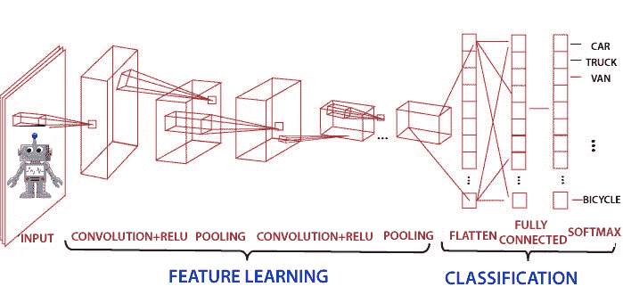
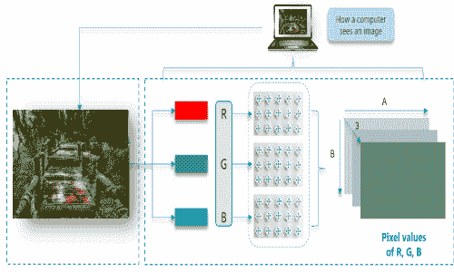
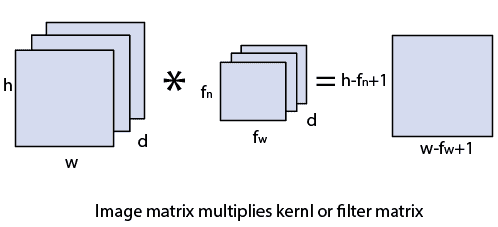
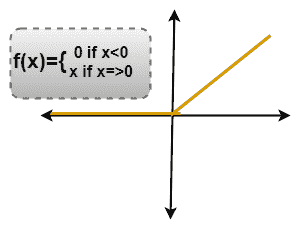
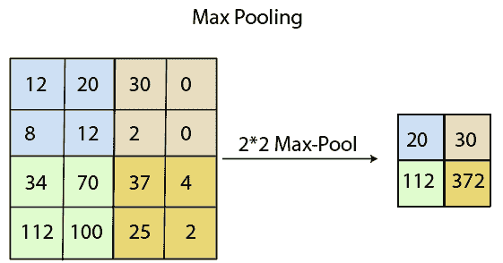
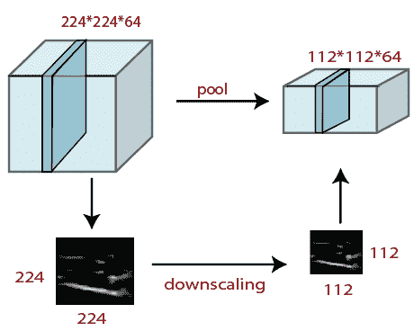
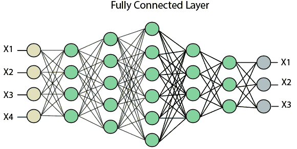
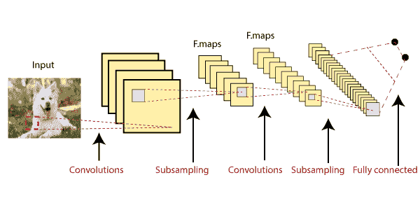

# 张量流中卷积神经网络的引入

> 原文：<https://www.javatpoint.com/convolutional-neural-network-in-tensorflow>

卷积神经网络是神经网络中进行图像分类和图像识别的技术之一。它被设计成通过多层阵列来处理数据。这种类型的神经网络用于像**图像识别**或**人脸识别**这样的应用中。CNN 与其他神经网络的主要区别在于，CNN 将输入作为二维数组。它直接对图像进行操作，而不是像其他神经网络那样专注于特征提取。



美国有线电视新闻网的主要方法包括解决识别问题。像**谷歌**和**脸书**这样的公司已经投资了与识别项目相关的领域研发，以更快的速度完成活动。

场景标注、物体检测、人脸识别等。是卷积神经网络工作的一些领域。

卷积神经网络(CNN 或 ConvNet)是一种前馈人工网络，其神经元之间的连接模式受到动物**视觉皮层**组织的启发。

> **视皮层**有一个小的细胞区域，对视野的特定区域敏感。我们大脑中的一些单个神经元细胞在特定方向的边缘出现时会做出反应。

## 卷积神经网络的起源

神经网络的智能是非自然的。虽然人工神经网络早在 20 世纪 60 年代由**罗森布拉特**在**研究**，但直到 2000 年代后期**才开始使用神经网络进行深度学习。关键的促成因素是计算能力和数据集的规模，谷歌正在将研究发展成深度学习。在 2012 年 7 月**中，谷歌的研究人员公开了一种先进的神经网络，用于从 YouTube 视频中分割出一系列未标记的静态图像。****

 ******例如**

乍看之下，想象一下这个自然的形象；我们会看到很多建筑和颜色。

### 计算机如何读取图像？

图像分为 3 个颜色通道，分别是**红色**、**绿色**和**蓝色**。这些颜色通道中的每一个都映射到图像的像素。



一些神经元在暴露于顶点边缘时激发，一些神经元在显示水平或对角边缘时激发。有线电视新闻网利用输入数据存在的空间相关性。神经网络的每个并发层连接一些输入神经元。这个区域被称为局部感受野。局部感受野集中在隐藏的神经元上。

隐藏神经元处理上述域内的输入数据，不实现特定边界外的变化。

## 卷积神经网络有以下 4 层:

*   卷积的
*   图层继电器
*   联营
*   完全连接

### 卷积层

卷积层是从输入图像中导出特征的第一层。卷积层通过使用输入数据的小方块学习图像特征来保存像素之间的关系。是取**图像矩阵****核**或**任意滤波器**等两个输入的数学运算。

*   图像矩阵的维数为 **h×w×d** 。
*   任何过滤器的尺寸为 **f <sub>h</sub> ×f <sub>w</sub> ×d** 。
*   输出尺寸为**(h-f<sub>h</sub>+1)×(w-f<sub>w</sub>+1)×1**。



### 图层继电器

**整流线性单元(ReLU)** 变换功能仅在输入高于一定量时激活节点。当数据低于零时，输出为零，但当输入上升到某个阈值以上时。它与因变量呈线性关系。

在这一层中，我们从过滤后的图像中移除所有负值，并用零替换它们。

这是为了避免数值加起来为零。



### 汇集层

池层在任何图像的预处理中起着至关重要的作用。当图像太大时，池层减少了参数的数量。汇集是从先前的层实现的图像的**“缩小”**。它可以比作缩小图像以降低图像的密度。空间池也称为下采样和二次采样，它们降低了每个地图的维度，但保留了基本信息。以下是空间池的类型。

我们通过执行以下 4 个步骤来做到这一点:

*   选择一个**窗口大小**(通常为 2 或 3)
*   选择**步幅**(通常为 2)
*   走过你的窗口 T2 穿过你的 T4 过滤图像
*   从每个**窗口**取**最大**值

### 最大池

最大池化是一个**基于样本的离散化过程**。最大池化的主要目标是缩小输入表示，降低其维数，并允许假设子区域中包含的特征。

最大池化是通过在初始表示的非重叠子区域中应用最大过滤器来完成的。




### 平均池

通过将输入划分为矩形汇集区域并计算每个区域的平均值，通过平均汇集来执行缩减。

**语法**

```

layer = averagePooling2dLayer(pool Size)
layer = averagePooling2dLayer(poolSize, Name, Value)

```

### 总和池

**总和汇集**和**均值汇集**的子区域设置与**最大汇集**相同，但我们使用总和或均值代替最大函数。

在这一层中，我们将图像堆栈缩小为更小的步长；

1.  选择窗口大小(通常为 2 或 3)
2.  选择步幅(通常为 2 步)
3.  走过我们的窗口，穿过过滤后的图像。
4.  从每个窗口中，取最大值。

执行池化，窗口大小为 2，步长为 2。

### 完全连接(密集)层

完全连接层(密集层)是一个层，来自其他层的输入将被压入矢量。它会将输出转换成网络中任何所需数量的类。



在上图中，地图矩阵被转换为向量，如 **x1，x2，x3...xn** 借助全连接层。我们将结合各种功能创建任何模型，并应用激活功能，如 **softmax** 或 **sigmoid** 将输出分类为汽车、狗、卡车等。



这是实际分类发生的最后阶段。

* * *****