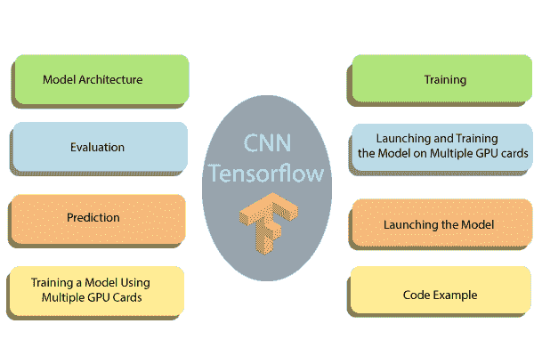

# 用张量流训练美国有线电视新闻网

> 原文：<https://www.javatpoint.com/training-of-cnn-in-tensorflow>

MNIST 数据库(**修改后的国家标准技术研究所数据库**)是一个广泛的手写数字数据库，用于训练各种图像处理系统。它是由**从 **MNIST** 的原始数据集重新整合**样本而创建的。

如果我们熟悉 Connects 的构建模块，我们就准备好用 TensorFlow 构建一个了。我们使用 MNIST 数据集进行图像分类。

准备数据与上一教程相同。我们可以运行代码，直接跳转到 CNN 的架构中。

这里，我们在**谷歌 Colab** (机器学习的在线编辑器)中执行我们的代码。

我们可以通过下面的链接进入 TensorFlow 编辑器:[https://colab.research.google.com](https://colab.research.google.com)

这些是用来训练卷积神经网络的步骤。

**步骤:**

**步骤 1:** 上传数据集

**步骤 2:** 输入层

**步骤 3:** 卷积层

**第四步:**汇聚层

**步骤 5:** 卷积层和汇聚层

**第六步:**致密层

**第 7 步:**逻辑层



## 步骤 1:上传数据集

MNIST 数据集可通过本网址(统一资源定位器)中的 scikit 进行学习。我们可以下载并存储在我们的下载中。我们可以用 fetch_mldata ('MNIST 原创')上传。

### 创建测试/训练集

我们需要将数据集拆分成 **train_test_split** 。

**缩放特征**

最后，我们借助**最小最大缩放器**来缩放函数。

```

import numpy as np
import tensorflow as tf

from sklearn.datasets import fetch_mldata
#Change USERNAME by the username of the machine
##Windows USER
mnist = fetch_mldata('C:\\Users\\USERNAME\\Downloads\\MNIST original')
## Mac User
mnist = fetch_mldata('/Users/USERNAME/Downloads/MNIST original')
print(mnist.data.shape)
print(mnist.target.shape)
from sklearn.model_selection import train_test_split
A_train, A_test, B_train, B_test = train_test_split(mnist.data,mnist.target, test_size=0.2, random_state=45)
B_train  = B_train.astype(int)
B_test  = B_test.astype(int)
batch_size =len(X_train)
print(A_train.shape, B_train.shape,B_test.shape )
## rescale
from sklearn.preprocessing import MinMaxScaler
scaler = MinMaxScaler()
# Train the Dataset
X_train_scaled = scaler.fit_transform(A_train.astype(np.float65))

```

```

#test the dataset
X_test_scaled = scaler.fit_transform(A_test.astype(np.float65))
feature_columns = [tf.feature_column.numeric_column('x',shape=A_train_scaled.shape[1:])]
X_train_scaled.shape[1:]

```

## 定义卷积神经网络

与传统神经网络的全局模式相比，有线电视新闻网对任何图像的像素使用过滤器来学习详细的模式。要创建 CNN，我们必须定义:

1.  **卷积层:**将过滤器的数量应用于特征图。卷积后，我们需要使用继电器激活函数来增加网络的非线性。
2.  **汇聚层:**约定后的下一步是对最大设施进行下采样。目的是降低特征图的移动性，防止过拟合，提高计算速度。最大池化是一种传统技术，它将要素地图拆分为子字段，并且只保存最大值。
3.  **完全连接的层:**过去层的所有神经元都与下一层的其他神经元相关联。美国有线电视新闻网已经根据卷积层的特征对标签进行了分类，并减少了任何汇集层。

## 有线电视新闻网建筑

*   **卷积层:**应用 14 个 5x5 滤波器(提取 5x5 像素子区域)，
*   **汇集图层:**这将使用 2x2 过滤器和 2 的跨距(指定汇集区域不重叠)执行最大汇集。
*   **卷积层:**应用 36 个 5x5 滤波器，具有 ReLU 激活功能
*   **汇集层:**再次，使用 2x2 过滤器和 2 的步幅执行最大汇集。
*   **1，764 个神经元，**的脱落正则化率为 0.4(其中任意给定元素在训练中脱落的概率为 0.4)
*   **密层(Logits Layer):** 有十个神经元，每个数字目标类(0-9)一个。

**用于创建 CNN 的重要模块:**

1.  Conv2d()。构建一个二维卷积层，包含滤波器数量、滤波器内核大小、填充和激活函数等参数。
2.  max _ pooling2d()。使用最大池算法构建二维池层。
3.  密集()。用隐藏的层和单元构建一个密集的层

我们可以定义一个函数来构建 CNN。

让我们详细看看如何在包装函数中的所有内容之前构造每个构建块。

## 第二步:输入层

```

#Input layer
def cnn_model_fn(mode, features, labels):
input_layer = tf.reshape(tensor= features["x"],shape=[-1, 26, 26, 1])

```

我们需要用数据的形状定义一个张量。为此，我们可以使用**模块 tf .重塑**。在这个模块中，我们需要声明张量来重塑和塑造张量。第一个参数是数据的特征，在函数的参数中定义。

图片有宽度、高度和通道。 **MNIST** 数据集是一张单色图片，大小为 **28x28** 。我们在 shape 参数中将批处理大小设置为-1，这样它就采用了特征["x"]的形状。这样做的好处是将批量调整到超参数。如果批量为 7，张量馈送 **5，488** 值( **28 * 28 * 7** )。

## 步骤 3:卷积层

```

# first CNN Layer
conv1 = tf.layers.conv2d(
 inputs= input_layer, 
 filters= 18, 
 kernel_size= [7, 7], 
 padding="same", 
 activation=tf.nn.relu) 

```

第一个卷积层有 18 个滤波器，内核大小为 7x7，填充相等。相同的填充使输出张量和输入张量具有相同的宽度和高度。TensorFlow 将在行和列中添加零，以确保大小相同。

我们使用 Relu 激活功能。输出大小将为[28、28 和 14]。

## 步骤 4:池层

卷积后的下一步是合并计算。合并计算将减少数据的扩展。我们可以使用模块 max _ pooling2d，大小为 3x3，步幅为 2。我们使用前一层作为输入。输出大小可以是[batch_size，14，14 和 15]。

```

##first Pooling Layer 
pool1 = tf.layers.max_pooling2d (inputs=conv1,
pool_size=[3, 3], strides=2)

```

## 步骤 5:汇集层和第二卷积层

第二个 CNN 正好有 32 个过滤器，输出大小为[batch_size，14，14，32]。池层的大小与前面相同，输出形状为[batch_size，14，14 和 18]。

```

conv2 = tf.layers.conv2d(
      inputs=pool1,
      filters=36,
      kernel_size=[5, 5],
      padding="same",
      activation=tf.nn.relu)
pool2 = tf.layers.max_pooling2d (inputs=conv2, pool_size=[2, 2],strides=2).

```

## 步骤 6:完全连接(密集)层

我们必须定义全连接层。在与密集图层结合之前，必须对要素地图进行压缩。我们可以使用尺寸为 **7*7*36** 的模块重塑。

致密层将连接 **1764** 神经元。我们添加了一个 Relu 激活函数，可以添加一个 Relu 激活函数。我们添加了一个辍学率正则化项，比率为 0.3，这意味着 30%的权重将为 0。辍学只发生在培训阶段。 **cnn_model_fn()** 有一个参数模式来声明模型是否需要训练或评估。

```

pool2_flat = tf.reshape(pool2, [-1, 7 * 7 * 36])
dense = tf.layers.dense(inputs=pool2_flat, units=7 * 7 * 36, activation=tf.nn.relu)
dropout = tf.layers.dropout(
inputs=dense, rate=0.3, training=mode == tf.estimator.ModeKeys.TRAIN)

```

## 步骤 7:逻辑层

最后，我们用模型的预测来定义最后一层。输出形状等于批次大小 12，等于图层中的图像总数。

```

#Logit Layer
logits = tf.layers.dense(inputs=dropout, units=12)	

```

我们可以创建一个包含类和每个类的可能性的字典。如果是 logit 层，该模块将使用 tf.argmax()返回最高值。softmax 函数返回每个类的概率。

```

predictions= {
 # Generate predictions 
"classes":tf.argmax(input=logits, axis=1),
"probabilities":tf.nn.softmax (logits, name="softmax_tensor")}

```

我们只想在模式设置为预测时返回字典预测。我们添加这些代码来显示预测。

```

If mode== tf.estimator.ModeKeys.PREDICT:
return tf.estimator.EstimatorSpec(mode=mode, predictions=predictions)

```

下一步包括计算模型的损失。使用以下代码可以轻松计算损失:

```

# Calculate Loss (for both EVAL and TRAIN modes)
loss = tf.losses.sparse_softmax_cross_entropy(labels=labels, logits=logits)

```

最后一步是优化模型，就是找到权重的最佳值。为此，我们使用学习率为 0.001 的梯度下降优化器。目标是减少损失。

```

optimizer= tf.train.GradientDescentOptimizer(learning_rate=0.0001)
train_op= optimizer.minimize(
loss=loss,
global_step=tf.train.get_global_step())

```

我们和美国有线电视新闻网结束了。但是，我们希望在评估模式期间显示性能指标。多类模型的性能指标是准确性指标。TensorFlow 配备了具有两个参数、标签和预测值的精度模型。

```

eval_metric_ops = {
"accuracy": tf.metrics.accuracy(labels=labels, predictions=predictions["classes"])}
return tf.estimator.EstimatorSpec(mode=mode, loss=loss, eval_metric_ops=eval_metric_ops)

```

我们可以创建我们的第一个美国有线电视新闻网，我们已经准备好将所有东西包装在一个功能中来使用它，并训练和评估模型。

```

def cnn_model_fn(features, labels, mode):
""Model function for CNN.""
  # Input Layer
  input_layer = tf.reshape(features["x"], [-1, 28, 28, 1])

  # Convolutional Layer
  conv1 = tf.layers.conv2d(
      inputs=input_layer,
      filters=32,
      kernel_size=[5, 5],
      padding="same",
      activation=tf.nn.relu)

  # Pooling Layer
  pool1 = tf.layers.max_pooling2d(inputs=conv1, pool_size=[2, 2], strides=2)

  # Convolutional Layer #2 and Pooling Layer
  conv2 = tf.layers.conv2d(
      inputs=pool1,
      filters=36,
      kernel_size=[5, 5],
      padding="same",
      activation=tf.nn.relu)
  pool2 = tf.layers.max_pooling2d(inputs=conv2, pool_size=[2, 2], strides=2)

  # Dense Layer
  pool2_flat = tf.reshape(pool2, [-1, 7 * 7 * 36])
  dense = tf.layers.dense(inputs=pool2_flat, units=7 * 7 * 36, activation=tf.nn.relu)
  dropout = tf.layers.dropout(
      inputs=dense, rate=0.4, training=mode == tf.estimator.ModeKeys.TRAIN)

  # Logits Layer
  logits = tf.layers.dense(inputs=dropout, units=10)

  predictions = {
      # Generate predictions (for PREDICT and EVAL mode)
      "classes": tf.argmax(input=logits, axis=1),
      "probabilities": tf.nn.softmax(logits, name="softmax_tensor")
  }

  if mode == tf.estimator.ModeKeys.PREDICT:
    return tf.estimator.EstimatorSpec(mode=mode, predictions=predictions)

  # Calculate Loss
  loss = tf.losses.sparse_softmax_cross_entropy(labels=labels, logits=logits)

  # Configure the Training Op (for TRAIN mode)
  if mode == tf.estimator.ModeKeys.TRAIN:
    optimizer = tf.train.GradientDescentOptimizer(learning_rate=0.001)
    train_op = optimizer.minimize(
        loss=loss,
        global_step=tf.train.get_global_step())
    return tf.estimator.EstimatorSpec(mode=mode, loss=loss, train_op=train_op)
# Add evaluation metrics Evaluation mode
  eval_metric_ops = {
   "accuracy": tf.metrics.accuracy( 
   labels=labels, predictions=predictions["classes"])} 
  return tf.estimator.EstimatorSpec(
  mode=mode, loss=loss, eval_metric_ops=eval_metric_ops) 

```

一个 CNN 需要多次训练，因此，我们在每 **50** 次迭代中创建一个日志钩子来存储软件层的值。

```

# Set up logging for predictions
tensors_to_log = {"probabilities": "softmax_tensor"}
logging_hook =tf.train.LoggingTensorHook(tensors=tensors_to_log, every_n_iter=50)

```

我们准备对模型进行估计。我们有一个 100 的批量，将数据分成许多部分。注意，我们将训练步骤设置为 18000，这可能需要很多时间来训练。

```

#Train the model
train_input_fn = tf.estimator.inputs.numpy_input_fn(
    x={"x": X_train_scaled},
    y=y_train,
    batch_size=100,
    num_epochs=None,
    shuffle=True)	
    mnist_classifier.train( 
    input_fn=train_input_fn,
    steps=18000, 
    hooks=[logging_hook])

```

现在，模型已经训练好了，我们可以对其进行评估并轻松打印结果。

```

# Evaluate the model and print the results
eval_input_fn = tf.estimator.inputs.numpy_input_fn(
    x= {"x": X_test_scaled},
    y=y_test,
    num_epochs=1,
    shuffle=False)
eval_results = mnist_classifier.evaluate(input_fn=eval_input_fn)
print(eval_results)

```

```

INFO:tensorflow:Calling model_fn
INFO:tensorflow:Done calling model_fn
INFO:tensorflow:Starting evaluation at 2019-08-10-12:53:40
INFO:tensorflow:Graph is finalized.
INFO:tensorflow:Restoring parameters from train/mnist_convnet_model/model.ckpt-15652
INFO:tensorflow: Running local_init_op
INFO:tensorflow: Running local_init_op
INFO:tensorflow:Finished evaluation at 2019-07-05-12:52:56
INFO:tensorflow: Saving dict for global step 15652: accuracy = 0.9589586, global_step = 15852, loss = 0.13894269{'accuracy': 0.9689286, 'loss': 0.13894269, 'global_step': 15652}

```

借助架构，我们得到了 **97%** 的准确率。我们可以改变架构、批量和迭代次数来提高准确性。架构、批量和迭代次数，以提高准确性。

CNN 神经网络的表现远远好于人工神经网络或逻辑回归。在人工神经网络教程中，我们的准确率为 **96%** ，低于 CNN。美国有线电视新闻网的表现令人印象深刻，无论是在速度计算还是准确性方面，都有丰富的图像集。

要建立 CNN，我们需要遵循以下六个步骤:

### 1)输入层:

该步骤重置数据。大小等于像素数的平方根。例如，如果一张图片有 156 个像素，则该数字为 26x26。我们需要指定图像是否包含颜色。如果是这样的话，我们有一个大小为 3 到 3 的 RGB-，否则为 1。

```

Input_layer= tf.reshape(tensor= features["x"], shape= [-1,30,30,1])

```

### 2)卷积层

我们需要创建一致的层。我们应用各种过滤器来学习网络的重要特性。我们定义内核的大小和过滤器的体积。

```

conv1= tf.layers.conv2d(
inputs=input_layer,
filters=14,
kernel_size=[6, 6],
padding="same",
activation= tf.nn.relu)

```

### 3)汇集层

在第三步中，我们添加一个池层。这一层减小了输入的大小。它通过取子矩阵的最大值来实现。

```

pool1 = tf.layers.max_pooling2d(inputs=conv1, strides=2, pool_size=[2, 2])	

```

### 4)添加卷积层和汇集层

在这一步中，我们可以添加任意多的池层。它使用谷歌架构，有 20 多个硬层。

### 5)致密层

第 5 步使前面的变平，形成完全连接的层。在这一步中，我们可以使用不同的激活函数，并添加退出效果。

```

pool2_flat = tf.reshape(pool2, [-1, 8 * 8 * 36])
dense = tf.layers.dense(inputs=pool3_flat, units=8 * 8 * 36, activation=tf.nn.relu)
dropout = tf.layers.dropout(
Inputs=dense, rate=0.3, trainingmode == tf.estimator.ModeKeys.TRAIN)

```

### 6)逻辑层

最后一步是预测。

```

logits = tf.layers.dense(inputs=dropout, units=12)	

```

* * *