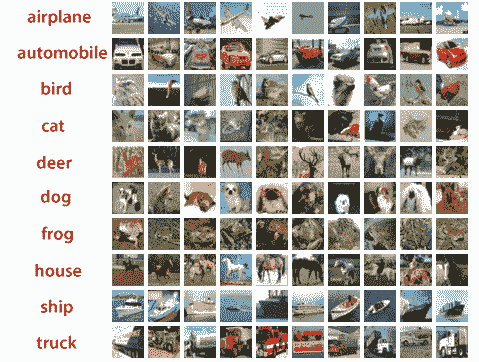
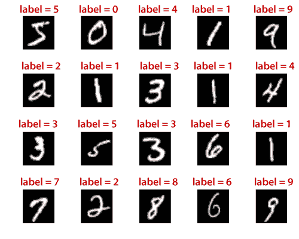
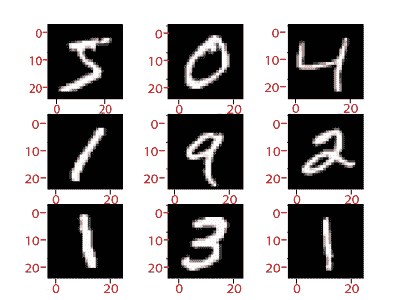

# TensorFlow 中的 CIFAR-10 和 CIFAR-100 数据集

> 原文：<https://www.javatpoint.com/cifar-10-and-cifar-100-dataset-in-tensorflow>

**CIFAR-10(加拿大高级研究所)**和 CIFAR-100 是**8000 万**微小图像数据集的标记子集。它们是由**亚历克斯·克里哲夫斯基、杰弗里·辛顿和维诺德·奈尔**收集的。数据集分为五个训练批次，只有一个测试批次，每个批次有 **10000 张**图像。

测试批次包含从每个类别中随机选择的 **1000 张**图像。训练批次包含随机顺序的剩余图像，但是一些训练批次包含随机顺序的剩余图像，但是一些训练批次包含从一个类别到另一个类别的更多图像。在它们之间，每个类的训练批次恰好包含 5000 个图像。



这些类将完全相互排斥。汽车和卡车之间不会有重叠。汽车包括类似于轿车和越野车的东西。卡车类只包括大卡车，不包括皮卡。如果我们仔细查看 CIFAR 数据集，我们会发现这不仅仅是一种鸟或猫。鸟和猫类包含许多不同类型的鸟和猫。鸟类和猫类提供多种大小、颜色、放大倍数、不同角度和不同姿势的鸟类和猫。

有了无穷无尽的数据集，我们有很多方法可以写出第一条和第二条。它只是没有那么多样化，除此之外，无尽的数据集是一个灰色标量。CIFAR 数据集由 32 幅大于 32 的彩色图像组成，每张照片有三个不同的颜色通道。现在我们最重要的问题是，在无穷无尽的数据集上表现如此出色的 LeNet 模型是否足以对 CIFAR 数据集进行分类？

## CIFAR-100 数据集

它就像 CIFAR-10 数据集一样。唯一不同的是，它有 100 个类，每个类包含 600 个图像。每节课有 100 个测试图像和 500 个训练图像。这 100 个类被分成 20 个超类，每个图像都带有一个“粗糙”标签(它所属的超类)和一个“精细”标签(它所属的类)和一个“精细”标签(它所属的类)。

在 CIFAR-100 数据集中的以下类中:

| 南不 | 超类 | 班级 |
| **1。** | 花 | 兰花、罂粟花、玫瑰、向日葵、郁金香 |
| **2。** | 鱼 | 观赏鱼、比目鱼、鳐、鲨鱼、鳟鱼 |
| **3。** | 水生哺乳动物 | 海狸，海豚，水獭，海豹，鲸鱼 |
| **4。** | 食品容器 | 瓶子、碗、罐、杯子、盘子 |
| **5。** | 家用电器 | 时钟、灯、电话、电视、电脑键盘 |
| **6。** | 水果和蔬菜 | 苹果、蘑菇、橘子、梨、甜椒 |
| **7。** | 家用家具 | 桌子，椅子，沙发，衣柜，床， |
| **8。** | 昆虫蜜蜂、甲虫、蝴蝶、毛虫、蟑螂 |  |
| **9。** | 大型自然户外场景 | 云、森林、山、平原、海 |
| **10。** | 大型人造户外用品 | 桥、城堡、房子、道路、摩天大楼 |
| **11 时。** | 大型食肉动物 | 熊，豹，狮子，老虎，狼 |
| **12 时。** | 中型哺乳动物 | 狐狸、豪猪、负鼠、浣熊、臭鼬 |
| **13。** | 大型杂食动物和食草动物 | 骆驼、牛、黑猩猩、大象、袋鼠 |
| **14。** | 非昆虫无脊椎动物 | 螃蟹、龙虾、蜗牛、蜘蛛、蠕虫 |
| **15。** | 爬行动物 | 鳄鱼、恐龙、蜥蜴、蛇、乌龟 |
| **16。** | 树 | 枫树、橡树、棕榈、松树、柳树 |
| **17。** | 人 | 女孩，男人，女人，宝贝，男孩 |
| **18。** | 小型哺乳动物 | 仓鼠，兔子，老鼠，鼩鼱，松鼠 |
| **19。** | 车辆 1 | 自行车、公共汽车、摩托车、皮卡车、火车 |
| **20。** | 车辆 2 | 割草机、火箭、电车、拖拉机、坦克 |

## 用例:借助使用TensorFlow的卷积神经网络实现 CIFAR10

现在，使用内置的卷积神经网络**TensorFlow**，训练网络对来自 **CIFAR10** 数据集的图像进行分类。



考虑下面的流程图来理解用例的工作:

图片

### 安装必要的软件包:

```

pip3 install numpy tensorflow pickle

```

### 训练网络:

```

import numpy as np
import tensorflow as tf
from time import time
import math
from include .data import get_data_set
from include.model import model, lr
train_x, train_y= get_data_set("train")
test_x, test_y = get_data_set("test")
tf. set_random_seed(21)
x, y, output, y_pred_cls, global_step, learning_rate=model()
global_accuracy =0
epoch_start=0
#PARAM
_BATCH_SIZE=128
_EPOCH=60
_SAVE_PATH="./tensorboard/cifar-10-v1.0.0/"
#LOSS AND OPTIMIZER
loss = tf.reduce_mean(tf.nn.softmax_cross_entropy_with_logits_v2(logits=output, labels=y))
optimizer=tf.train.AdamOptimizer(learning_rate= learning_rate, beta1=0.9, beta2=0.999, epsilon=1e-08). Minimize(loss, global_step=global_step)
#PREDICTION AND ACCURACY CALCULATION
correct_prediction=tf.equal(y_pred_cls, tf.argmax(y, axis=1))
accuracy = tf.reduce_mean(tf.cast(correct_predictiction, tf.float32))
# SAVER
merged = tf.summary.merge_all()
saver = tf.train.Saver()
sess = tf.Session()
train_writer= tf.summary.FileWriter(_SAVE_PATH, sess.graph)
try:
print(" Trying to restore last checkpoint?")
last_chk_path= tf.train.latest_checkpoint(checkpoint_dir=SAVE_PATH)
saver.restore(sess, save_path=last_chk_path)
print("Restored checkpoint from:", last_chk_path)
except ValueError:
print("Failed to restore checkpoint. Initializing variable instead.")
sess.run(tf.global_variables_initializer())
def train(epoch):
    global epoch_start
    epoch_start= time()
    batch_size=int(math.ceil(len(train_x)/_BATCH_SIZE))
    i_global = 0
for s in range(batch_size):
    batch_xs= train_x[s*_BATCH_SIZE: (s+1)*_BATCH_SIZE]
    batch_ys = train_y[s*_BATCH_SIZE: (s+1)*_BATCH_SIZE]
   start_time= time()
i_global, _, batch_loss, batch_acc=sess.run( [global_step, optimizer, loss, accuracy],
feed_dict={x: batch_xs, y: batch_ys, learning_rate: lr(epoch)})
duration = time() - start_time
if s% 10== 0:
percentage = int(round((s/batch_size)*100))
bar_len=29
filled_len= int ((bar_len*int(percentage))/100)
bar='=' *filled_len + ?>' + ?-? * (bar_len _filled_len)
msg= "Global step: { :>5} - [{}] {:>3}% -acc: {:.{:>4f} - loss: {:.4f} -{:.1f} sample/sec"
print(msg.format(i_global, bar, percentage, batch_acc, batch_loss, _BATCH_SIZE/duration))
test_and_save(i_global, epoch)
def test_and_save(_global_step, epoch):
global global_accuracy
global epoch_start
i=0
predicted_class=np.zeroes(shape=len(test_x), dtype=np.int)
while i< len (test_x) : j=min(i+_BATCH_SIZE, len(test_x)) batch_xs=test_x[I:j, :] batch_ys=test_y[i:j,:] predicted_class[i:j]=sess.run(y_pred_cls, feed_dict=x:batch_xs, y: batch_ys, learning_rate: lr(epoch)} ) i=j correct= (np.argmax(test_y, axis=1) == predicted_class) acc = correct.mean()*100 correct_numbers = correct.sum() hours, rem = divmod(time() - epoch_start, 3600) minutes, seconds = divmod(rem, 60) mes = "
Epoch {} - accuracy: {: .2f}% ({}/{})- time: {:0>2}:{:0.2}:{:05.2f}"
print(mes.format((epoch+1), acc, correct_numbers, len(test_x), int(hours), int(minutes), seconds))
if global_accuracy != 0 and global_accuracy < acc: summary = tf.Summary(value=[ tf.Summary.Value(tag="Accuracy/test", simple_value=acc), ]) train_writer.add_summary(summary, _global_step) saver.save(sess, save_path=_SAVE_PATH, global_step=_global_step) mes = "This epoch receive better accuracy: {:.2f} > {:.2f}. Saving session... 
 print(mes.format((acc, global_accuracy))
global_accuracy = acc
elif global_accuracy==0:
global_accuracy=acc
print("################################################################
def main():
train_start=time()
for i in range(_EPOCH):
print(" Epoch: {}/{}".format(( i+1),_EPOCH))
train(i)
hours, rem=divmod(time()-train_start, 3600 minutes, seconds=divmod(rem,60)
mes= "Best accuracy per session: {:.2f}, time: {:0>2}:{:0>2}:{:05.2f}"
print(mes.format(global_accuracy, int(hours), int(minutes), seconds))
if _name_ =="_main_":
main()
sess.close()

```

**输出:**

```
Epoch: 60/60

Global step: 23070 - [>-----------------------------]   0% - acc: 0.9531 - loss: 1.5081 - 7045.4 sample/sec
Global step: 23080 - [>-----------------------------]   3% - acc: 0.9453 - loss: 1.5159 - 7147.6 sample/sec
Global step: 23090 - [=>----------------------------]   5% - acc: 0.9844 - loss: 1.4764 - 7154.6 sample/sec
Global step: 23100 - [==>---------------------------]   8% - acc: 0.9297 - loss: 1.5307 - 7104.4 sample/sec
Global step: 23110 - [==>---------------------------]  10% - acc: 0.9141 - loss: 1.5462 - 7091.4 sample/sec
Global step: 23120 - [===>--------------------------]  13% - acc: 0.9297 - loss: 1.5314 - 7162.9 sample/sec
Global step: 23130 - [====>-------------------------]  15% - acc: 0.9297 - loss: 1.5307 - 7174.8 sample/sec
Global step: 23140 - [=====>------------------------]  18% - acc: 0.9375 - loss: 1.5231 - 7140.0 sample/sec
Global step: 23150 - [=====>------------------------]  20% - acc: 0.9297 - loss: 1.5301 - 7152.8 sample/sec
Global step: 23160 - [======>-----------------------]  23% - acc: 0.9531 - loss: 1.5080 - 7112.3 sample/sec
Global step: 23170 - [=======>----------------------]  26% - acc: 0.9609 - loss: 1.5000 - 7154.0 sample/sec
Global step: 23180 - [========>---------------------]  28% - acc: 0.9531 - loss: 1.5074 - 6862.2 sample/sec
Global step: 23190 - [========>---------------------]  31% - acc: 0.9609 - loss: 1.4993 - 7134.5 sample/sec
Global step: 23200 - [=========>--------------------]  33% - acc: 0.9609 - loss: 1.4995 - 7166.0 sample/sec
Global step: 23210 - [==========>-------------------]  36% - acc: 0.9375 - loss: 1.5231 - 7116.7 sample/sec
Global step: 23220 - [===========>------------------]  38% - acc: 0.9453 - loss: 1.5153 - 7134.1 sample/sec
Global step: 23230 - [===========>------------------]  41% - acc: 0.9375 - loss: 1.5233 - 7074.5 sample/sec
Global step: 23240 - [============>-----------------]  43% - acc: 0.9219 - loss: 1.5387 - 7176.9 sample/sec
Global step: 23250 - [=============>----------------]  46% - acc: 0.8828 - loss: 1.5769 - 7144.1 sample/sec
Global step: 23260 - [==============>---------------]  49% - acc: 0.9219 - loss: 1.5383 - 7059.7 sample/sec
Global step: 23270 - [==============>---------------]  51% - acc: 0.8984 - loss: 1.5618 - 6638.6 sample/sec
Global step: 23280 - [===============>--------------]  54% - acc: 0.9453 - loss: 1.5151 - 7035.7 sample/sec
Global step: 23290 - [================>-------------]  56% - acc: 0.9609 - loss: 1.4996 - 7129.0 sample/sec
Global step: 23300 - [=================>------------]  59% - acc: 0.9609 - loss: 1.4997 - 7075.4 sample/sec
Global step: 23310 - [=================>------------]  61% - acc: 0.8750 - loss:1.5842 - 7117.8 sample/sec
Global step: 23320 - [==================>-----------]  64% - acc: 0.9141 - loss:1.5463 - 7157.2 sample/sec
Global step: 23330 - [===================>----------]  66% - acc: 0.9062 - loss: 1.5549 - 7169.3 sample/sec
Global step: 23340 - [====================>---------]  69% - acc: 0.9219 - loss: 1.5389 - 7164.4 sample/sec
Global step: 23350 - [====================>---------]  72% - acc: 0.9609 - loss: 1.5002 - 7135.4 sample/sec
Global step: 23360 - [=====================>--------]  74% - acc: 0.9766 - loss: 1.4842 - 7124.2 sample/sec
Global step: 23370 - [======================>-------]  77% - acc: 0.9375 - loss: 1.5231 - 7168.5 sample/sec
Global step: 23380 - [======================>-------]  79% - acc: 0.8906 - loss: 1.5695 - 7175.2 sample/sec
Global step: 23390 - [=======================>------]  82% - acc: 0.9375 - loss: 1.5225 - 7132.1 sample/sec
Global step: 23400 - [========================>-----]  84% - acc: 0.9844 - loss: 1.4768 - 7100.1 sample/sec
Global step: 23410 - [=========================>----]  87% - acc: 0.9766 - loss: 1.4840 - 7172.0 sample/sec
Global step: 23420 - [==========================>---]  90% - acc: 0.9062 - loss: 1.5542 - 7122.1 sample/sec
Global step: 23430 - [==========================>---]  92% - acc: 0.9297 - loss: 1.5313 - 7145.3 sample/sec
Global step: 23440 - [===========================>--]  95% - acc: 0.9297 - loss: 1.5301 - 7133.3 sample/sec
Global step: 23450 - [============================>-]  97% - acc: 0.9375 - loss: 1.5231 - 7135.7 sample/sec
Global step: 23460 - [=============================>] 100% - acc: 0.9250 - loss: 1.5362 - 10297.5 sample/sec

Epoch 60 - accuracy: 78.81% (7881/10000)
This epoch receive better accuracy: 78.81 > 78.78\. Saving session...
##################################################################################################

```

### 在测试数据集上运行网络:

```

import numpy as np
import tensorflow as tf
from include.data import get_data_set
from include.model import model
test_x, test_y= get_data_set("test")
x, y, output, y_pred_cls, global_step, learning_rate =model()
_BATCH_SIZE = 128
_CLASS_SIZE = 10
_SAVE_PATH = "./tensorboard/cifar-10-v1.0.0/"
saver= tf.train.Saver()
Sess=tf.Session()
try;
 print(" Trying to restore last checkpoint ...")
last_chk_path = tf.train.latest_checkpoint(checkpoint_dir=_SAVE_PATH
saver.restore(sess, save_path=last_chk_path)
print("Restored checkpoint from:", last_chk_path)
expect ValueError:
print("
Failed to restore checkpoint. Initializing variables instead.")
sess.run(tf.global_variables_initializer())
def main():
i=0
predicted_class= np.zeros(shape=len(test_x), dtype=np.int)
while i< lens(test_x):
j=min(i+_BATCH_SIZE, len(test_x))
batch_xs=test_x[i:j,:]
batch_xs=test_y[i:j,:]
pre dicted_class[i:j] = sess.run(y_pred_cls, feed_dict={x: batch_xs, y: batch_ys})
i=j
corr ect = (np.argmax(test_y, axis=1) == predicted_class)
acc=correct.mean()*100
correct_numbers=correct.sum()
print()
print("Accuracy is on Test-Set: {0:.2f}% ({1} / {2})".format(acc, correct_numbers, len(test_x)))
if__name__=="__main__":
main()
sess.close()

```

**简单输出**

```
Trying to restore last checkpoint ...
Restored checkpoint from: ./tensorboard/cifar-10-v1.0.0/-23460

Accuracy on Test-Set: 78.81% (7881 / 10000)

```



## 训练时间

在这里，我们看到 60 个纪元需要多少时间:

| 设备 | 一批 | 时间 | 准确度[%] |
| **NVidia** | One hundred and twenty-eight | 8m4s | Seventy-nine point one two |
| **英特尔 7000 HQ** | One hundred and twenty-eight | 3h30m | Seventy-eight point nine one |

* * *