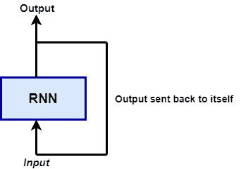
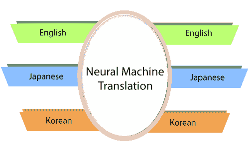
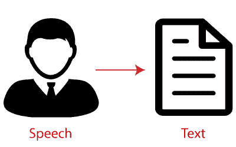
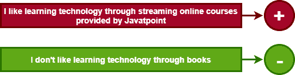
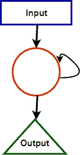

# 张量流中的递归神经网络(RNN)

> 原文：<https://www.javatpoint.com/recurrent-neural-network-in-tensorflow>

递归神经网络( **RNN** )是一种主要用于**语音识别**和**自然语言处理** (NLP)的人工神经网络。RNN 被用于深度学习和开发模仿人类大脑**神经元活动的模型。**

递归网络旨在识别数据序列中的模式，例如来自传感器、股票市场和政府机构的 T2 文本、基因组、手写、口语、T3 和 T4 数字时间序列数据。

递归神经网络看起来类似于传统的神经网络，只是在神经元上增加了记忆状态。计算包括一个简单的记忆。

递归神经网络是一种面向深度学习的算法，它遵循顺序方法。在神经网络中，我们总是假设每个输入和输出都依赖于所有其他层。这些类型的神经网络被称为递归，因为它们顺序执行数学计算。

## RNN 的申请

在预测未来时，RNN 有多种用途。在金融行业，RNN 可以帮助预测股价或股市方向的标志(即**正**或**负**)。

RNN 用于自动驾驶汽车，因为它可以通过预测车辆的路线来避免车祸。

RNN 广泛应用于**图像字幕、文本分析、机器翻译、**和**情感分析**。**例如，**应该用电影评论来理解观众在**看完电影**后的感受。当电影公司没有更多的时间来审阅、合并、标记和分析评论时，自动化这项任务非常有用。这台机器能以更高的精度完成这项工作。

以下是 RNN 的申请:

### 1.机器翻译

我们利用翻译引擎中的递归神经网络将文本从一种语言翻译成另一种语言。他们是结合其他车型来做到这一点的，比如**(长短期记忆) **s** 。**

**

### 2.语音识别

递归神经网络取代了传统的使用隐马尔可夫模型的语音识别模型。这些递归神经网络，以及 LSTMs，在对演讲进行分类并将它们转换成文本时，不会丢失上下文。

### 3.情感分析

我们利用情感分析来判断句子的积极、消极或中性。因此，RNNs 最擅长的是按顺序处理数据，找到句子的情感。

### 4.自动图像标记器

RNNs 与卷积神经网络相结合，可以检测图像并以标签的形式提供它们的描述。例如，使用 RNNs 可以更好地解释狐狸跳过栅栏的图片。

## RNN 的局限性

RNN 应该及时传递信息。然而，当时间步长过长时，传播所有这些信息是非常具有挑战性的。当一个网络有太多的深层时，它就变得无法描述。这个问题叫做:消失梯度问题。

如果我们记得，神经网络更新梯度下降算法的权重使用。当网络向下发展到较低层时，梯度变小。

梯度保持不变，意味着没有改进的空间。模型从梯度的变化中学习；这种变化会影响网络的输出。如果梯度差太小(即权重变化不大)，系统什么也学不到，输出也是如此。因此，面临消失梯度问题的系统不能收敛到正确的解。

### 递归神经将执行以下操作。

循环网络首先执行独立激活到依赖激活的转换。它还为所有层分配相同的权重和偏差，这降低了参数 RNN 的复杂性。它通过提供先前的输出作为下一层的输入，为记忆先前的输出提供了一个标准平台。

这三层具有相同的权重和偏差，组合成一个单一的循环单元。

为了计算当前状态-

**h t =f(h t-1 ，X t )**

其中 h t = **当前状态**
H t-1 = **先前状态**T9】Xt=**输入状态**

为了应用激活函数 tanh，我们有-

**ht = tanh(w【h】-1+w【xh】)**

其中:

W hh = **复发性神经元的重量，**T4【Wxh=**输入神经元的重量**

**计算产量的公式:**

**Yt= WhyhtT7】**

## 通过 RNN 进行培训

*   网络只需要输入一个时间步长。
*   我们可以通过当前输入和之前的状态来计算当前状态。
*   现在，当前状态通过 h t-1 为下一个状态。
*   有 n 个步骤，最后，所有的信息都可以连接起来。
*   完成所有步骤后，最后一步是计算输出。
*   最后，通过计算实际输出和预测输出之间的差值来计算误差。
*   误差被反向传播到网络以调整权重并产生更好的结果。

* * ***