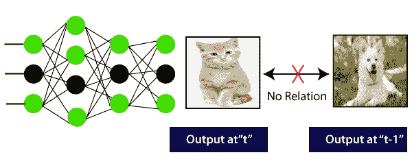
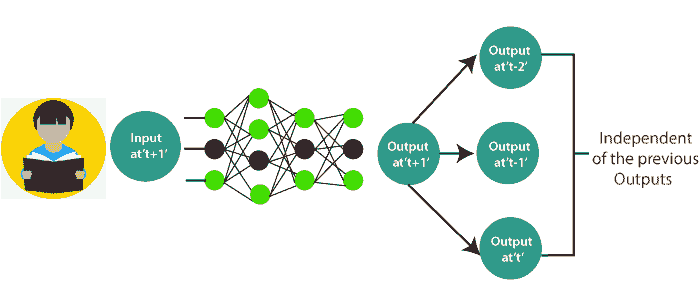
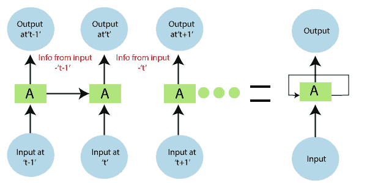
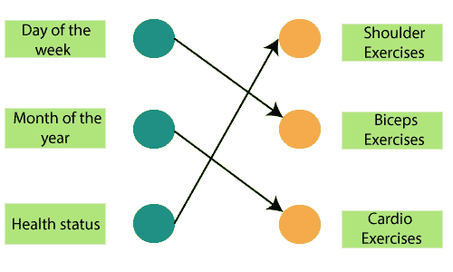
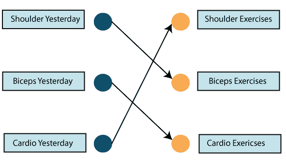
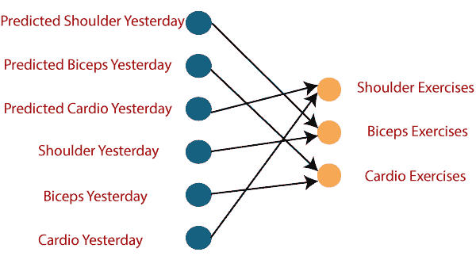
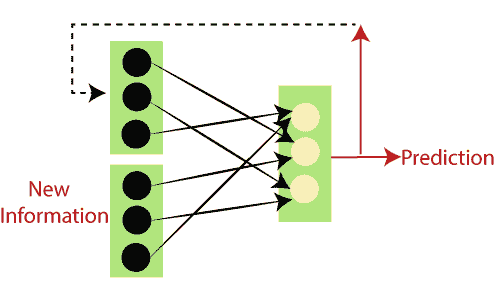
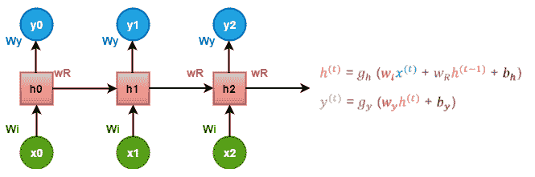
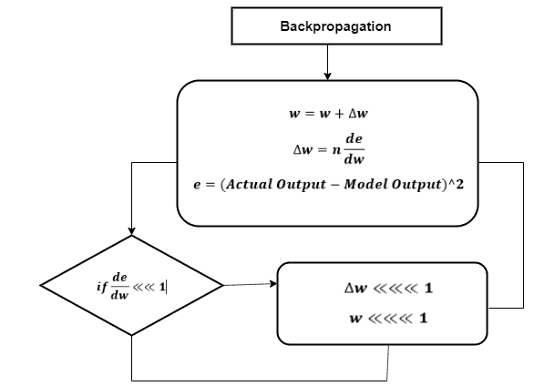

# RNN 在张量流中的工作

> 原文：<https://www.javatpoint.com/working-of-rnn-in-tensorflow>

递归神经网络在图像分类和**视频识别、机器翻译、**和**音乐创作**中有着广泛的应用。

考虑一个**图像分类**用例，其中我们已经**训练了**神经网络来**对一些**动物**的图像**进行分类。

所以，让我们喂一个猫或狗的形象；网络向猫或狗的图片提供带有**对应标签**的输出。

**见下图:**

这里，第一个输出是猫，不会影响前一个输出是狗。这意味着时间“t”的输出独立于时间“t-1”的输出？。

考虑我们需要使用最后获得的输出的场景:

概念和读一本**书**一样。随着我们进入每一页，我们需要对前几页的**理解来完整理解大多数**情况下的**信息**。****

借助前馈网络，在**时间 t+1** 的新输出？与时间 t、 **t-1、t-2** 的输出无关。

因此，前馈网络不能用于预测句子中的单词，因为它与前一组单词没有绝对关系。

但是，借助**递归神经网络，**这个挑战是可以克服的。

**见下图:**

在上图中，我们在-1？被输入网络。这些输入也将在时间 t-1 产生并行输出。

在下一个时间戳中，来自先前输入 t-1 的信息？与输入一起提供。提供最终的输出。

这个过程重复进行，以确保最新的输入是已知的，并且可以使用从先前的时间戳获得的信息。

**递归网络**是一种人工神经网络，旨在识别数据序列中的模式。比如，**文字、基因组、笔迹、**口语、来自**传感器的数字时间序列数据、**股市和**政府机构**。

为了更好地理解，请考虑以下比较:

我们经常去健身房，教练给了我们锻炼的时间表:

请注意，所有的练习每周都以适当的顺序重复进行。让我们使用前馈网络来尝试和预测练习的类型。

输入为**日、月、**和**健康状况**。已经使用这些输入来训练神经网络，以提供锻炼的预测。

但是，考虑到输入，这不会很准确。为了解决这个问题，我们使用了递归神经网络的概念，如下所示:

在这种情况下，找出前一天要锻炼的内容。

所以，如果我们昨天做了**肩部运动**，我们今天就可以做**二头肌运动**，这个过程将持续一周。

然而，如果我们碰巧错过了健身房的一天，那么来自之前参加的时间戳的数据可以在下面考虑。

如果一个模型是基于它从上次练习中获得的数据来体验的，那么模型的输出将是准确的。

总而言之，让我们把数据转换成向量。

其中向量是输入到**模型中的数字**到**表示**，如果我们做了练习或者没有做。

所以，如果我们有一个肩部练习，对应的节点将是‘1’，其余的练习节点将被映射到‘0’。

我们必须检查神经网络工作背后的数学原理。

检查“w”作为权重矩阵，“b”作为偏差:

在时间 t=0 时，输入为‘x0’，任务是找出什么是‘h0’。在方程中代入 t=0，得到函数 h(t)值。“y0”的下一个值是在应用于新公式时使用先前计算的值找出的。

对模型中的所有时间戳重复相同的过程来训练模型。

## 训练递归神经网络

递归神经网络使用**反向传播算法**进行训练，但它适用于每个时间戳。它通常被称为**时间反向传播**(BTT)。

反向传播的一些问题，例如:

*   消失渐变
*   爆炸梯度

### 消失渐变

在消失梯度的反向传播的使用中，目标是计算误差，通过找出实际输出和模型输出之间的差异并将其提高到 2 的幂，找出实际输出和模型输出之间的差异。

利用**计算误差**，估算与重量差异有关的误差变化。但是随着每一个学习率的提高，这可以随着相同的模型而增加。

所以，学习率与变化的乘积**传递**到数值，这是**权重**的确定变化。

每一次训练迭代中**权重**的变化都会加入到旧的权重集合中，如下图所示。这里的赋值是权重变化相乘，然后**值**为**减**。

### 爆炸梯度

塌陷梯度的作用是相似的，但是这里的权重变化极大，而不是可以忽略的变化。注意这里的小:

我们必须克服这两个问题，这首先是一个挑战。

| 爆炸梯度 | 消失渐变 |
| 

*   **Truncated BTT** does not start back propagation at the last timestamp, so we can choose a smaller timestamp, such as 10.

 | 

*   **ReLU activation function**
    We can use an activation like ReLU, which is calculating the gradient.

的同时给出输出一 |
| 

*   **Clip the gradient at the threshold**
    Clip the gradient when the gradient exceeds the threshold.

 | 

*   **RMSprop**
    Trim the gradient when the gradient exceeds the threshold.

 |
| 

*   **RMSProp adjusts the learning rate**

 | 

*   **lstm, Grus**
    Different network architectures specially designed can be used to solve this problem.

 |

## 什么是长期依赖？

很多时候，在执行操作的模型中只需要最近的数据。但是从过去获得的一条信息中可能会有一个要求。

* * *