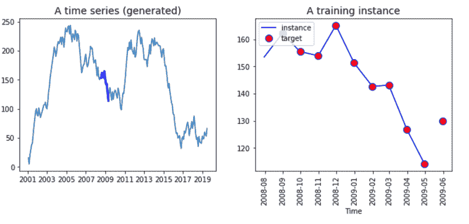
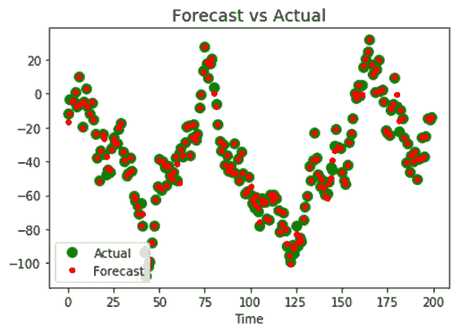

# RNN 的时间序列

> 原文：<https://www.javatpoint.com/tensorflow-time-series-in-rnn>

在本教程中，我们将使用具有时间序列数据的 RNN。时间序列依赖于以前的时间，这意味着过去的值包含网络可以学习的重要信息。时间序列预测是估计任何序列的未来价值，比如说，股票价格、温度、国内生产总值等等。

RNN 和时间序列的数据准备有点棘手。目标是预测序列的其他值，我们将使用过去的信息来估计 t +1 的成本。标签等于输入的连续一个周期。

其次，输入的数量设置为 1，即每次一个观察。最后，时间步长等于数值的顺序。如果我们将时间步长设置为 10，输入序列将连续返回十次。

请看下图，我们必须在左边表示时间序列数据，在右边表示虚拟输入序列。我们创建了一个函数来返回 2001 年 1 月到 2016 年 12 月每天都有随机值的数据集

```

# To plotting amazing figure 
%matplotlib inline
import matplotlib
import pandas as pd
import matplotlib.pyplot as plt
def create_ts(start = '2001', n = 201, freq = 'M'):
ring = pd.date_range(start=start, periods=n, freq=freq)
ts =pd.Series(np.random.uniform(-18, 18, size=len(rng)), ring).cumsum()
return ts
ts= create_ts(start = '2001', n = 192, freq = 'M')
ts.tail(5)

```

**输出:**

```
2016-08-31    -93.459631
2016-09-30    -95.264791
2016-10-31    -95.551935
2016-11-30   -105.879611
2016-12-31   -123.729319
Freq: M, dtype: float64

ts = create_ts(start = '2001', n = 222)

```

```

# Left plotting diagram
plt.figure(figsize=(11,4))
plt.subplot(121)
plt.plot(ts.index, ts)
plt.plot(ts.index[90:100], ts[90:100], "b-",linewidth=3, label="A train illustration in the plotting area")
plt.title("A time series (generated)", fontsize=14)

## Right side plotted Diagram
plt.subplot(122)
plt.title("A training instance", fontsize=14)
plt.plot(ts.index[90:100], ts[90:100], "b-", markersize=8, label="instance")
plt.plot(ts.index[91:101], ts[91:101], "bo", markersize=10, label="target", markerfacecolor='red')
plt.legend(loc="upper left")
plt.xlabel("Time")
plt.show()

```



图表的右边部分显示了所有的系列。始于 2001 年，止于 2019 年。毫无意义地馈送网络中的所有数据；相反，我们必须创建一批长度等于时间步长的数据。该批次将是 X 变量。Y 变量与 X 变量相同，但移动了一个周期(即我们要预测 t+1)。

两个向量具有相同的长度。我们可以在上图的右边部分看到这一点。该行代表 X 输入的十个值，而红点标签有十个值，y。请注意，标签从 X 的前一个周期开始，在一个周期后结束。

## 建立一个 RNN 来分析张量流中的时间序列

是时候建造我们的第一个 **RNN** 来预测这个系列了。我们必须指定一些超参数(模型的参数，即神经元的数量等。)为模型。

*   输入数量:1
*   时间步长(时间序列中的窗口):10
*   神经元数量:120
*   产出数量:1

我们的网络将从一系列的 **10** 天中学习，并包含 **120** 复发神经元。我们向模型输入一个输入。

在构建模型之前，我们需要将数据集分为训练集和测试集。全数据集有 **222** 个数据点；我们将使用前 201 点来训练模型，最后 21 点来测试我们的模型。

在我们定义了一个训练和测试集之后，我们需要创建一个包含批次的对象。在这些批次中，我们有 X 值和 Y 值。请记住，X 值是一个周期离散。因此，我们使用前 200 个观察值，时间步长等于 10。x _ batches 对象必须有 20 个大小为 10 或 1 的批处理。Y _ batches 对象的大小与 X _ batches 对象相同，但上面有一个句点。

### 步骤 1)创建列车并进行测试

首先，我们将序列转换成 numpy 数组；然后，我们定义窗口(网络将从中学习的时间数量)、输入、输出的数量以及训练集的大小。

```

series = np.array(ts)
n_windows = 20   
n_input =  1
n_output = 1
size_train = 201

```

之后，我们将数组分成两个数据集。

```

# Split data
train = series[:size_train]
test = series[size_train:]
print(train.shape, test.shape)
(201) (21)

```

### 步骤 2)创建返回 X 批和 y 批的函数

我们可以创建一个返回两个不同数组的函数，一个用于**X _ battery**，一个用于**y _ battery**。让事情变得更简单。

让我们创建一个函数来构造批处理。

请注意，X _ battery 记录了一个周期(我们取值 t-1)。函数的输出有三个维度。第一个维度等于批次数量，第二个维度是窗口大小，最后一个维度是输入数量。

时间序列中棘手的部分是正确选择数据点。对于 X 数据点，我们选择从 **t = 1 到 t =200** 的观测值，而对于 Y 数据点，我们返回从 **t = 2 到 201** 的观测值。一旦我们有了正确的数据点，重塑系列就毫不费力了。

为了用批次构建对象，我们需要将数据集分成十个相同长度的批次。我们可以使用整形方法和 pass -1，使系列与批次大小相同。值 20 是每批注释的数量，1 是输入的数量。

我们需要为标签做同样的步骤。

Note that we need to shift the data to the number of times we want to forecast. For instance, if we want to predict one time, then we shift the series by 1\. If we want to forecast two days, then shift the data by 2 points.

```

x_data = train[:size_train-1]: Select the training instance.
X_batches = x_data.reshape(-1, Windows, input): creating the right shape for the batch.
def create_batches(df, Windows, input, output):
    ## Create X         
        x_data = train[:size_train-1] # Select the data
        X_batches = x_data.reshape(-1, windows, input)  # Reshaping the data in this line of code
    ## Create y
        y_data = train[n_output:size_train]
        y_batches = y_data.reshape(-1, Windows, output)
        return X_batches, y_batches #return the function

```

现在定义了函数，我们称之为创建批处理。

```

Windows = n_
Windows, # Creating windows
                          input = n_input,
                                      output = n_output)

```

我们可以打印形状，以确保尺寸正确。

```

print(X_batches.shape, y_batches.shape)
(10, 20, 1) (10, 20, 1)

```

我们需要创建只有一批数据和 20 个观察值的测试集。

请注意，我们的预测日复一日，这意味着第二个预测值将基于测试数据集第一天( **t+1** )的实际值。真正的价值将会为人所知。

如果要预测 **t+2** ，我们需要使用预测值**t+1**；如果要预测 **t+3** ，我们需要使用期望值 t+1 和 t+2。这使得精确预测“t+n”天变得困难。

```

X_test, y_test = create_batches(df = test, windows = 20,input = 1, output = 1)
print(X_test.shape, y_test.shape)
(10, 20, 1) (10, 20, 1)

```

我们的批量已经准备好了，我们可以建造 RNN 建筑。记住，我们有 120 个复发性神经元。

### 步骤 3)构建模型

为了创建模型，我们需要定义三个部分:

1.  带有张量的变量
2.  RNN
3.  损失与优化

**1。变量**

我们需要用适当的形状指定 X 和 y 变量。这一步微不足道。张量与物体 **X 批次**和物体 **y 批次**的尺寸相同。

例如，张量 X 是一个占位符，几乎有三个维度:

*   注:批次的大小
*   n_windows:窗口长度。
*   n_input:输入数量

结果是:

```

tf.placeholder(tf.float32, [None, n_windows, n_input]) 	
## 1\. Construct the tensors
X = tf.placeholder(tf.float32, [None, n_windows, n_input])   
y = tf.placeholder(tf.float32, [None, n_windows, n_output])

```

**2。创建 RNN**

在第二部分，我们需要定义网络的架构。和以前一样，我们使用对象 BasicRNNCell 和来自 TensorFlow 估计器的 dynamic_rnn。

```

## 2\. create the model
basic_cell = tf.contrib.rnn.BasicRNNCell(num_units=r_neuron, activation=tf.nn.relu)   
rnn_output, states = tf.nn.dynamic_rnn(basic_cell, X, dtype=tf.float32)   

```

下一部分更复杂，但计算速度更快。我们需要将运行输出转换为密集层，然后将其转换为具有与输入字段相同的维度。

```

stacked_rnn_output = tf.reshape(rnn_output, [-1, r_neuron])          
stacked_outputs = tf.layers.dense(stacked_rnn_output, n_output)       
outputs = tf.reshape(stacked_outputs, [-1, n_windows, n_output])  

```

**3。创造损失和优化**

模型优化取决于我们正在执行的任务。

这种差异很重要，因为它可以改变优化问题。最小化均方误差的连续变量优化问题。要在 **TF** 中构建这些指标，我们可以使用:

```

tf.reduce_sum(tf.square(outputs - y))

```

持久的代码和以前一样；我们使用亚当优化器来减少损失。

```

tf.train.AdamOptimizer(learning_rate=learning_rate)
optimizer.minimize(loss)

```

我们可以把所有东西打包在一起，我们的模型已经准备好训练了。

```

tf.reset_default_graph()
r_neuron = 120    

## 1\. Constructing the tensors
X = tf.placeholder(tf.float32, [None, n_windows, n_input])   
y = tf.placeholder(tf.float32, [None, n_windows, n_output])

```

```

## 2\. creating our models
basic_cell = tf.contrib.rnn.BasicRNNCell(num_units=r_neuron, activation=tf.nn.relu)   
rnn_output, states = tf.nn.dynamic_rnn(basic_cell, X, dtype=tf.float32)              

stacked_rnn_output = tf.reshape(rnn_output, [-1, r_neuron])          
stacked_outputs = tf.layers.dense(stacked_rnn_output, n_output)       
outputs = tf.reshape(stacked_outputs, [-1, n_windows, n_output])   

## 3\. Loss optimization of RNN
learning_rate = 0.001  

loss = tf.reduce_sum(tf.square(outputs - y))    
optimizer = tf.train.AdamOptimizer(learning_rate=learning_rate)         
training_op = optimizer.minimize(loss)                                          

init = tf.global_variables_initializer() 

```

我们将使用 **1500** 时期训练模型，并每 150 次迭代打印损失。一旦模型得到训练，我们就在测试集上评估模型，并创建一个包含预测的对象。

```

iteration = 1500 
with tf.Session() as sess:
    init.run()
    for iters in range(iteration):
        sess.run(training_op, feed_dict={X: X_batches, y: y_batches})
        if iters % 150 == 0:
            mse = loss.eval(feed_dict={X: X_batches, y: y_batches})
            print(iters, "\tMSE:", mse)
    y_pred = sess.run(outputs, feed_dict={X: X_test})
"0 	MSE: 502893.34
150 	MSE: 13839.129
300 	MSE: 3964.835
450 	MSE: 2619.885
600 	MSE: 2418.772
750 	MSE: 2110.5923
900 	MSE: 1887.9644
1050 	MSE: 1747.1377
1200 	MSE: 1556.3398
1350  MSE: 1384.6113" 

```

最后，我们可以将序列的实际值与预测值进行比较。如果我们的模型被修正，预测值应该放在实际值之上。

我们可以看到，这个模型还有改进的空间。由我们来改变超参数，比如窗口，当前文件中循环神经元数量的批量大小。

```

plt.title("Forecast vs Actual", fontsize=14)
plt.plot(pd.Series(np.ravel(y_test)), "bo", markersize=8, label="actual", color='green')
plt.plot(pd.Series(np.ravel(y_pred)), "r.", markersize=8, label="forecast", color='red')
plt.legend(loc="lower left")
plt.xlabel("Time")
plt.show()

```



递归神经网络是一种处理时间序列和文本分析的体系结构。先前状态的输出用于保存系统随时间或单词序列的记忆。

在张量流中，我们可以使用 be；给定代码，为**时间序列**训练递归神经网络:

**模型参数**

```

n_windows = 20   
n_input =  1
n_output = 1
size_train = 201

```

**定义模型**

```

X = tf.placeholder(tf.float32, [none, n_windows, n_input])   
y = tf.placeholder(tf.float32, [none, n_windows, n_output])
basic_cell = tf.contrib.rnn.BasicRNNCell(num_units=r_neuron, activation=tf.nn.relu)   
rnn_output, states = tf.nn.dynamic_rnn(basic_cell, X, dtype=tf.float32)              
stacked_rnn_output = tf.reshape(rnn_output, [-1, r_neuron])          
stacked_outputs = tf.layers.dense(stacked_rnn_output, n_output)       
outputs = tf.reshape(stacked_outputs, [-1, n_windows, n_output])

```

**构造优化函数**

```

learning_rate = 0.001  
loss = tf.reduce_sum(tf.square(outputs - y))    
optimizer = tf.train.AdamOptimizer(learning_rate=learning_rate)         
training_op = optimizer.minimize(loss)

```

**训练模型**

```

init = tf.global_variables_initializer() 
iteration = 1500 

with tf.Session() as sess:
    init.run()
for iters in range(iteration):
sess.run(training_op, feed_dict={X: X_batches, y: y_batches})
        if iters % 150 == 0:
            mse = loss.eval(feed_dict={X: X_batches, y: y_batches})
            print(iters, "\tMSE:", mse)
 y_pred = sess.run(outputs, feed_dict={X: X_test})

```

* * *