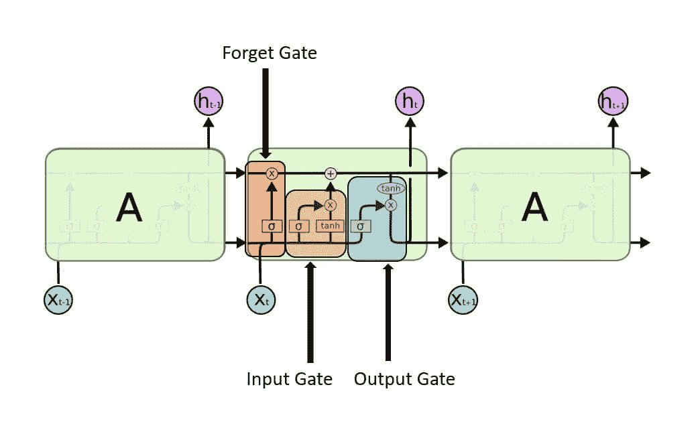
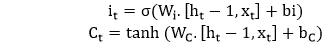
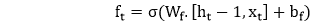
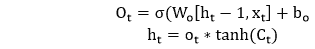
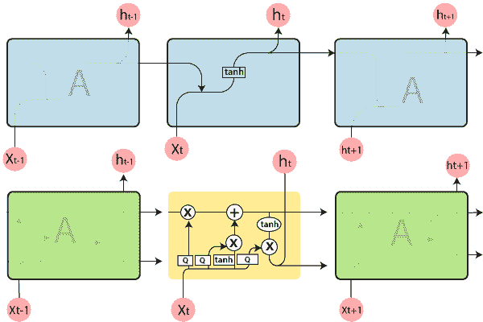
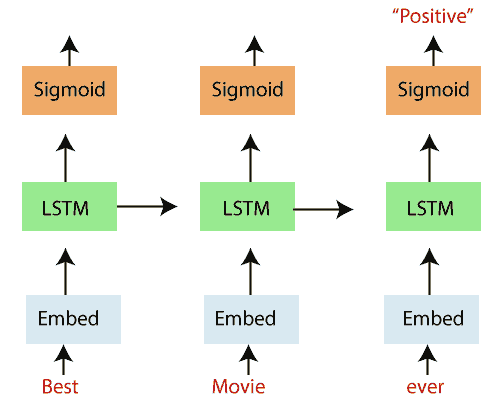

# Tensorflow 中的长短期记忆(LSTM) RNN

> 原文：<https://www.javatpoint.com/long-short-term-memory-rnn-in-tensorflow>

长短期记忆(LSTM)是一种用于深度学习领域的人工递归神经网络(RNN)架构。它是在 1997 年由**Sepp hochriter**和 **Jurgen schmidhuber** 提出的。与标准的前馈神经网络不同，LSTM 有反馈连接。它不仅可以处理单个数据点(如图像)，还可以处理整个数据序列(如语音或视频)。

**例如，** LSTM 是一个应用程序，用于诸如未分段、**连接手写识别、**或**语音识别**等任务。

通用 **LSTM** 单元由一个单元、一个输入门、一个输出门和一个遗忘门组成。细胞在任意时间间隔内记住数值，三个门控制进出细胞的信息流。LSTM 非常适合对未知持续时间的时间序列进行分类、处理和预测。

> *长短期记忆(LSTM)网络是递归神经网络的改进版本，它使记忆中更容易记住过去的数据。*



**1。输入门-** 它发现哪个输入值应该用于修改存储器。 **Sigmoid** 函数决定让 0 或 1 通过哪些值。 **tanh** 功能对通过的值赋予权重，决定它们的重要程度，范围从 **-1** 到 **1** 。



**2。忘记门-** 它发现要从块中丢弃的细节。一个 sigmoid 函数决定它。它查看先前的状态 **(ht-1)** 和内容输入(Xt)，并为单元格状态 **Ct-1** 中的每个数字输出一个介于 0(忽略此)和 1(保留此)之间的数字。



**3。输出门-** 块的输入和存储器用于决定输出。Sigmoid 函数决定让哪些值通过 0 或 1。而 **tanh** 函数决定让哪些值通过 0，1。tanh 函数对通过的值赋予权重，决定它们的重要程度，范围从 **-1 到 1** ，并乘以 **sigmoid** 的输出。




它代表一个完整的 RNN 单元，接受序列 xi 的当前输入，并输出当前的隐藏状态，hi，将它传递给我们输入序列的下一个 RNN 单元。LSTM 电池的内部比传统的 RNN 电池复杂得多，而传统的 RNN 电池只有一个“内层”作用于当前状态(ht-1)和输入(xt)。



在上图中，我们看到了一个“展开”的 LSTM 网络，它有一个嵌入层、一个后续的 **LSTM** 层和一个 sigmoid 激活函数。我们认识到我们的输入，在这种情况下，电影评论中的单词，是顺序输入的。

单词被输入到嵌入查找表中。在大多数情况下，当使用文本数据语料库时，词汇的大小异常大。

这是向量空间中单词的多维分布式表示。这些嵌入可以使用其他深度学习技术来学习，如 **word2vec** ，我们可以以端到端的方式训练模型，以确定我们教授的嵌入。

这些嵌入然后被输入到我们的 **LSTM 层**，在这里输出被馈送到 sigmoid 输出层和我们序列中下一个单词的 **LSTM 单元**。

## LSM 图层

我们将设置一个函数来构建 LSTM 图层，以动态处理图层的数量和大小。该服务将采用 LSTM 大小的列表，该列表可以基于列表的长度指示 LSTM 层的数量(例如，我们的示例将使用长度为 2 的列表，包含大小 128 和 64，指示两层 LSTM 网络，其中第一层大小为 128，第二层具有隐藏层大小 64)。

```

def build_lstm_layers(lstm_sizes, embed, keep_prob_, batch_size):
    """
    Create the LSTM layers
    """
    lstms = [tf.contrib.rnn.BasicLSTMCell(size) for size in lstm_sizes]
    # Add dropout to the cell
    drops = [tf.contrib.rnn.DropoutWrapper(lstm, output_keep_prob=keep_prob_) for lstm in lstms]
    # Stacking up multiple LSTM layers, for deep learning
    cell = tf.contrib.rnn.MultiRNNCell(drops)
# Getting an initial state of all zeros
    initial_state = cell.zero_state(batch_size, tf.float32)
    lstm_outputs, final_state = tf.nn.dynamic_rnn(cell, embed, initial_state=initial_state)

```

然后，丢弃包装的 LSTMs 列表被传递到 TensorFlow **MultiRNN** 单元，以将这些层堆叠在一起。

## 损失函数、优化器和准确性

最后，我们创建函数来定义模型损失函数、优化器和精度。尽管损失和精度只是根据结果计算的，但在张量流中，一切都是计算图的一部分。

```

def build_cost_fn_and_opt(lstm_outputs, labels_, learning_rate):
    """
    Creating the Loss function and Optimizer
    """
    predictions = tf.contrib.layers.fully_connected(lstm_outputs[:, -1], 1, activation_fn=tf.sigmoid)
    loss = tf.losses.mean_squared_error(labels_, predictions)
    optimzer = tf.train.AdadeltaOptimizer (learning_rate).minimize(loss)
def build_accuracy(predictions, labels_):
    """
    Create accuracy
    """
    correct_pred = tf.equal(tf.cast(tf.round(predictions), tf.int32), labels_)
    accuracy = tf.reduce_mean(tf.cast(correct_pred, tf.float32))

```

## 构建图表和培训

首先，我们调用我们定义的每个函数来构建网络，并调用 TensorFlow 会话来使用小批量在预定义数量的时期上训练模型。在每个时期结束时，我们将打印损失、训练精度和验证精度，以便在训练模型时监控结果。

```

def build_and_train_network(lstm_sizes, vocab_size, embed_size, epochs, batch_size,
                 learning_rate, keep_prob, train_x, val_x, train_y, val_y):

    # Build Graph

    with tf.Session() as sess:

        # Train Network
        # Save Network

```

接下来，我们定义我们的模型超参数，我们将构建一个两层 LSTM 网络，其隐藏层大小分别为 **128** 和 **64** 。

当模型完成训练后，我们使用 TensorFlow 保存程序保存模型参数以备后用。

```
Epoch: 1/50 Batch: 303/303 Train Loss: 0.247 Train Accuracy: 0.562 Val Accuracy: 0.578
Epoch: 2/50 Batch: 303/303 Train Loss: 0.245 Train Accuracy: 0.583 Val Accuracy: 0.596
Epoch: 3/50 Batch: 303/303 Train Loss: 0.247 Train Accuracy: 0.597 Val Accuracy: 0.617
Epoch: 4/50 Batch: 303/303 Train Loss: 0.240 Train Accuracy: 0.610 Val Accuracy: 0.627
Epoch: 5/50 Batch: 303/303 Train Loss: 0.238 Train Accuracy: 0.620 Val Accuracy: 0.632
Epoch: 6/50 Batch: 303/303 Train Loss: 0.234 Train Accuracy: 0.632 Val Accuracy: 0.642
Epoch: 7/50 Batch: 303/303 Train Loss: 0.230 Train Accuracy: 0.636 Val Accuracy: 0.648
Epoch: 8/50 Batch: 303/303 Train Loss: 0.227 Train Accuracy: 0.641 Val Accuracy: 0.653
Epoch: 9/50 Batch: 303/303 Train Loss: 0.223 Train Accuracy: 0.646 Val Accuracy: 0.656
Epoch: 10/50 Batch: 303/303 Train Loss: 0.221 Train Accuracy: 0.652 Val Accuracy: 0.659

```

## 测试

最后，我们在测试集上检查我们的模型结果，以确保它们与我们在训练中观察到的一致。

```

def test_network(model_dir, batch_size, test_x, test_y):

    # Build Network

with tf.Session() as sess:

    # Restore Model
    # Test Model

```

测试精度为 **72%** 。这与我们的验证准确性是一致的，并且表明我们在数据分割中以适当的分布捕获了数据。

```
INFO:tensorflow:Restoring parameters from checkpoints/sentiment.ckpt
Test Accuracy: 0.717

```

* * *