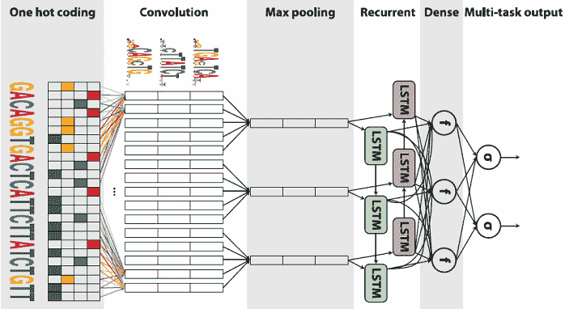
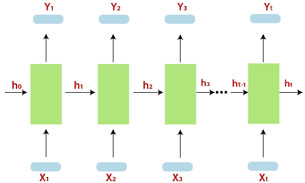

# RNN 在 TensorFlow 的培训

> 原文：<https://www.javatpoint.com/training-of-rnn-in-tensorflow>

递归神经网络是一种面向深度学习的算法，它遵循顺序方法。在神经网络中，我们假设所有层的每个输入和输出都是独立的。这些类型的神经网络被称为**递归**，因为它们依次执行数学计算。



**训练递归神经网络的以下步骤:**

**步骤 1-** 从数据集中输入一个特定的示例。

**步骤 2-** 网络将以随机初始化的变量为例，计算一些计算。

**步骤 3-** 然后计算预测结果。

**步骤 4-** 将生成的实际结果与预期值进行比较会产生误差。

**步骤 5-** 它通过同样的路径传播，其中变量也被调整以跟踪错误。

**步骤 6-** 从 1 到 5 的级别被重复，直到我们确信声明用于获得输出的变量被适当定义。

**步骤 7-** 在最后一步，通过应用这些变量来获得新的未看到的输入，从而进行系统的预测。

表示递归神经网络的示意性方法描述如下-



## 用TensorFlow实现递归神经网络

**完整代码**

```

from __future__ import print_function
import tensorflow as tf
from tensorflow.contrib import rnn

# Importing MNIST data
from tensorflow.examples.tutorials.mnist import input_data
mnist = input_data.read_data_sets("/tmp/data/", one_hot=True)
'''
To classify images using a recurrent neural network, we consider every image
row as a sequence of pixels. Because MNIST image shape is 28*28px, we will then
handle 28 sequences of 28 steps for every sample.

'''
# Training the Parameters
learning_rate = 0.001
training_steps = 10000
batch_size = 128
display_step = 200

# Here the code describe the Network Parameters
num_input = 28 # MNIST data input (img shape: 28*28)
timesteps = 28 # timesteps
num_hidden = 128 # hidden layer num of features
num_classes = 10 # MNIST total classes (0-9 digits)

# tf Graph input
X = tf.placeholder("float", [None, timesteps, num_input])
Y = tf.placeholder("float", [None, num_classes])

# Defining weights
weights = {
    'out': tf.Variable(tf.random_normal([num_hidden, num_classes]))
}
biases = {
    'out': tf.Variable(tf.random_normal([num_classes]))
}
def RNN(x, weights, biases):

    # Preparing data shape to match `rnn` function requirements
    # Current data input shape: 
     (batch_size, timesteps, n_input)
    # Required shape: 
     'timesteps' tensors list of shape (batch_size, n_input)
    # Unstack to get a list of 'timesteps' tensors of shape (batch_size, n_input)
    x = tf.unstack(x, timesteps, 1)

    # Here we define a LSTM cell with tensorflow
    lstm_cell = rnn.BasicLSTMCell(num_hidden, forget_bias=1.0)

    # Get LSTM cell output
    outputs, states = rnn.static_rnn(lstm_cell, x, dtype=tf.float32)

    # Linear activation, using RNN inner loop last output
    return tf.matmul(outputs[-1], weights['out']) + biases['out']

logits = RNN(X, weights, biases)
prediction = tf.nn.softmax(logits)

# Then here we define loss and optimizer
loss_op = tf.reduce_mean(tf.nn.softmax_cross_entropy_with_logits(
    logits=logits, labels=Y))
optimizer = tf.train.GradientDescentOptimizer(learning_rate=learning_rate)
train_op = optimizer.minimize(loss_op)

# Evaluate model (with test logits, for dropout to be disabled)
correct_pred = tf.equal(tf.argmax(prediction, 1), tf.argmax(Y, 1))
accuracy = tf.reduce_mean(tf.cast(correct_pred, tf.float32))

# Initializing the variables (i.e. assign their default value)
init = tf.global_variables_initializer()

# Start the training
with tf.Session() as sess:

 # Run the initializer
    sess.run(init)

    for step in range(1, training_steps+1):
        batch_x, batch_y = mnist.train.next_batch(batch_size)
 # Reshape data to get 28 sequence of 28 elements
        batch_x = batch_x.reshape((batch_size, timesteps, num_input))
 # Run optimization op (back prop)
        sess.run(train_op, feed_dict={X: batch_x, Y: batch_y})
        if step % display_step == 0 or step == 1:
 # calculate batch loss and accuracy
            loss, acc = sess.run([loss_op, accuracy], feed_dict={X: batch_x,
                                                               Y: batch_y})
            print("Step " + str(step) + ", Minibatch Loss= " + \
                  "{:.4f}".format(loss) + ", Training Accuracy= " + \
                  "{:.3f}".format(acc))
print("Optimization Finished!")

 #, At last, calculate the accuracy for 128 mnist test images
    test_len = 128
    test_data = mnist.test.images[:test_len].reshape((-1, timesteps, num_input))
    test_label = mnist.test.labels[:test_len]
    print("Testing Accuracy:", \
        sess.run(accuracy, feed_dict={X: test_data, Y: test_label}))

```

**输出:**

```
Instructions for updating:
Future major versions of TensorFlow will allow gradients to flow
into the label's input on backprop by default.

See `tf.nn.softmax_cross_entropy_with_logits_v2`.

Step 1, Minibatch Loss= 2.6592, Training Accuracy= 0.148
Step 200, Minibatch Loss= 2.1379, Training Accuracy= 0.250
Step 400, Minibatch Loss= 1.8860, Training Accuracy= 0.445
Step 600, Minibatch Loss= 1.8542, Training Accuracy= 0.367
Step 800, Minibatch Loss= 1.7489, Training Accuracy= 0.477
Step 1000, Minibatch Loss= 1.6399, Training Accuracy= 0.492
Step 1200, Minibatch Loss= 1.4379, Training Accuracy= 0.570
Step 1400, Minibatch Loss= 1.4319, Training Accuracy= 0.500
Step 1600, Minibatch Loss= 1.3899, Training Accuracy= 0.547
Step 1800, Minibatch Loss= 1.3563, Training Accuracy= 0.570
Step 2000, Minibatch Loss= 1.2134, Training Accuracy= 0.617
Step 2200, Minibatch Loss= 1.2582, Training Accuracy= 0.609
Step 2400, Minibatch Loss= 1.2412, Training Accuracy= 0.578
Step 2600, Minibatch Loss= 1.1655, Training Accuracy= 0.625
Step 2800, Minibatch Loss= 1.0927, Training Accuracy= 0.656
Step 3000, Minibatch Loss= 1.2648, Training Accuracy= 0.617
Step 3200, Minibatch Loss= 0.9734, Training Accuracy= 0.695
Step 3400, Minibatch Loss= 0.8705, Training Accuracy= 0.773
Step 3600, Minibatch Loss= 1.0188, Training Accuracy= 0.680
Step 3800, Minibatch Loss= 0.8047, Training Accuracy= 0.719
Step 4000, Minibatch Loss= 0.8417, Training Accuracy= 0.758
Step 4200, Minibatch Loss= 0.8516, Training Accuracy= 0.703
Step 4400, Minibatch Loss= 0.8496, Training Accuracy= 0.773
Step 4600, Minibatch Loss= 0.9925, Training Accuracy= 0.719
Step 4800, Minibatch Loss= 0.6316, Training Accuracy= 0.812
Step 5000, Minibatch Loss= 0.7585, Training Accuracy= 0.750
Step 5200, Minibatch Loss= 0.6965, Training Accuracy= 0.797
Step 5400, Minibatch Loss= 0.7134, Training Accuracy= 0.836
Step 5600, Minibatch Loss= 0.6509, Training Accuracy= 0.812
Step 5800, Minibatch Loss= 0.7797, Training Accuracy= 0.750
Step 6000, Minibatch Loss= 0.6225, Training Accuracy= 0.859
Step 6200, Minibatch Loss= 0.6776, Training Accuracy= 0.781
Step 6400, Minibatch Loss= 0.6090, Training Accuracy= 0.781
Step 6600, Minibatch Loss= 0.5446, Training Accuracy= 0.836
Step 6800, Minibatch Loss= 0.6514, Training Accuracy= 0.750
Step 7000, Minibatch Loss= 0.7421, Training Accuracy= 0.758
Step 7200, Minibatch Loss= 0.5114, Training Accuracy= 0.844
Step 7400, Minibatch Loss= 0.5999, Training Accuracy= 0.844
Step 7600, Minibatch Loss= 0.5764, Training Accuracy= 0.789
Step 7800, Minibatch Loss= 0.6225, Training Accuracy= 0.805
Step 8000, Minibatch Loss= 0.4691, Training Accuracy= 0.875
Step 8200, Minibatch Loss= 0.4859, Training Accuracy= 0.852
Step 8400, Minibatch Loss= 0.5820, Training Accuracy= 0.828
Step 8600, Minibatch Loss= 0.4873, Training Accuracy= 0.883
Step 8800, Minibatch Loss= 0.5194, Training Accuracy= 0.828
Step 9000, Minibatch Loss= 0.6888, Training Accuracy= 0.820
Step 9200, Minibatch Loss= 0.6094, Training Accuracy= 0.812
Step 9400, Minibatch Loss= 0.5852, Training Accuracy= 0.852
Step 9600, Minibatch Loss= 0.4656, Training Accuracy= 0.844
Step 9800, Minibatch Loss= 0.4595, Training Accuracy= 0.875
Step 10000, Minibatch Loss= 0.4404, Training Accuracy= 0.883
Optimization Finished!
Testing Accuracy: 0.890625

```

* * *