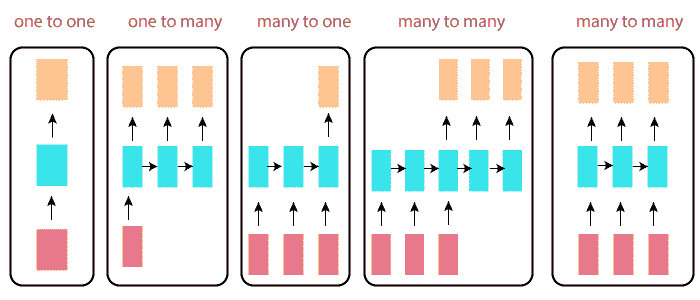

# RNN 的类型

> 原文：<https://www.javatpoint.com/tensorflow-types-of-rnn>

递归网络更令人兴奋的主要原因是，它们允许我们对向量序列进行操作:输入中的序列，输出中的序列，或者在最一般的情况下，两者都有。几个例子可能更具体:

上图中的每个矩形代表矢量，箭头代表函数。输入向量是红色的，输出向量是蓝色的，绿色代表 RNN 状态。

### 一对一:

这也称为**普通神经网络**。它处理固定大小的输入到固定大小的输出，其中它们独立于先前的信息/输出。

**例:**图像分类。

### 一对多:

它处理固定大小的信息作为输入，给出一系列数据作为输出。

**示例:**图像字幕以图像为输入，输出一句话。

### 多对一:

它将一系列信息作为输入，并输出固定大小的输出。

**示例:**任何句子被归类为表达积极或消极情绪的情绪分析。

### 多对多:

它将一系列信息作为输入，并将重复输出的数据作为一系列数据进行处理。

**例:**机器翻译，RNN 人读任何一个英语句子，然后输出法语句子。

### 双向多对多:

同步序列输入和输出。请注意，在每种情况下，长度序列都没有预先指定的约束，因为循环变换(绿色)是固定的，可以根据我们的需要应用多次。

**示例:**视频分类，我们希望标记视频的每一帧。

## 递归神经网络的优势

*   RNN 可以对一系列数据进行建模，这样就可以假设每个样本都依赖于之前的样本。
*   递归神经网络甚至与卷积层一起用于扩展活动像素邻域。

## 递归神经网络的缺点

*   渐变消失和爆炸问题。
*   训练 RNN 是一项复杂的任务。
*   如果它像激活函数一样使用 tanh 或 relu，它就不能处理很长的序列。

* * *