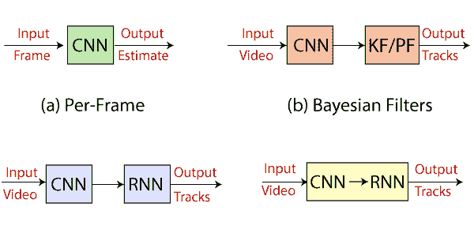

# 美国有线电视新闻网和 RNN 的区别

> 原文：<https://www.javatpoint.com/tensorflow-cnn-vs-rnn>

| S.no | 美国有线新闻网；卷积神经网络 | RNN |
| **1** | **CNN** 代表**卷积神经网络**。 | **RNN** 代表**递归神经网络**。 |
| **2** | 美国有线电视新闻网被认为比 RNN 更强大。 | 与美国有线电视新闻网相比，RNN 的功能兼容性较差。 |
| **3** | CNN 是图像和视频处理的理想选择。 | RNN 是文本和语音分析的理想选择。 |
| **4** | 它适用于像图像这样的空间数据。 | RNN 用于时态数据，也称为顺序数据。 |
| **5** | 网络接受固定大小的输入并产生固定大小的输出。 | RNN 可以处理任意输入/输出长度。 |
| **6** | 有线电视新闻网是一种前馈人工神经网络，多层感知器的变体被设计成使用最少的预处理量。 | 与前馈神经网络不同，RNN 可以使用其内部存储器来处理任意输入序列。 |
| **7** | 美国有线电视新闻网对神经元之间连接模式的使用。CNN 受动物**视皮层**的组织影响，其单个神经元的排列方式可以对视野中重叠的区域做出反应。 | 递归神经网络使用时间序列信息——用户最后说什么会影响他接下来说什么。 |

下图为**CNN****RNN**示意图

* * *