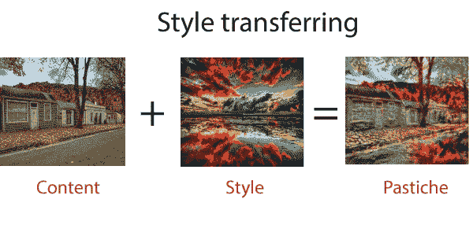
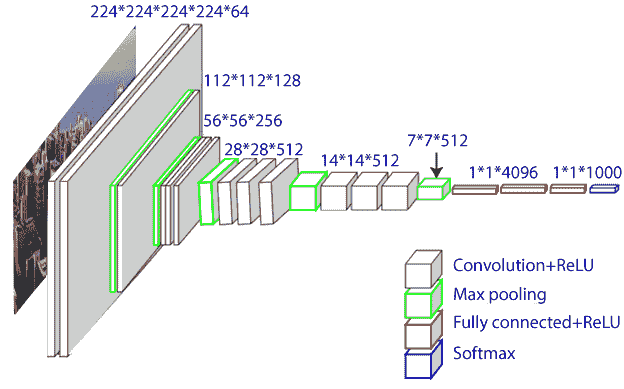
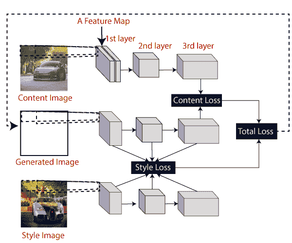
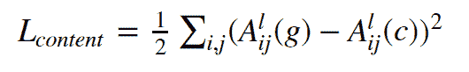
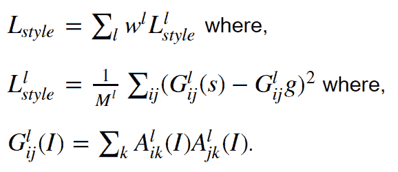
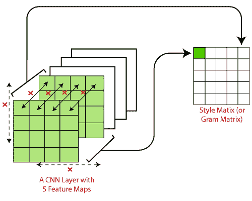

# 张量流中的风格转换

> 原文：<https://www.javatpoint.com/style-transferring-in-tensorflow>

神经风格转移( **NST** )是指一类操纵数字图像或视频，或者采用另一幅图像的外观或视觉风格的软件算法。当我们实现算法时，我们定义了两个距离；一个用于内容( **Dc** )，另一个用于形式( **Ds** )。

在本主题中，我们将实现一个基于深度神经网络的人工系统，该系统将创建高感知质量的图像。系统将使用神经表示来分离、重组作为输入的内容图像(**一个风格图像**)，并在使用风格图像的艺术风格打印时返回内容图像。

神经风格转移是一种优化技术，主要用于拍摄两幅图像- **一幅内容图像**和**一幅风格参考图像**并进行融合。因此，输出图像看起来像内容图像，以匹配内容图像的内容统计和样式参考图像的样式统计。这些统计数据是使用卷积网络从图像中导出的。



## 神经风格转换算法的工作

当我们实现给定的算法时，我们定义了两个距离；一个用于样式(Ds)，另一个用于内容(Dc)。Dc 衡量两个图像之间内容的不同，Ds 衡量两个图像之间风格的不同。我们获取第三个图像作为输入，并将其转换为最小化其与内容图像的内容距离和其与样式图像的样式距离。

### 需要库

```

import tensorflow as tf  
#we transform and models because we will modify our images and we will use pre-trained model VGG-19   
from torchvision import transforms, models  from PIL 
import Image  
import matplotlib.pyplot as plt  
import numpy as np  

```

## wall-19 型号

**VGG-19 型**类似于 VGG-16 型。**西蒙扬**和**齐泽曼**推出了 VGG 模式。VGG-19 是在来自 ImageNet 数据库的 100 多万张图像上训练的。该模型有 19 层深度神经网络，可以将图像分为 **1000** 个对象类别。



### 高级架构

神经类型转换使用相关的卷积神经网络。然后定义一个损失函数，绝对混合两个图像来创建视觉上吸引人的艺术，NST 定义了以下输入:

*   **内容图像(c)—**我们要将样式转移到的图像
*   **一个样式图像—**我们想要移动方法的图像
*   **输入图像(g)-(T1)包含最终结果的图像。**

模型的结构是相同的，计算的损失如下所示。我们不需要对下图中发生的事情有深刻的理解，因为我们将在接下来的几节中详细了解每个组件。这个想法是为了对发生风格转换的工作流有一个高层次的理解。



## 下载并加载相关的 VGG-16

我们将从这个网页上借用 VGG-16 的重量。我们需要下载 **vgg16_weights.npz** 文件，并将其替换到我们项目主目录中名为 vgg 的文件夹中。我们只需要卷积和汇集层。显而易见，我们将加载前七个卷积层，用作 NST 网络。我们可以使用**负载权重(...)**功能在笔记本中给出。

#### 注意:我们要多尝试几层。但是要注意我们的中央处理器和图形处理器的内存限制。

```

# This function takes in a file path to the file containing weights
# and an integer that denotes how many layers to be loaded.
vgg_layers=load_weights(os.path.join('vgg','vgg16_weights.npz'),7)

```

### 定义构建风格传递网络的功能

我们定义了几个函数，这些函数将有助于我们在给定输入的情况下完全定义 CNN 的计算图。

**创建张量流变量**

我们将 numpy 数组加载到 TensorFlow 变量中。我们正在创建以下变量:

*   内容图像( **tf.placeholder** )
*   样式图像( **tf.placeholder** )
*   生成的图像( **tf。可变和可训练=真**)
*   预处理重量和偏差( **tf。可变和可训练=假**)

确保我们保持生成的图像可训练，同时保持预训练的权重和权重和偏差冻结。我们展示了定义输入和神经网络权重的两个函数。

```

def define_inputs (input_shape):
"""
This function defines the inputs (placeholders) and image to be generated (variable)
"""
content = tf.placeholder(name='content' , shape=input_shape, dtype=tf.float32)
style= tf.placeholder(name='style', shape=input_shape, dtype=tf.float32)
generated= tf.get_variable(name='generated', initializer=tf.random_normal_initalizer=tf.random_normal_initiallizer(), shape=input_shape, dtype=tf.float32, trainable=true)
return {'content':content,'style,'generated': generated}
def define_tf_weights():
"""
This function defines the tensorflow variables for VGG weights and biases
"""
for k, w_dict in vgg_layers.items():
w, b=w_dict['weights'], w_dict['bias']
with tf.variable_scope(k):
  tf.get_variable(name='weights', initializer=tf.constant(w, dtype=tf.float32), trainable=false)
tf.get_variable(name='bias', initializer=tf.constant(b, dtype=tf.float32), trainable=False)

```

### 计算 VGG 净产出

```

Computing the VGG net output
Def build_vggnet(inp, layer_ids, pool_inds, on_cpu=False):
"This function computes the output of full VGG net """
    outputs = OrderedDict()

    out = inp

for lid in layer_ids:
        with tf.variable_scope(lid, reuse=tf.AUTO_REUSE):
            print('Computing outputs for the layer {}'.format(lid))
            w, b = tf.get_variable('weights'), tf.get_variable('bias')
            out = tf.nn.conv2d(filter=w, input=out, strides=[1,1,1,1], padding='SAME')
out = tf.nn.relu(tf.nn.bias_add(value=out, bias=b))
            outputs[lid] = out

        if lid in pool_inds:
            with tf.name_scope(lid.replace('conv','pool')):
                out = tf.nn.avg_pool(input=out, ksize=[1,2,2,1], strides=[1, 2, 2, 1], padding='SAME')
                outputs[lid.replace('conv','pool')] = out

return outputs

```

### 损失函数

在这一节中，我们定义了两个损失函数；风格损失函数和内容函数。内容丢失功能确保生成的图像和内容图像之间较高层的激活是相似的。

### 内容成本函数

内容成本函数确保内容图像中存在的内容被捕获到生成的图像中。已经发现，CNN 在较高的级别捕获关于内容的信息，其中较低的级别更关注单像素值。

假设 **A^l_{ij}(I)** 是使用图像 I 实现的第 1 层、第 1 特征图和第 j 位置的激活。然后内容丢失被定义为



### 内容丢失背后的直觉

如果我们把通过神经网络学到的东西可视化，有证据表明，在不同物体存在的情况下，更高层的不同特征图会被激活。因此，如果两个图像具有相同的内容，它们在顶层具有相似的激活。

我们将内容成本定义如下。

```

def define_content_loss(inputs, layer_ids, pool_inds, c_weight):
c_outputs= build_vggnet (inputs ["content"], layer_ids, pool_inds)
g_outputs= build_vggnet (inputs ["generated"], layer_ids, pool_inds)
content_loss= c_weight * tf.reduce_mean(0.5*(list(c_outputs.values())[-1]-list(g_outputs.values())[-1])**2)

```

### 风格损失函数

它定义了期望更多工作的风格损失函数。为了从 VGG 网络中获得风格信息，我们将使用美国有线电视新闻网的完整层。样式信息是通过图层中要素地图之间的相关性来衡量的。数学上，风格损失定义为，



### 风格丧失背后的直觉

通过上面的方程系统，这个想法很简单。主要目标是为原始图像和样式图像计算样式矩阵。

然后，样式损失被定义为两个样式矩阵之间的均方根差。



```

	   def define_style_matrix(layer_out):
 """
	This function computes the style matrix, which essentially computes
	how correlated the activations of a given filter to all the other filers.
	Therefore, if there are C channels, the matrix will be of size C x C
	"""
	n_channels = layer_out.get_shape().as_list()[-1]
	unwrapped_out = tf.reshape(layer_out, [-1, n_channels])
	 style_matrix = tf.matmul(unwrapped_out, unwrapped_out, transpose_a=True)
	return style_matrix

	def define_style_loss(inputs, layer_ids, pool_inds, s_weight, layer_weights=None):
	 """ 
	This function computes the style loss using the style matrix computed for
	 the style image and the generated image 
	 """ 
	c_outputs = build_vggnet(inputs["style"], layer_ids, pool_inds)
	g_outputs = build_vggnet(inputs["generated"], layer_ids, pool_inds)

	 c_grams = [define_style_matrix(v) for v in list(c_outputs.values())]
	g_grams = [define_style_matrix(v) for v in list(g_outputs.values())]

	    if layer_weights is None:
	        style_loss =  s_weight * \
	            tf.reduce_sum([(1.0/len(layer_ids)) * tf.reduce_mean((c - g)**2) for c,g in zip(c_grams, g_grams)])
	    else:
	        style_loss = s_weight * \

```

* * *