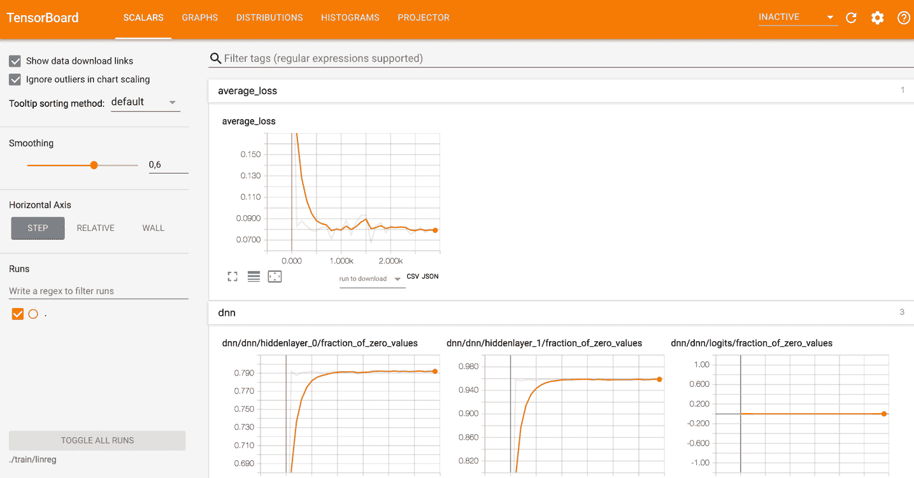
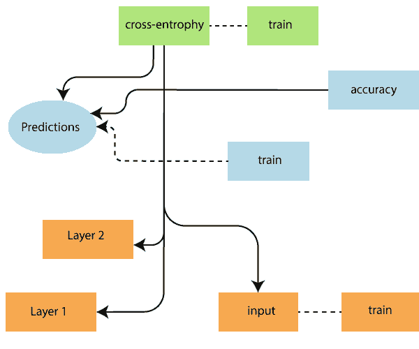
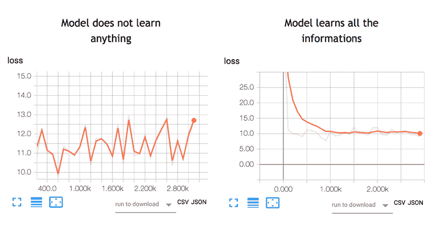
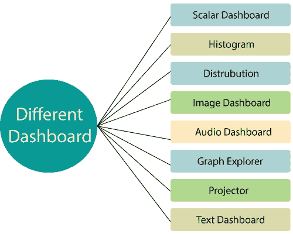
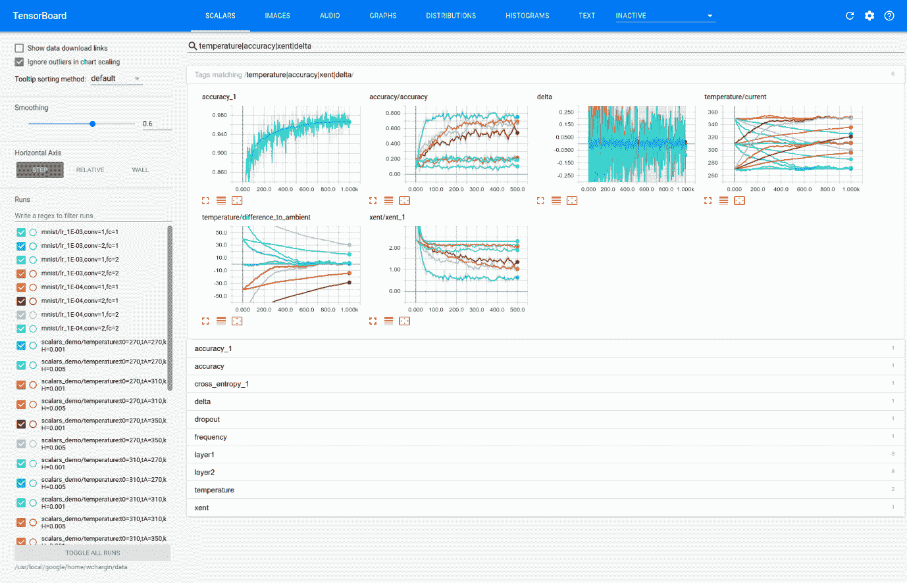

# TensorBoard

> 原文：<https://www.javatpoint.com/tensorflow-tensorboard>

张量流是一种可视化工具，被称为张量板。它用于分析数据流图，并用于理解机器学习模型。TensorBoard 是用于可视化图形的界面，以及许多用于理解、调试和优化模型的工具。

TensorBoard 的重要特点是，它包括一个关于垂直对齐中任何图形的参数和细节的不同类型统计的视图。

深度神经网络包括多达 **36，000 个**节点。TensorFlow 有助于在高层折叠这些节点，在高层块中折叠这些节点并突出显示相同的结构。这允许更好地分析图形，集中在计算图形的主要部分。



据说 TensorBoard 可视化非常具有交互性，用户可以平移、缩放和扩展节点来显示细节。

以下是显示 TensorBoard 可视化的完整工作的给定图表表示-



该算法将节点折叠成高级块，并突出显示具有相同结构的特定组，从而将高级节点分开。创建的 TensorBoard 非常有用，对于调整机器学习模型同样重要。这个可视化工具是为配置日志文件设计的。

请看下图:



一个神经网络决定如何连接不同的“**神经元**”，以及在模型能够预测结果之前有多少层。一旦我们定义了架构，我们不仅需要训练模型，还需要度量来计算预测的准确性。这个度量被称为损失函数。目标是作为损失函数。

TensorBoard 是一个很好的工具，可以可视化指标并突出潜在的问题。神经网络可能需要几个小时到几周的时间才能找到解决方案。TensorBoard 会经常更新参数。

TensorBoard 位于此网址: **http://localhost:6006**

## TensorBoard 中仪表板的类型



**1。标量仪表盘**

它用于可视化依赖于时间的统计数据；例如，我们可能想看看学习率或损失函数的变化。

**2。直方图**

张量板中的直方图仪表板显示张量的统计分布如何随时间变化。它将通过**记录的数据可视化。**

**3。配电仪表盘**

显示了 **tf.summary .直方图**的一些高级用法。它显示了发行版的一些高级开始。图表上的每一行都给出了关于数据分布的百分位数的提示。

**4。图像仪表盘**

这显示了通过**保存的 png。行对应于标签，列对应于运行。通过使用 TensorBoard 的这个图像仪表板，我们可以嵌入自定义可视化。**

**5。音频仪表盘**

这是一个很好的工具，可以为通过 **tf.summary.audio** 保存的音频嵌入可播放的音频小部件。仪表板总是为每个标签嵌入最新的音频。

**6。图形浏览器**

它主要用于检查张量流模型。

**7。投影仪**

TensorFlow 中用于多维数据的嵌入式投影仪。嵌入投影仪从检查点文件中读取数据，并可能使用相应的数据(如词汇文件)进行设置。

**8。文本仪表盘**

文本仪表板显示通过**保存的文本专家，包括超链接、列表和表格等功能。**



## 对 TensorBoard 的不同看法

不同的视图接受不同格式的输入，并以不同的方式显示它们。我们可以在橙色的顶栏上更换它们。

*   **标量-** 可视化标量值，如分类精度。
*   **Graph-** 可视化我们模型的计算图，就像神经网络模型一样。
*   **分布-** 可视化数据如何随时间变化，例如神经网络的权重。
*   **直方图-** 分布的更高级视图，显示以三维视角显示分布的分布。
*   **投影仪-** 它可以用来可视化单词嵌入(即单词嵌入是捕捉单词语义关系的单词的数字表示)
*   **图像-** 可视化图像数据
*   **音频-** 可视化音频数据
*   **文本-** 可视化文本数据

## 如何使用 TensorBoard？

我们将学习如何从终端为 MacOS 和命令行窗口打开 TensorBoard。

该代码将在未来的教程中解释；这里的重点是 TensorBoard。

首先，我们需要导入我们将在培训中使用的库。

```

 ## Import the library
import tensorflow as tf
import numpy as np

```

我们创建数据。它是一个包含 10000 行和列的数组/p >

```

X_train = (np.random.sample((10000,5)))
y_train =  (np.random.sample((10000,1)))
X_train.shape

```

下面的代码转换数据并创建模型。

注意学习率等于 0.1。如果我们把这个比率改成一个更高的值，模型就找不到解决办法了。这是上图左侧发生的事情。

在下面的例子中，我们将模型存储在工作目录中，即存储笔记本或 python 文件的位置。在路径内部，TensorFlow 创建一个名为 train 的文件夹，子文件夹名为 linreg。

```

feature_columns = [
      tf.feature_column.numeric_column('x', shape=X_train.shape[1:])]
DNN_reg = tf.estimator.DNNRegressor(feature_columns=feature_columns,
# Indicate where to store the log file    
     model_dir='train',    					
     hidden_units=[500, 300],    
     optimizer=tf.train.ProximalAdagradOptimizer(      
          learning_rate=0.1,      
          l1_regularization_strength=0.001    
      )
)

```

**输出:**

```
INFO:tensorflow:Using the default configuration.
INFO:tensorflow:Using config:{'_model_dir': 'train/linreg', '_tf_random_seed': None, '_save_summary_steps': 100, '_save_checkpoints_steps': None, '_save_checkpoints_secs': 600, '_session_config': None, '_keep_checkpoint_max': 5, '_keep_checkpoint_every_n_hours': 10000, '_log_step_count_steps': 100, '_train_distribute': None, '_service': None, '_cluster_spec': , '_task_type': 'worker', '_task_id': 0, 
'_global_id_in_cluster': 0, '_master': '', '_evaluation_master': '', '_is_chief': True, '_num_ps_replicas': 0, '_num_worker_replicas': 1} 
```

最后一步是训练模型。在训练期间，TensorFlow 将信息写入模型目录。

```

# Train the estimator
train_input = tf.estimator.inputs.numpy_input_fn(    
     x={"x": X_train},    
     y=y_train, shuffle=False,num_epochs=None)
DNN_reg.train(train_input,steps=3000) 

```

**输出:**

```
INFO:tensorflow:Calling model_fn.
INFO:tensorflow:Done calling model_fn.
INFO:tensorflow:Create CheckpointSaverHook.
INFO:tensorflow: Graph was finalized.
INFO:tensorflow:Running local_init_op.
INFO:tensorflow:Done running local_init_op.
INFO:tensorflow:Saving checkpoints for 1 into train/linreg/model.ckpt.
INFO:tensorflow:loss = 40.060104, step = 1
INFO:tensorflow:global_step/sec: 197.061
INFO:tensorflow:loss = 10.62989, step = 101 (0.508 sec)
INFO:tensorflow:global_step/sec: 172.487
INFO:tensorflow:loss = 11.255318, step = 201 (0.584 sec)
INFO:tensorflow:global_step/sec: 193.295
INFO:tensorflow:loss = 10.604872, step = 301 (0.513 sec)
INFO:tensorflow:global_step/sec: 175.378
INFO:tensorflow:loss = 10.090343, step = 401 (0.572 sec)
INFO:tensorflow:global_step/sec: 209.737
INFO:tensorflow:loss = 10.057928, step = 501 (0.476 sec)
INFO:tensorflow:global_step/sec: 171.646
INFO:tensorflow:loss = 10.460144, step = 601 (0.583 sec)
INFO:tensorflow:global_step/sec: 192.269
INFO:tensorflow:loss = 10.529617, step = 701 (0.519 sec)
INFO:tensorflow:global_step/sec: 198.264
INFO:tensorflow:loss = 9.100082, step = 801 (0.504 sec)
INFO:tensorflow:global_step/sec: 226.842
INFO:tensorflow:loss = 10.485607, step = 901 (0.441 sec)
INFO:tensorflow:global_step/sec: 152.929
INFO:tensorflow:loss = 10.052481, step = 1001 (0.655 sec)
INFO:tensorflow:global_step/sec: 166.745
INFO:tensorflow:loss = 11.320213, step = 1101 (0.600 sec)
INFO:tensorflow:global_step/sec: 161.854
INFO:tensorflow:loss = 9.603306, step = 1201 (0.619 sec)
INFO:tensorflow:global_step/sec: 179.074
INFO:tensorflow:loss = 11.110269, step = 1301 (0.556 sec)
INFO:tensorflow:global_step/sec: 202.776
INFO:tensorflow:loss = 11.929443, step = 1401 (0.494 sec)
INFO:tensorflow:global_step/sec: 144.161
INFO:tensorflow:loss = 11.951693, step = 1501 (0.694 sec)
INFO:tensorflow:global_step/sec: 154.144
INFO:tensorflow:loss = 8.620987, step = 1601 (0.649 sec)
INFO:tensorflow:global_step/sec: 151.094
INFO:tensorflow:loss = 10.666125, step = 1701 (0.663 sec)
INFO:tensorflow:global_step/sec: 193.644
INFO:tensorflow:loss = 11.0349865, step = 1801 (0.516 sec)
INFO:tensorflow:global_step/sec: 189.707
INFO:tensorflow:loss = 9.860596, step = 1901 (0.526 sec)
INFO:tensorflow:global_step/sec: 176.423
INFO:tensorflow:loss = 10.695, step = 2001 (0.567 sec)
INFO:tensorflow:global_step/sec: 213.066
INFO:tensorflow:loss = 10.426752, step = 2101 (0.471 sec)
INFO:tensorflow:global_step/sec: 220.975
INFO:tensorflow:loss = 10.594796, step = 2201 (0.452 sec)
INFO:tensorflow:global_step/sec: 219.289
INFO:tensorflow:loss = 10.4212265, step = 2301 (0.456 sec)
INFO:tensorflow:global_step/sec: 215.123
INFO:tensorflow:loss = 9.668612, step = 2401 (0.465 sec)
INFO:tensorflow:global_step/sec: 175.65
INFO:tensorflow:loss = 10.009649, step = 2501 (0.569 sec)
INFO:tensorflow:global_step/sec: 206.962
INFO:tensorflow:loss = 10.477722, step = 2601 (0.483 sec)
INFO:tensorflow:global_step/sec: 229.627
INFO:tensorflow:loss = 9.877638, step = 2701 (0.435 sec)
INFO:tensorflow:global_step/sec: 195.792
INFO:tensorflow:loss = 10.274586, step = 2801 (0.512 sec)
INFO:tensorflow:global_step/sec: 176.803
INFO:tensorflow:loss = 10.061047, step = 2901 (0.566 sec)
INFO:tensorflow:Saving checkpoints for 3000 into train/linreg/model.ckpt.
INFO:tensorflow: Loss for the final step: 10.73032\. 

<tensorflow.python.estimator.canned.dnn.DNNRegressor at 0x1818e63630>

```

**对于 Windows 用户**

```

cd C:\Users\Admin\Anaconda3
activate hello-tf

```

**要启动 TensorBoard，我们可以使用这个代码**

```

tensorboard --logdir=.\train\linreg

```

* * *