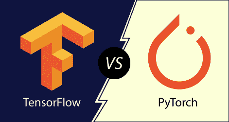
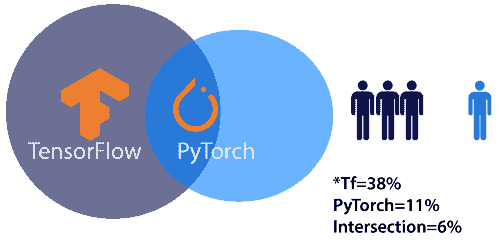
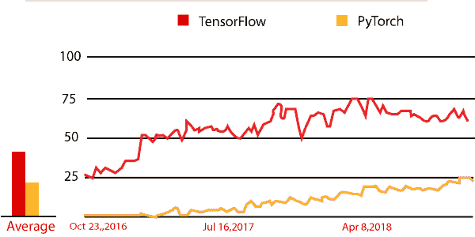

# TensorFlow和 PyTorch 的区别

> 哎哎哎:# t0]https://www . javatppoint . com/tensorlow-vs pytorch

两个框架 **TensorFlow** 和 **PyTorch** 都是机器学习的**顶级**库，都是用 Python 语言开发的。这些是开源的神经网络库框架。TensorFlow 是一个软件库，用于各种任务所需的差分和数据流编程，但 PyTorch 基于 **Torch** 库。

## 我们为什么使用TensorFlow？

TensorFlow 是一个机器学习应用程序的库框架。该框架是一个数学库，主要用于数值计算，以应用来自图形的数据。图的边可以表示多维数据数组，节点表示各种精确的表示。它教授关于数学符号、图像识别和部分微分的神经网络，完全能够在多个**图形处理器**和**图形处理器**上运行。它的架构很灵活。

这个框架也可能支持 **C#、哈斯克尔、茱莉亚、鲁斯特、斯卡拉、水晶、**和**奥卡姆**。

## 我们为什么要用 PyTorch？

PyTorch 是一个机器学习库，适用于自然语言处理等应用。Pytorch 也适合构建各种类型的应用程序。

这个库框架有两个基本特征:

该库的第一个特征是用于训练和构建深度神经网络的自动区分。

第二个特点是高功率图形处理器加速支持下的计算张量能力。

Pytorch 有三个操作模块。**最佳模块、自动分级模块、**和**神经网络模块**。每个模块都有其特定的功能和应用。

例如，**最佳模块**用于实现神经网络开发的各种类型的算法。**神经网络模块**用于定义所有复杂的低级神经网络

 

## TensorFlow与 PyTorch 的比较

| 基础 | TensorFlow | PyTorch |
| **库** | TensorFlow 是一个自由软件库，这个库本质上是开源的。 | PyTorch 框架是一个开源的机器学习库。 |
| **原点** | 这个库是由**谷歌大脑团队**基于构建模型的数据流图的思想开发的。 | 该库由一个基于火炬的**脸书人工智能**研究小组开发。 |
| **兼容性** | TensorFlow 库兼容不同的编码语言，如 **C、C++、Java** 。 | PyTorch 库仅用于基于 **Python** 的编码。 |
| **功能** | 这个框架被用来教授机器许多计算方法。 | 该框架用于构建神经网络和自然语言处理。 |
| API | TensorFlow 库既有低级 API，也有高级 API。 | PyTorch 库有一些低级的 API，专注于数组表达式的工作。 |
| **能力** | 它以跨多个平台的快速计算能力而闻名。 | PyTorch 以其研究目的而闻名。它还有助于深度学习应用。 |
| **速度** | TensorFlow 的速度更快，并提供高性能。 | PyTorch 的速度和性能与 TensorFlow 非常相似。 |
| **架构** | TensorFlow的体系结构很复杂，有点难以理解。 | Pytorch 的架构相当复杂，对任何初学者来说都是一个挑战。 |
| **调试能力** | 在 TensorFlow 中调试的过程是复杂的。 | 与 Keras 和 TensorFlow 相比，Pytorch 的调试能力更好。 |
| **能力** | TensorFlow 能够处理大型数据集，因为库的处理速度非常快。 | Pytorch 可以处理大型数据集和高性能任务。 |
| **尺寸** | TensorFlow 的代码大小在格式上较小，以提高准确性。 | Pytorch 的所有代码都由单独的行组成。 |
| **项目** | 顶级的 TensorFlow 项目是**洋红色、十四行诗、路德维希** | 高 PyTorch 计划为 **CheXNet、PYRO、Horizon** |
| **上升时间** | PyTorch 正在利用 Numpy 来使用显卡。 | TensorFlow依赖于使用TensorFlow执行引擎运行编译后的代码。 |

更多信息[点击这里](pytorch-vs-tensorflow)。

* * *