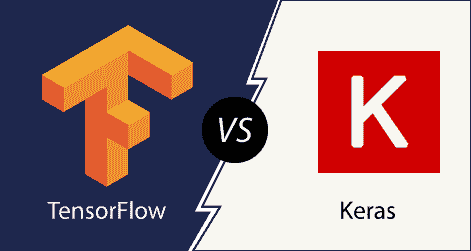
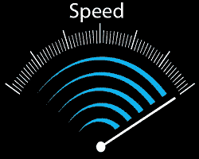
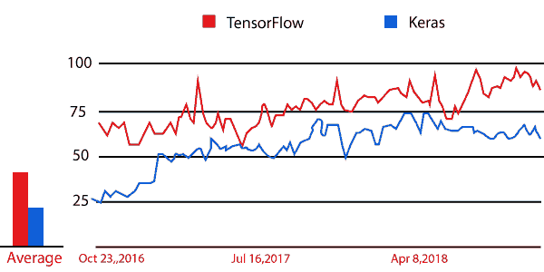

# TensorFlow和 Keras 的区别

> 原文： [https://www.javatpoint.com/tensorflow-vs-keras](https://www.javatpoint.com/tensorflow-vs-keras)

**TensorFlow** 和 **Keras** 都是数据科学家和深度学习领域初学者首选的顶级框架。TensorFlow 和 PyTorch 的比较将为我们提供关于顶级深度学习框架的清晰知识，并帮助我们找到适合我们的框架。

**TensorFlow** 是一个开源软件库，用于一系列任务之外的数据流编程。这是一个数学库，用于机器学习应用，如神经网络。

**Keras** 是用 Python 编写的开源神经网络库。它可以运行在TensorFlow之上。它被定义为能够使用深度神经网络进行快速实验。

## 两种框架的比较

所有这三个框架在内部都是相互关联的，并且有一些基本的区别来区分它们。

*   起源
*   速度
*   原料药的级别
*   体系结构
*   排除故障
*   资料组
*   流行
*   蜜蜂

**原点**

TensorFlow 库是由谷歌大脑团队和自由软件库共同开发的。这个库本质上是开源的。而 **Keras** 是一个用于深度学习的极简 Python 库，可以运行在 antio 或 TensorFlow 之上，由 **Francois Chollet** 开发，他是一名谷歌工程师，使用了四个指导原则:模块化、极简主义、可扩展性和 Python。

**速度**

在 **Keras 中性能大约较低，而 TensorFlow** 和 **Pytorch** 提供了类似的速度，这是快速的并且适合高性能。

**空气污染指数等级**

**Keras** 是一个高级 API，能够运行在 **TensorFlow、CNTK、**和**安诺**之上。它因其易用性和语法简单性获得了支持，从而促进了快速开发。

**TensorFlow** 是一个同时提供高级和低级 API 的框架。**但是另一方面，Pytorch** 是一个更低级的 API，专注于直接处理数组表达式。

**架构**

**喀拉斯**有**纯**建筑。可读性更强，更简洁。另一方面， **TensorFlow** 并不容易使用，尽管它提供了 Keras 作为框架，使工作**变得更容易**。

**调试**

在 Keras 中调试简单网络的需求通常很小。但是在 **TensorFlow** 的情况下，执行调试是很棘手的。 **PyTorch** 相比其他两个有更好的调试能力。

**数据集**

**Keras** 用于**小数据集**，因为它比较慢。另一方面， **TensorFlow** 和 **PyTorch** 用于高性能模型和**需要快速执行的海量数据集**。

**人气**

随着数据科学领域需求的上升，深度学习在行业中有了很大的增长。凭借这一点，这三个框架都获得了很大的普及。 **Keras** 位居榜首，其次是 **TensorFlow** 和 **PyTorch** 。与其他两种相比，它因其简单性而获得了巨大的普及。

API

Keras 库有一个非常高级的 API，可以在 CNTK 和茶诺上运行，但是 TensorFlow 库有低级和高级 API。

**Keras 最适合:**

*   快速原型
*   小数据集
*   多后端支持

**TensorFlow 最适合:**

*   大型数据集
*   高性能
*   功能
*   目标检测

* * *