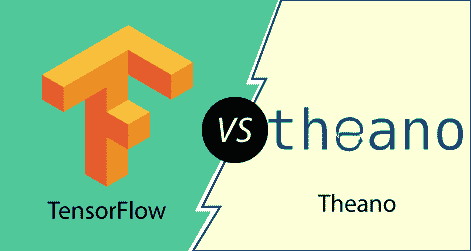

# TensorFlow与茶氨酸的区别

> 哎哎哎:# t0]https://www . javatppoint . com/tensorlow-vs theano

深度学习领域的研究人员使用 TensorFlow 和 antano，更多时候，人们会比较它们的受欢迎程度、技术优势、易用性等等。

而 TensorFlow 是由谷歌大脑团队的工程师和研究人员开发的，而 antao 是由蒙特利尔 MILA 大学的 Yoshua Bengio 开发的，从 2007 年的 T2 就已经存在了。

## 安诺流和TensorFlow的主要区别:

两者是服务于几乎相同目的的库。以下是下面描述的一些关键差异:

*   antao 是由 **LISA** 小组开发的，该小组是蒙特利尔大学代表队的一部分，而谷歌大脑团队开发了供内部使用的 TensorFlow。它是为内部使用而设计的，后来被公开了。
*   当应用程序需要的资源不足，并且计算不太复杂时，最好使用 and。在开发需要适度系统配置的算法时，可以毫无疑问地使用 an ano。当需要大量计算并且资源适当可用时，TensorFlow 是首选。TensorFlow 的一个优点是可以让复杂的算法在系统中运行。
*   该库提供了只有基于 Python 的应用程序才能授权它的地方。由于局限性，它不被有兴趣使用 C++的研究人员所喜欢。TensorFlow 允许我们将它与 C++和 python 一起使用，最终提供了一个扩展的研究环境。
*   两者都是为了同一个目标而开发的，但是由于组织的角色，它们带有可靠性的标签。由谷歌开发，谷歌有一个名为 brain team 的专门团队，不断开发这个。
*   TensorFlow 比 antano 更受欢迎。
*   antao 由一个名为 LISA 的小组开发，工作得非常好，但由于它的一些限制，它不如 TensorFlow 受欢迎。
*   在受欢迎的情况下，TensorFlow 赢得了一个高点，这是一个事实，它得到了领先的科技传奇之一谷歌的支持。相比之下，到目前为止，antao 是由蒙特利尔大学的 MILA 积极开发和维护的，一个团队中有 50 多名成员，他们贡献自己的时间来不断改进它。
*   许多专家认为，TensorFlow 就像是对 antao 的完全重新实现，谷歌创建 TensorFlow 是为了取代 antao。即便如此，后者在许多方面都被认为比 TensorFlow 更快。
*   安诺还支持更广泛的操作和各种程序，虽然 TF 在这些方面表现出了希望，但在达到安诺之前还有时间。

## 茶氨酸与TensorFlow的比较

| 提亚诺 | TensorFlow |
| **它是一个基于 python 的库**
antao 是一个完全基于 python 的库，这意味着它必须与唯一的 python 一起使用。该库将使用 python 语言，并且依赖于要实现的 python 编程。 | **它是一个基于 C++和 python 的库**
TensorFlow 是一个基于 C++和 python 的库，这意味着它可以用于 C++和 python 编程。能够用两种语言交付，这更被开发人员所考虑。 |
| **它使用单个中央处理器**
它使用单个中央处理器来处理或执行计算。它有效地利用单个中央处理器，并根据中央处理器的处理能力生成结果。 | **使用一个或多个 CPU**
TensorFlow 能够根据其性能使用一个或多个 CPU。使用多 CPU 优于单个 CPU，因为这样可以减少完成计算所需的时间。 |
| **中等编译速度**
蚂蚁热衷于执行复杂的计算，但有时由于编译速度较低，无法满足要求。编译时间太高，但是如果程序的程序复杂性更高，就会导致花费时间。 | **快速编译速度**
TensorFlow 被认为比 antio 花费更少的编译时间。事实上，它可以利用多个中央处理器，这使得它能够在一定时间内完成比人工智能更复杂的计算。 |
| **中等受欢迎程度**
与 TensorFlow 相比，由于其功能的限制，它被认为不太受欢迎。它可以在 python 编程中使用，并且仅限于使用单个 CPU，因此仅在需要常规计算的情况下才是首选。 | **更高人气**
TensorFlow 库已经用 python 和 C++开发出来了。它能够与许多中央处理器一起工作。由于这些在需要复杂计算的地方受欢迎和偏爱。 |

* * *