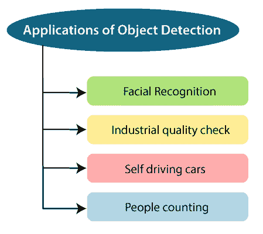
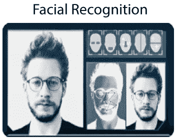
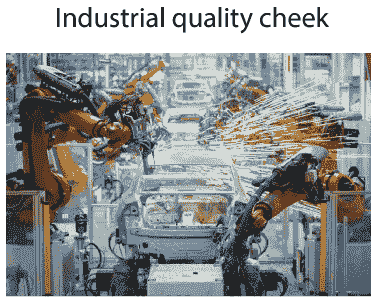
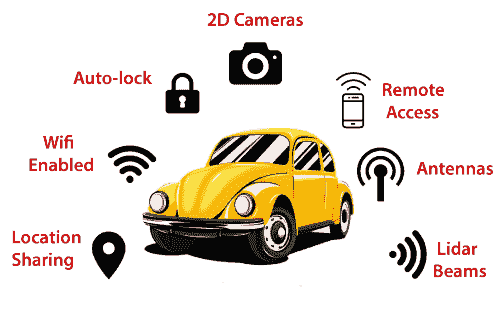
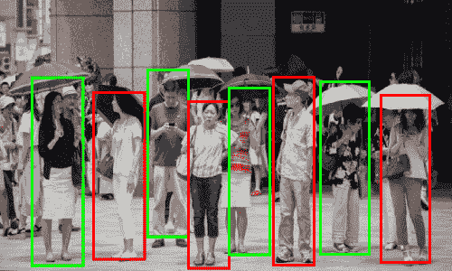
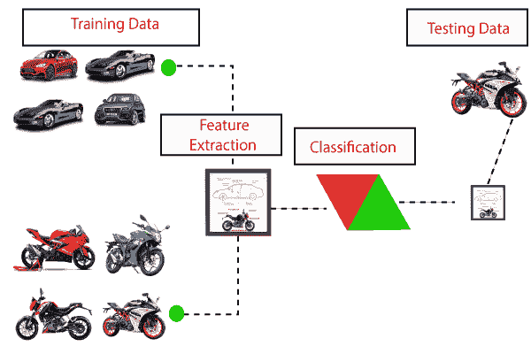
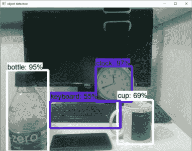

# TensorFlow目标检测

> 原文：<https://www.javatpoint.com/tensorflow-object-detection>

物体检测是在图像或视频中发现真实世界物体细节的过程，例如汽车或自行车、电视、花卉和人类。它允许识别、定位和识别图像中的多个对象，让我们更好地理解图像。它用于图像检索、安全、监控和高级驾驶员辅助系统 **(ADAS)** 等应用。

## 目标检测的应用



**面部识别:**

脸书的一组研究人员开发了一个名为“深度面部识别”的深度学习面部识别系统，该系统可以非常有效地识别数字图像中的人脸。**谷歌照片**，根据图片中的人物自动分离所有图片。人脸识别涉及到很多组件，如**脸、鼻、口、**和**眉**。



**工业质量检查:**

物体检测也用于工业过程中识别产品。通过目视检查找到特定的物体是一项必不可少的任务，它涉及到多个工业流程，如**库存管理、加工、质量管理、包装、分拣、**等。

库存管理非常棘手，因为物品很难实时跟踪。自动定位和对象计数可以提高库存准确性。



**自动驾驶汽车:**

自动驾驶汽车是未来的汽车。但是背面的工作非常棘手，因为它结合了多种技术来感知大气，包括雷达、激光、全球定位系统、里程计和计算机视觉。

有先进的控制系统，解释感官信息，以确定适当的导航路径，以及障碍。一旦图像传感器检测到任何生物的迹象，它就会自动停止。这种情况发生的速度很快，是向无人驾驶汽车迈出的一大步。



**人数统计:**

物体检测可用于人数统计，用于分析节日期间商店业绩或人群数字。随着人们快速走出框架，这往往会变得更加困难。

它是人群聚集期间的关键应用程序；此功能可用于多种目的。



## 对象检测工作流

每种目标检测算法都在不同的教学中工作，但它们都基于相同的原理。

**特征提取:**他们从手边的输入图像中提取特征，并使用这些特征来确定图片的类别。无论是通过 **Mat Lab、Open CV、Viola-Jones、**还是**深度学习**。



**先决条件**

*   计算机编程语言
*   TensorFlow
*   张量板
*   Protobuf v3.4 或以上版本

## 环境设置

现在要下载 TensorFlow 和 TensorFlow GPU，我们可以使用开始时的 **pip** 或 **conda** 命令。

**完成命令**

```

import numpy as np
import os
import zipfile
import six.moves.urllib as urllib
import sys
import tarfile
import tensorflow as tf
from collections import defaultdict
from matplotlib import pyplot as plt
from PIL import Image
from io import StringIO

import cv2
cap = cv2.VideoCapture(0)

sys.path.append("..")
from utils import visualization_utils as vis_util
from utils import label_map_util

MODEL_NAME = 'ssd_mobilenet_v1_coco_11_06_2017'
MODEL_FILE = MODEL_NAME + '.tar.gz'
DOWNLOAD_BASE = 'http://download.tensorflow.org/models/object_detection/'

# Here, the path to frozen detection graph. 
PATH_TO_CKPT = MODEL_NAME + '/frozen_inference_graph.pb'

# Here, list of the strings that are used to add a correct label for every box.
PATH_TO_LABELS = os.path.join('data', 'mscoco_label_map.pbtxt')

NUM_CLASSES = 90

opener = urllib.request.URLopener()
opener.retrieve(DOWNLOAD_BASE + MODEL_FILE, MODEL_FILE)
tar_file = tarfile.open(MODEL_FILE)
for file in tar_file.getmembers():
  file_name = os.path.basename(file.name)
  if 'frozen_inference_graph.pb' in file_name:
    tar_file.extract(file, os.getcwd())

detection_graph = tf.Graph()
with detection_graph.as_default():
  od_graph_def = tf.GraphDef()
  with tf.gfile.GFile(PATH_TO_CKPT, 'rb') as fid:
    serialized_graph = fid.read()
    od_graph_def.ParseFromString(serialized_graph)
    tf.import_graph_def(od_graph_def, name='')

label_map = label_map_util.load_labelmap(PATH_TO_LABELS)
categories =label_map_util.convert_label_map_to_categories(label_map, max_num_classes=NUM_CLASSES, use_display_name=True)
category_index = label_map_util.create_category_index (categories)

with detection_graph.as_default():
  with tf.Session(graph=detection_graph) as sess:
    while True:
     ret, image_np = cap.read()
    # Expanding the dimensions since the model expects images into the shape: [1, None, None, 3]
    image_np_expanded = np.expand_dims(image_np, axis=0)
    image_tensor = detection_graph.get_tensor_by_name('image_tensor:0')
    # Every box representing a part of the image where a particular object was detected.
    boxes = detection_graph.get_tensor_by_name('detection_boxes:0')
    scores = detection_graph.get_tensor_by_name('detection_scores:0')
    classes = detection_graph.get_tensor_by_name('detection_classes:0')
    num_detections = detection_graph.get_tensor_by_name('num_detections:0')
    #.
    (boxes, scores, classes, num_detections) = sess.run(
      [boxes, scores, classes, num_detections],
      feed_dict={image_tensor: image_np_expanded})
    # Visualization of the results through detection.
    vis_util.visualize_boxes_and_labels_on_image_array(
image_np,
        np.squeeze(boxes),
        np.squeeze(classes).astype(np.int32),
        np.squeeze(scores),
        category_index,
        use_normalized_coordinates=True,
        line_thickness=8)

    cv2.imshow('object detection', cv2.resize(image_np, (800,500))) 
    if cv2.waitKey(0) & 0xFF == ord('q'):
      cv2.destroyAllWindows()
      break

```

**输出-**



* * *