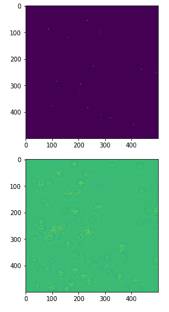

# TensorFlow形成图

> 原文：<https://www.javatpoint.com/tensorflow-forming-graphs>

一个偏微分方程 **(PDE)** 是微分方程的主要类型，它涉及几个自变量的未知函数的偏导数。关于偏微分方程，我们专注于创建新的图形。

让我们假设有一个尺寸为 **500*500** 平方的池塘-

**N=500**

现在，我们将计算偏微分方程，并使用它形成相应的图形。生成下面给出的计算图表的步骤。

将TensorFlow代码中的 **v1** 升级为 **v2** 如下:

```

import tensorflow.compat.v1 as tf
tf.disable_v2_behavior()

```

**步骤 1-** 首先导入库进行模拟。

```

import tensorflow as tf
import numpy as np
import matplotlib.pyplot as plt

```

**步骤 2-** 包括将 2D 阵列转换为卷积核的函数，并简化了成形图的 **2D** 卷积运算。

**示例:**

```

def make_kernel(a):
a = np.asarray(a)
a = a.reshape (list(a.shape) + [1,1])
return tf.constant(a, dtype=1)

def simple_conv(x, j):
""2D convolutional operation is generated below"": 
 x = tf.expand_dims(tf.expand_dims(x, 0), -1)
 y = tf.nn.depthwise_conv2d(x, j, [1, 1, 1, 1], padding = 'SAME') 
   return y[0, :, :, 0]
  def laplace(x):
"""Computing 2D laplacian of the arrays""": 
laplace_j = make_kernel ([[0.5, 1.0, 0.5], [1.0, -6., 1.0], [0.5, 1.0, 0.5]])
return simple_conv(x, laplace_j)

sess = tf.InteractiveSession()
We are going to step 3 now.

```

**步骤 3-** 包括迭代次数，并计算图表以相应地显示记录:-

```

N = 500

# Initial Conditions -- some raindrops hit the pond:

# Setting the zero here:
u_init = np.zeros([N, N], dtype = np.float32)
ut_init = np.zeros([N, N], dtype = np.float32)

#Few rain drops hit a pond at random points:
for n in range(100):
a,b = np.random.randint(0, N, 2)
u_init[a,b] = np.random.uniform()
plt.imshow(u_init)
plt.show()

# Parameters of Graphs
# eps -- time resolution
# damping -- wave damping
eps = tf.placeholder(tf.float32, shape = ())
damping = tf.placeholder(tf.float32, shape = ())

# Creating variable for simulation state 
U = tf.Variable(u_init)
Ut = tf.Variable(ut_init)

# Discretized PDE updated rule: 
U_ = U + eps * Ut
Ut_ = Ut + eps*(laplace(U) - damping * Ut)

# Updating the state of rules:
step =tf.group(U.assign(U_), Ut.assign(Ut_))

# Initializing state to initial conditions
tf.initialize_all_variables().run()

# Running 1000 steps of PDE and forming graph 
for i in range(1000):
# Step simulating:
step.run({eps: 0.03, damping: 0.04})
# Visualizing every 50 steps
   if i % 500 == 0:
      plt.imshow(U.eval())
      plt.show()

```

**输出:**



* * *