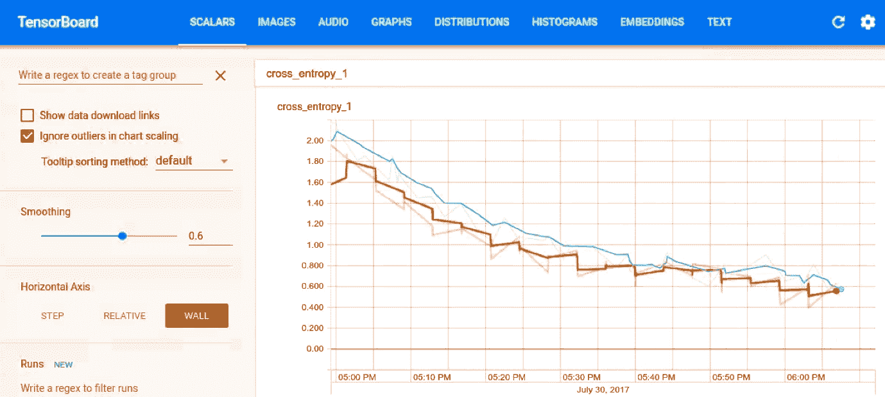
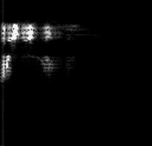
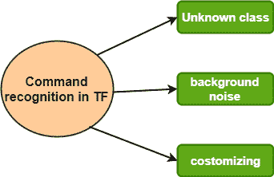

# 张量流音频识别

> 原文：<https://www.javatpoint.com/tensorflow-audio-recognition>

音频识别是计算语言学的一个跨学科分支，它开发了能够通过计算机将口语识别和翻译成文本的方法和技术。**语音识别**常用于操作设备、执行命令和书写，无需借助**键盘、鼠标、**或按任何**按钮**。

现在都是在电脑上用 **ASR** (自动语音识别)软件程序完成。许多语音识别程序要求用户“训练”语音识别程序来识别其声音，以便它能够更准确地将语音转换为文本。

比如我们可以说“**打开谷歌 chorme** ”，电脑就会打开互联网浏览器 chrome。

第一台 ASR 设备用在 **1952** 上，识别任何用户说出的一位数。在当今时代，ASR 程序被用于许多行业，**包括军事、医疗、电信、**和**个人计算**。

**我们可能使用过语音识别的例子:**谷歌语音、自动电话系统、数字语音、数字助理、车载蓝牙。

## 语音识别系统的类型

自动语音识别是语音识别的一个例子。下面是语音识别系统的一些其他例子。

*   **说话人相关系统-** 语音识别需要经过训练才能使用，这就需要我们阅读一系列**单词**和**短语**。
*   **与说话人无关的系统-** 语音识别软件无需训练即可识别大多数用户的声音。
*   **离散语音识别-** 用户必须在每个单词之间暂停，以便语音识别能够识别每个单独的单词。
*   **连续语音识别-** 语音识别可以理解一个标准的说话速率。
*   **自然语言-** 语音识别不仅可以理解语音，还可以返回正在被询问的问题或其他查询的答案。
    像 MNIST 对于图像，这应该让我们对所涉及的技术有一个基本的了解。完成本 TensorFlow 音频识别教程后，我们将有一个模型尝试将一秒钟的音频片段分类为:
*   沉默
*   一个未知的词
*   是
*   不
*   起来
*   向下
*   左边的
*   对吧
*   在

## 张量流音频识别训练

要在张量流音频识别中开始训练过程，请向张量流源表示并写下以下内容:

```

 Python tensorflow/examples/speech_commands/train.py 

```

该命令可以下载语音数据集，由 **65k 组成。Wav** 人们看到 30 个不同单词的音频文件。

## 张量流中的混淆矩阵

前 400 步，会给我们:

```

1\. I0730 17:57:38.073667 55030 train.py:243] Confusion of  the matrix: 
2\. [[258 0 0 0 0 0 0 0 0 0 0 0 0 ]
3\. [ 7 6 76 94 7 49 1 15 50 2 0 11]
4\. [ 10 1 107 80 13 33 0 13 10 1 0 4]
5\. [ 1 3 16 164 6 48 0 5 10 1 0 17]
6\. [ 15 1 17 114 44 13 0 9 22 5 0 9]
7\. [ 1 1 6 97 3 86 1 12 46 0 0 10]
8\. [ 8 6 84 86 13 24 1 9 9  1 6 0]
9\. [ 9 3 32 112 9 26 1 36 19 0 0 9]
10\. [ 9 2 12 94 9 49 0 6 72 0 0 2]
11\. [ 16 1 39 75 29 52 0 6 37 9 0 3]
12\. [ 15 6 17 71 60 37 0 6 32 3 1 9]
13\. [ 11 1 6 151 5 43 0 8 16 0 0 20]]

```

我们看到第一部分是一个矩阵。每一列代表一组样本，这些样本是针对每个关键词估计的。在上面的矩阵中，第一列表示所有预测为静音的片段，第二列表示未知单词，第三列表示“是”，依此类推。

## 张量流中的张量板

我们使用 TensorBoard 可视化培训进度。事件保存到**/tmp/retain _ log**中，并使用以下语法加载:

```

tensorboard --logdir /tmp/retrain_logs

```



## 音频识别培训结束

经过几个小时的训练，脚本完成约 **2 万步**，打印出最终的混淆矩阵，以及准确率

我们可以使用给定的代码以紧凑的形式导出到移动设备:

```

python tensorflow speech_commands/freeze.py\ 
--start_checkpoint=/tmp/speech_commands_train/conv.ckpt-18000 \
--output_file=/tmp/my_frozen_graph.pb

```

## 语音识别模型的工作

它是基于美国有线电视新闻网的那种**，这是任何从事图像识别工作的人都非常熟悉的，就像我们在以前的教程中已经有的一样。音频是一维信号，不要因为 **2D** 空间问题而混淆。**

 **现在，我们必须通过定义一个时间段来解决这个问题，在这个时间段里，我们所说的话应该适合，并且把那个时间段里的信号变成图像。我们可以通过将输入的音频分成小段并计算频率强度来做到这一点。每个片段都被视为一个数字向量，这些数字按时间排列形成一个 2D 阵列。这一组数值可以像单通道图像一样处理，也称为**谱图**。我们可以查看音频样本产生的图像类型:

```

bazel run tensorflow/examples/wav_to_spectogram:wav_to_spectogram -- \
--input_wav=/tmp/speech_dataset/happy/ab00c4b2_nohash_0.wv \
--output_png=/tmp/spectrogram.png

```

**/tmp/spectra . png**会给我们展示:



这是一个 2d 单通道表示，所以我们也倾向于像一个图像。

产生的图像随后被输入到多层卷积神经网络中，该网络具有完全连接的层，最后是 softmax。

## 张量流中的命令识别



**未知类**

我们的应用程序可能会听到不属于我们训练集的声音。为了让网络学会抵制哪种声音，我们需要提供不属于我们课程的音频片段。为了做到这一点，我们可以创造嘘、喵，并用动物的声音填充它们。语音命令数据集包括 20 个未知类别的单词，包括数字、零到九以及随机名称。

**背景噪音**

任何捕获的音频剪辑中都有背景噪音。为了建立一个抵抗这种噪音的模型，我们需要针对具有相同属性的录音来训练模型。语音命令数据集中的文件被记录在多个设备和不同的环境中，这有助于训练。

然后，我们可以从文件中随机选择小片段，在训练过程中以低音量混合成片段。

**定制**

脚本使用的模型非常庞大，使用了 **940k** 权重参数，这些参数的计算量太大，无法在资源有限的设备上以一定的速度运行。应对这种情况的其他选择是:

**low_latency_conv:** 准确率比 conv 低，但权重参数的数量几乎相同，而且快得多

我们应该指定-model-architecture =**low _ latency _ conv**在命令行上使用这个模型。

我们应该添加参数，因为学习率=0.01，步数=20，000。

**low_latency_svdf:** 精度比 conv 低，但只使用 750k 参数，执行优化。在命令行上键入-model _ architecture = low _ latency _ svdf 以使用该模型，并指定训练速率和步骤数以及:

```

python tensorflow/examples/speech_commands/train \
--model_architecture=low_latency_svdf \
--how_many_training_steps=100000,35000 \
--learning_rate=0.01,0.005

```

* * ***