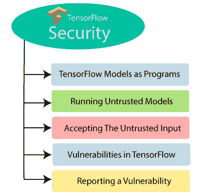

# TensorFlow 安全？TensorFlow的 5 个主要漏洞

> 原文：<https://www.javatpoint.com/tensorflow-security>

TensorFlow 的安全性包括 TensorFlow 模型作为程序、如何运行不可信模型以及接受不可信输入等重要问题。

## 作为程序的TensorFlow模型

TensorFlow 有它的运行时系统，它解释和执行它的程序。TensorFlow 中的程序被编码为计算图，并将参数分别存储为检查点。

在运行时，TensorFlow使用给定的参数执行计算图。图表的行为可能会根据设置的变化而变化。

所有执行的任务都是在 TensorFlow 进程的许可下完成的。

TensorFlow模型类似于程序，因此需要从TensorFlow安全性的角度来看待。

## 不受信任的模型

一般来说，不受信任的模型应该首先在沙箱中执行。任何模型都有可能变得不可信，例如，如果某个不可信方提供了 TensorFlow 内核或提供了 TensorFlow 图形所需的 python 代码。

TensorFlow 安全性由计算图决定，无论用户提供的检查点是否安全。通常，创建带有恶意检查的计算图会触发不常见且不安全的行为。

## 接受不信任的输入

任何人都可以通过提供安全处理不可信数据的模型来设计安全的模型。

我们假设我们没有任何 bug。

分析 TensorFlow 图如何工作的一个很好的方法，像 Python 这样的解释编程语言。人们可以编写一个安全的 Python 代码，可以很容易地向用户公开给定的输入，但是很容易编写不安全的 Python 程序。

## TensorFlow中的漏洞

TensorFlow 是一个广泛的复杂系统，它的使用依赖于几个第三方库。TensorFlow 模型执行任意计算，可以读写文件或通过网络进行通信。如果模型显示的不是这些规范，那么该行为会导致漏洞。

## 报告漏洞

我们将看到如何看到 TensorFlow 中的漏洞。我们可以将有关任何安全问题的报告发送至 **[【电子邮件保护】](/cdn-cgi/l/email-protection)** 。电子邮件的报告将发送给 TensorFlow 的安全团队。这些电子邮件会在 24 小时内接受，并在一周内提供详细的回复以及后续步骤。

* * *