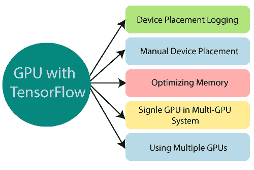

# 单个和多个图形处理器

> 原文：<https://www.javatpoint.com/tensorflow-single-and-multiple-gpu>

我们通常的系统可以包含多个计算设备，正如我们已经知道的 TensorFlow，支持中央处理器和图形处理器，我们表示一个字符串。

**例如:**

*   如果我们有一个 CPU，它可能被定为“/cpu:0”。
*   TensorFlow GPU 字符串的索引从零开始。
*   同样，第二个 GPU 是“/设备:GPU:1”。



## 设备放置记录

我们可以通过创建一个预设了**log _ device _ placement configuration**选项的会话来找出哪些设备处理特定的操作。

```

# Graph creation.
x = tf.constant([1.0, 2.0, 3.0, 4.0, 5.0, 6.0], shape=[2, 3], name='x')
y = tf.constant([1.0, 2.0, 3.0, 4.0, 5.0, 6.0], shape=[3, 2], name='y')
z = tf.matmul(x, y)
sess = tf.Session(config=tf.ConfigProto(log_device_placement=True))
# Running the operation.
print(sess.run(z))

```

TensorFlow GPU 设备放置日志的输出如下所示:

```

/log:localhost/replica:0/task:0/device:GPU:0 -> device: 0, name: Tesla K40c, pci bus
id: 0000:05:00.0
b: /job:localhost/replica:0/task:0/device:GPU:0
a: /job:localhost/replica:0/task:0/device:GPU:0
MatMul: /job:localhost/replica:0/task:0/device:GPU:0
[[ 22\.  28.]
[ 49\.  64.]]

```

## 手动设备放置

有时，我们可以决定应该在哪个设备上运行我们的操作，我们可以通过使用 **tf.device** 创建一个上下文来实现这一点，其中我们分配了特定的设备，如。应该进行计算的中央处理器或图形处理器，如下所示:

```

# Graph Creation.
with tf.device('/cpu:0'):
x = tf.constant([1.0, 2.0, 3.0, 4.0, 5.0, 6.0], shape=[2, 3], name='x')
y = tf.constant([1.0, 2.0, 3.0, 4.0, 5.0, 6.0], shape=[3, 2], name='y')
z = tf.matmul(x, y)
sess = tf.Session(config=tf.ConfigProto(log_device_placement=True))
# Running the operation.
print(sess.run(z))

```

TensorFlow GPU 的上述代码将常数 a 和 b 分配给 cpu:o，在代码的第二部分，由于没有明确声明哪个设备将执行任务，因此默认情况下会选择一个 GPU(如果可用)，它会在设备之间复制多维数组。

```

Device mapping:
/job:localhost/replica:0/task:0/device:GPU:0 -> device: 0, name: Tesla K40c, pci bus
id: 0000:05:00.0
y: /job:localhost/replica:0/task:0/cpu:0
x: /job:localhost/replica:0/task:0/cpu:0
MatMul: /job:localhost/replica:0/task:0/device:GPU:0
[[ 22\. 28.]
[ 49\. 64.]]

```

## 优化张量流图形处理器内存

内存碎片化是通过映射处理器可见的几乎所有 TensorFlow GPUs 内存来优化内存资源，从而节省大量潜在资源。如果处理器需要节省内存，TensorFlow GPU 提供两种配置选项来控制内存的分配，这些 TensorFlow GPU 优化描述如下:

配置原型用于此目的:

```

config = tf.ConfigProto()
config.gpu_options.allow_growth = True
session = tf.Session(config=config, ...)

```

per _ process _ gpu _ memory _ fraction 是第二种选择，它决定了总内存中应该分配给每个使用中的 GPU 的段。下面是一个例子，它将在 tensorflow 中用来分配 40%的内存:

```

config = tf.ConfigProto()
config.gpu_options.per_process_gpu_memory_fraction = 0.4
session = tf.Session(config=config, ...)

```

它仅在我们已经指定计算并且确信在处理过程中不会改变的情况下使用。

## 多图形处理器系统中的单图形处理器

在多 TensorFlow GPU 系统中，默认选择身份最低的设备，用户不需要。

```

# Creates a graph.
with tf.device('/device:GPU:2'):
x = tf.constant([1, 2.0, 3.0, 4.0, 5.0, 6.0], shape=[2, 3], name='x')
y = tf.constant([1.0, 2.0, 3.0, 4.0, 5.0, 6.0], shape=[3, 2], name='y')
z= tf.matmul(x, y)
# Creates a session with log_device_placement set to True.
sess = tf.Session(config=tf.ConfigProto(log_device_placement=True))
# Runs the op.
print(sess.run(c=z))

```

当用户指定的 TensorFlow 图形处理器不存在时，将获得 InvalidArgumentError，如下所示:

```

InvalidArgumentError: Invalid argument: Cannot assign a device to node 'y':
Could not satisfy explicit device specification '/device:GPU:2'
[[Node: b = Const[dtype=DT_FLOAT, value=Tensor<type: float shape: [3,2]
values: 1 2 3...>, _device="/device:GPU:2"]()]]

```

如果我们想指定默认值

## 在张量流中使用多图形处理器

我们已经知道 TensorFlow 中的塔，并且我们可以将每个塔分配给一个 GPU，从而为使用 TensorFlow 多个 GPU 制作多塔结构模型。

```

z= []
for d in ['/device:GPU:2', '/device:GPU:3']:
with tf.device(d):
x = tf.constant([1.0, 2.0, 3.0, 4.0, 5.0, 6.0], shape=[2, 3])
y = tf.constant([1.0, 2.0, 3.0, 4.0, 5.0, 6.0], shape=[3, 2])
z.append(tf.matmul(x, y))
with tf.device('/cpu:0'):
sum = tf.add_n(z)
sess = tf.Session(config=tf.ConfigProto(log_device_placement=True))
# Running the operations.
print(sess.run(sum))

```

TensorFlow GPU 的输出如下:

```

/job:localhost/replica:0/task:0/device:GPU:0 -> device: 0, name: Tesla K20m, pci bus
id: 0000:02:00.0
/job:localhost/replica:0/task:0/device:GPU:1 -> device: 1, name: Tesla K20m, pci bus
id: 0000:03:00.0
/job:localhost/replica:0/task:0/device:GPU:2 -> device: 2, name: Tesla K20m, pci bus
id: 0000:83:00.0
/job:localhost/replica:0/task:0/device:GPU:3 -> device: 3, name: Tesla K20m, pci bus
id: 0000:84:00.0
Const_3: /job:localhost/replica:0/task:0/device:GPU:3
Const_2: /job:localhost/replica:0/task:0/device:GPU:3
MatMul_1: /job:localhost/replica:0/task:0/device:GPU:3
Const_1: /job:localhost/replica:0/task:0/device:GPU:2
Const: 2/job:localhost/replica:0/task:0/device:GPU:2
MatMul: /job:localhost/replica:0/task:0/device:GPU:2
AddN: /job:localhost/replica:0/task:0/cpu:0
[[ 44\. 56.]
[ 98\.  128.]]

```

我们可以用一个简单的数据集(如 CIFAR10)测试这个多 GPU 模型，以实验和理解如何使用 GPU。

* * *