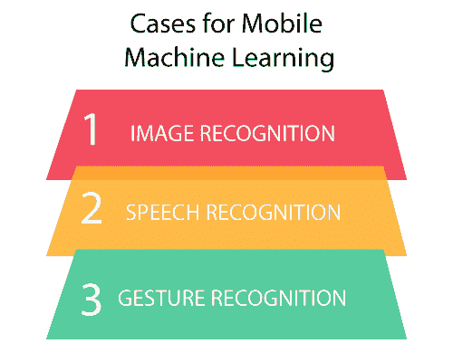
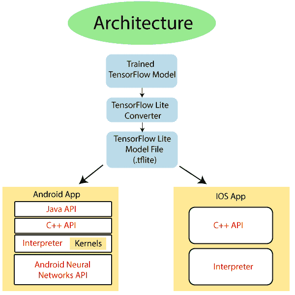

# TensorFlow Mobile

> 哎哎哎:# t0]https://www . javatppoint . com/tensorlow-mobile

**TensorFlow Mobile** 主要用于安卓、iOS 等任何移动平台。它用于那些拥有成功的 TensorFlow 模型并希望将其模型集成到移动环境中的开发人员。它也用于那些不能使用 TensorFlow Lite 的人。在将桌面环境模型集成到移动环境中时，任何人都能发现的主要挑战是:

*   了解如何使用 TensorFlow 手机。
*   他们正在为移动平台建立模型。
*   他们正在将 TensorFlow 库添加到他们的移动应用中。
*   准备模型文件。
*   优化**二进制大小、文件大小、内存使用**等。

## 使用移动机器学习的案例

与 TensorFlow 相关的开发人员在高性能图形处理器上使用它。但是，通过网络连接发送所有设备数据是一种非常耗时且成本高昂的方式。在任何手机上运行它都是一个简单的方法。

1)**TensorFlow 中的图像识别**:这是一种检测或获得用手机拍摄的图像的感觉的有用方法。如果用户正在拍照以了解里面有什么，可以有一种方法来应用适当的过滤器或标签，以便在必要时找到它们。

2) **TensorFlow 语音识别**:各种应用都可以搭建语音驱动的界面。很多时候，用户无法给出指令，因此将指令连续传输到服务器会产生很多问题。

3)**TensorFlow 中的手势识别**:通过分析传感器数据，借助手或其他手势来控制应用。我们在TensorFlow的帮助下做到了这一点。

**光学字符识别(OCR)、翻译、文本分类、语音识别等示例。**

## TensorFlow Lite：

TensorFlow Lite 是专门为移动平台和嵌入式设备设计的轻量级版本。它为移动设备提供了一个低延迟和小二进制大小的机器学习解决方案。

TensorFlow 支持一组已经针对移动平台进行调整的核心运营商。它还支持模型中的自定义操作。

TensorFlow Lite 教程解释了一种基于 Flat Buffers 的新文件格式，这是一个开源平台序列化库。它由任何新的移动解释器组成，用于保持应用程序更小更快。它使用定制的内存分配器来实现最小的负载和执行延迟。

## TensorFlow精简架构

磁盘上经过训练的 TensorFlow 模型可以使用 TensorFlow Lite 转换器转换为 TensorFlow Lite 文件格式。然后，我们在移动应用程序中使用转换后的文件。

对于部署 lite 模型文件:

*   **Java API** :是安卓上 C++ API 的一个包装器。
*   **C++ API** :可以加载 lite 模型，调用解释器。
*   **解释器**:执行模型。它使用选择性内核加载，这是 TensorFlow 中 Lite 的独特功能。

我们也可以使用 C++ API 实现定制内核。

**以下是关于 TensorFlow Lite** 的几点

它支持一组针对移动平台进行调整的运营商。TensorFlow 还支持模型中的自定义操作。

*   这是一种基于平面缓冲区的新文件格式。
*   它是一个设备上的解释器，使用选择性的加载技术。
*   当所有支持的运算符都链接在一起时，TensorFlow Lite 小于 300kb。
*   它支持 Java 和 C++ API。

## TensorFlow Lite Vs. TensorFlow Mobile

当我们看到什么是 TensorFlow Lite 和 TensorFlow Mobile，以及它们如何在移动环境和嵌入式系统中支持 TensorFlow 时，我们知道了它们之间的区别。TensorFlow Mobile 和 TensorFlow Lite 之间的区别如下:

*   它是 TensorFlow 手机的下一个版本。主要是，在 TensorFlow lite 上开发的应用程序将比 TensorFlow mobile 具有更好的性能和更少的二进制文件。
*   它仍处于早期阶段，因此并非所有案例都涵盖在内，而 TensorFlow mobile 的情况并非如此。
*   TensorFlow Lite 支持特定的运算符集。因此，在这里，并非所有的模型默认情况下都会在 TensorFlow Lite 上工作。

* * *